---
title: Promotions - Virto Commerce 1.13 User Guide
description: Promotions
layout: docs
date: 2015-03-18T20:11:12.560Z
priority: 3
---
## Introduction

A promotion is a marketing tool used to increase sales. Promotions are store-specific; to create a promotion for a store, you must have the Manage Promotions permission. Promotions cannot be shared across multiple stores. (To apply a promotion to multiple stores, it must be manually re-created in each applicable store.)

Virto Commerce supports two types of promotions:

* catalog promotions
* shopping cart promotions.

## Catalog promotions

Catalog promotions are used to make specific products and categories of products more attractive to shoppers through incentives, such as lowered pricing on a particular brand. A catalog promotion grants all shoppers a discount on a specific product or set of products. Catalog promotions are always visible to shoppers, so the price they see while browsing the site is the price they pay at checkout time (except taxes and any shopping cart promotions that may apply).

## Cart promotions

Cart promotions are used to encourage shoppers to increase their order size by providing incentives, such as free shipping on orders over a certain sum. A shopping cart promotion grants a discount on a specific product or set of products to shoppers who meet certain conditions. Cart promotions are only applied after the promotion conditions expression returned true. Thus, a shopper only sees the price that will be paid for a promoted item when it's viewed in the shopping cart or during checkout (assuming all the promotion's conditions are met).

For example, a product has a list price of $100.00. Currently, there is a shopping cart promotion that grants a 5% discount to all orders over $99.00. When browsing the catalog, all shoppers see the product's $100.00 list price. If a shopper adds the product to her shopping cart and then views the cart's contents, the price of the cart is $95.00 (due to the 5% discount). If the same shopper goes back to browsing the frontend, the catalog still shows the list price of $100.

## Promotion rules

Promotion rules define the behavior and effects of promotions. There are two types of promotion rules:

* conditions
* effects

## Conditions

Conditions are the set of criteria that determine, based on the current state of the cart, whether a shopper is eligible for a promotion. Examples of conditions are:

* the cart must contain a particular quantity of a certain product
* the cart subtotal must be greater than a specific amount

## Effects

Effects specify what benefits are granted by a promotion. They are the incentives used to encourage customers to purchase more or to purchase specific items. Examples of effects are:

* free shipping
* discounts on specific products
* free items
* coupons for discounts on future purchases.

The types of conditions and actions available depend on the promotion type.

There are many options available when configuring promotion rules. For detailed descriptions of the available options, see **Promotion Conditions and Rules**.

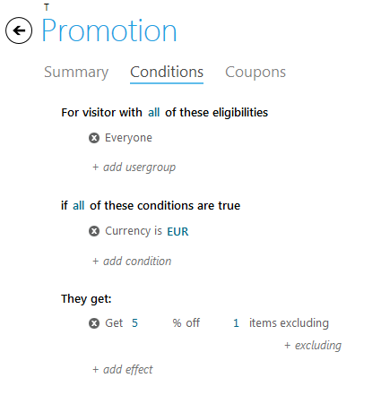

## Expression builder's visitor block

The visitor block is similar to promotion rules. It specifies criteria that determine, based on information that has been collected about the visitor, whether that visitor is eligible to receive a promotion.

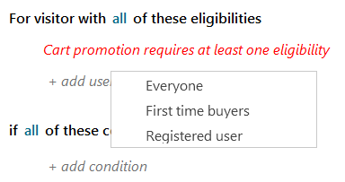

There are three options:

* **Everyone** - no filtering
* **Register user** - user that is currently logged in to storefront
* **First time buyer** - registered user who has never made any purchase

> User that has just created an account is always a first time buyer

## Activation rules

Activation rules determine how promotions are applied to the eligible purchases. In the simplest case, a promotion is applied automatically. This means that, if the customer meets all conditions, he receives the promotion action automatically, whether it's a discount on an item, free shipping, a coupon, etc.

Some promotions need to be "activated" by a coupon code (also referred to as a promotion code). For example, to receive a discount on an item in the shopping cart, the customer must enter a coupon code at checkout time. If your organization uses coupon codes, you will need to configure certain rules to control how they can be used with each promotion.

When you create a promotion, you need to specify whether it's activated automatically or by a coupon.

## Coupons

Coupons can be used by any eligible customer. This means that any customer who qualifies for a promotion can use coupon code associated with that promotion. Customers may re-use a previously redeemed coupon code.

## Promotions Best Practices and Tips

* Do not use the promotions to create permanent discounts. Instead, create sale prices in the appropriate price lists.
* Promotion rules are cached to improve performance in the frontend. As a result, there is a delay after a promotion is created and before it appears in the store. The delay depends on the configuration

## Searching for a promotion

From the **Marketing** module's Promotions tab select filters for Promotion name, Promotion status, Promotion type:

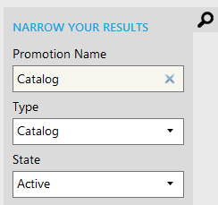

The promotions of the selected type, state and with the name that contains the entered text (case-insensitive search) will be filtered and displayed in the list of promotions.

All the search fields are optional. If all search fields are empty - all promotion will be displayed.

## Creating a Cart promotion

1. Open **Marketing** module.
2. Select **Promotions** tab.
3. Click **Add** button.
  
4. Before the wizard starts in the popup dialog select the type of promotion you need to create (the cart promotion). Click OK.
  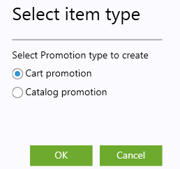
5. In the first step of the wizard setup promotion properties.
  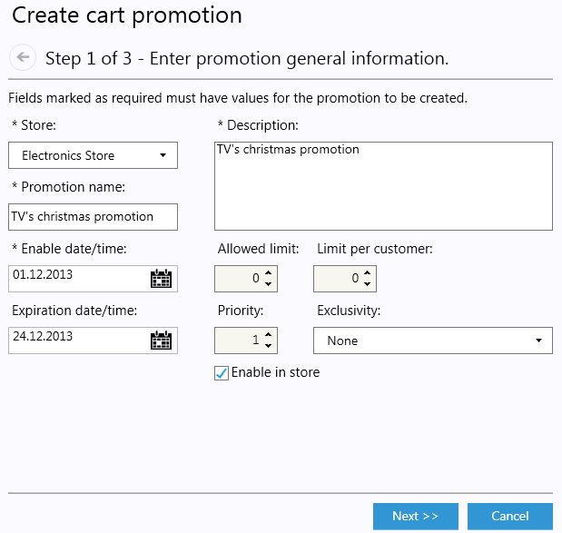

|Field name|Description|
|----------|-----------|
|Store|The store to which the new promotion applies.|
|Promotion name|Sets the name of the promotion. Set it as meaningful as possible for the later search purposes.|
|Description|Sets the meaningful description of the promotion.|
|Enable date|Sets the start date of the promotion. Available from the creation if not set.|
|Expiration date|Sets the end date of the promotion. Available until disabled if not set.|
|Allowed limit|Sets the maximum amount of times the promotion can be applied. If set 0 the promotion will be limitless.|
|Limit per customer|Sets the amount of times the promotion can be applied to the same customer. If set 0 the promotion will be limitless.|
|Priority|Sets the priority of the promotion, the less the priority number, the higher the priority. If more than one promotion can be applied to the cart or item, the one with higher priority will be applied.|
|Exclusivity|Sets if the promotion is applicable globally or per group.|
|Enable in store|Sets if the promotion is active.|

6. Click **Next**.
7. In the promotion step 2 setup rules (conditions) under which the promotion will be applied.

To set usergroup click

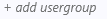

and select the target usergroup.

To set condtion click

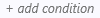

select required condition and setup required values of the selected condition.

To set effect click

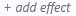

select required effect and setup values.

8. Click **Next**.
9. In step 3 of the wizard setup if the promotion applicable only if coupon with the specified value provided.

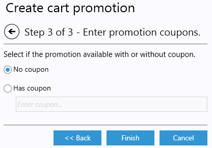

10. Click **Finish**.

The created promotion will be saved and displayed in the list of promotions.

## Creating a Catalog promotion

1. Open **Marketing** module.
2. Select **Promotions** tab.
3. Click **Add** button.
  
4. Before the wizard starts in the popup dialog select the type of promotion you need to create (the catalog promotion). Click OK.
  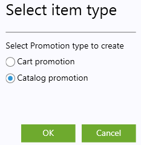
5. In the first step of the wizard setup promotion properties.
  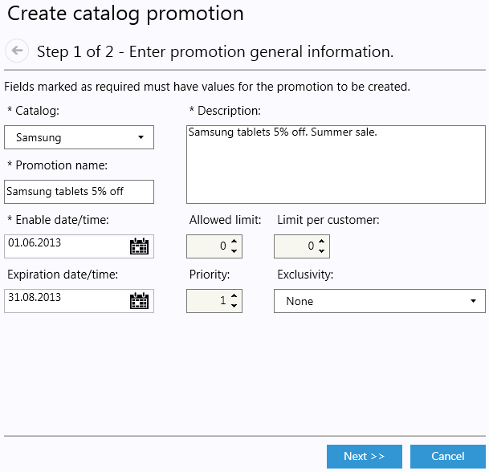

|Field name|Description|
|----------|-----------|
|Catalog|The catalog to which the new promotion applies.|
|Promotion name|Sets the name of the promotion. Set it as meaningful as possible for the later search purposes.|
|Description|Sets the meaningful description of the promotion.|
|Enable date|Sets the start date of the promotion. Available from the creation if not set.|
|Expiration date|Sets the end date of the promotion. Available until disabled if not set.|
|Allowed limit|Sets the maximum amount of times the promotion can be applied. If set 0 the promotion will be limitless.|
|Limit per customer|Sets the amount of times the promotion can be applied to the same customer. If set 0 the promotion will be limitless.|
|Priority|Sets the priority of the promotion, the less the priority number, the higher the priority. If more than one promotion can be applied to the cart or item, the one with higher priority will be applied.|
|Exclusivity|Sets if the promotion is applicable globally or per group.|
|Enable in store|Sets if the promotion is active.|

6. Click **Next**.
7. In the promotion step 2 setup rules (conditions) under which the promotion will be applied.

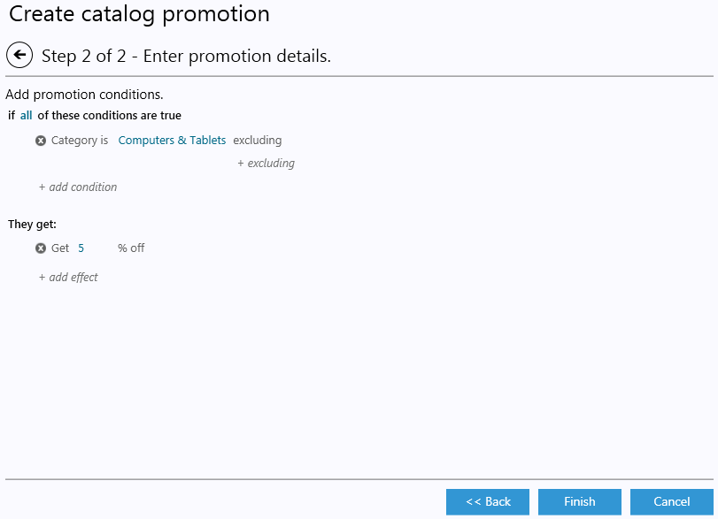

To set condtion click

select required condition and setup required values of the selected condition.

To set effect click 

select required effect and setup values.

8. Click **Finish**.

The created promotion will be saved and displayed in the list of promotions.

## Editing Promotion

1. Open **Marketing** module.
2. Select **Promotions** tab.
3. Double click the selected Promotion.
4. Edit the required fields.
5. Save changes.

> You can't edit Store for the Cart promotion and Catalog for Catalog promotion.

## Deleting Promotion

1. Open **Marketing** module.
2. Select **Promotions** tab.
3. Click the Promotion you want to delete.
4. Click **DELETE** button
5. Confirm deletion.

## Duplicating Promotion

If you want to create Promotion that is much similar to the already stored Promotion than the clone of that already present Promotion can be created. And after the Promotion has been cloned just edit the required properties to match your needs.

1. Open **Marketing** module.
2. Select **Promotions** tab.
3. Click the Promotion you want to clone.
4. Click **DUPLICATE** button
5. Confirm duplication.

As the result the new Promotion item will be created and added to the list with the name of the original and suffix _1. For example if you duplicate Promotion named 10% Christmas sale the clone with the name 10% Christmas sale_1 will be created.
