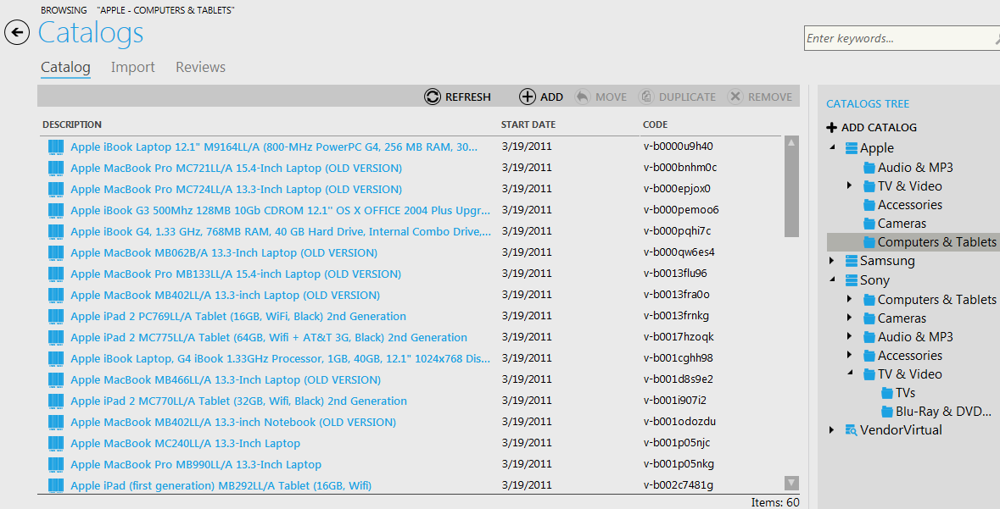

---
title: Browsing categories and items
description: Browsing categories and items
layout: docs
date: 2015-03-18T20:11:12.560Z
priority: 1
---
Browsing categories and items is very simple with the help of catalogs tree. Navigate to the Catalogs block of Commerce Manager. The right part of the page contains the tree of catalogs, categories within them and items inside of these categories.

On the sample screenshot you can see the catalog "Apple", "Computers & Tablets" - is a category within this catalog, and the list of products contained in this category is displayed on the left.

