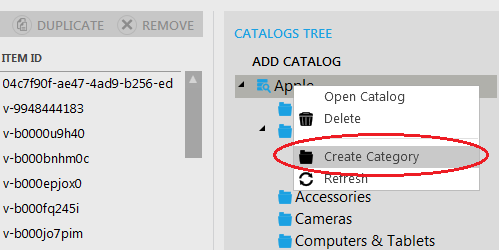
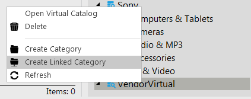
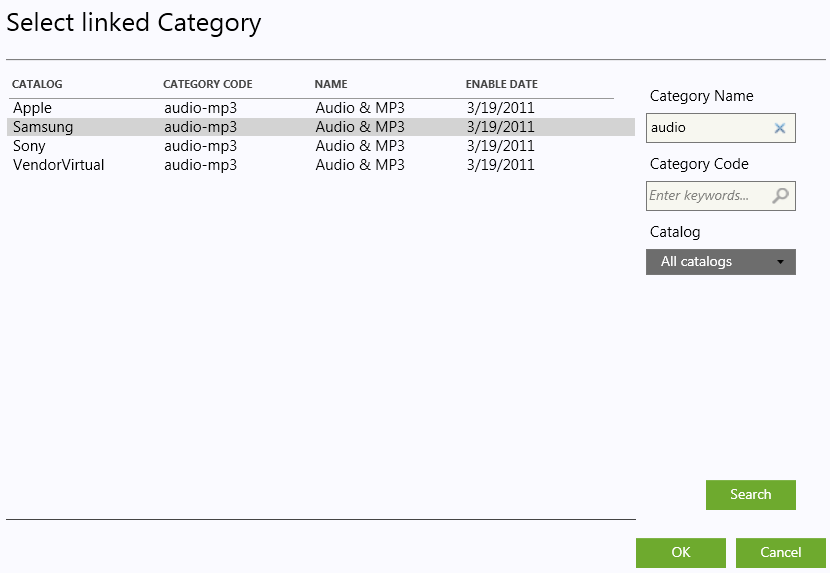
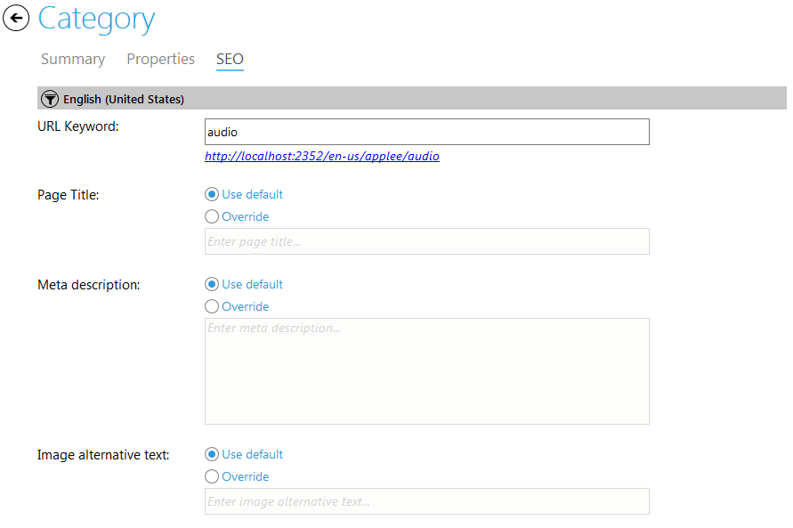

---
title: Categories
description: Categories
layout: docs
date: 2015-03-18T20:11:12.560Z
priority: 1
---
## Introduction

Catalogs consist of categories which are used to organize the content of them. Categories contain items and/or other categories.

When a new category is created, it appears in the storefront immediately. Only top categories will not appear until the server is restarted.

## Creating a Category

Select a catalog in the Catalogs tree where you need to add a category to. Use mouse to right-click it and select "Create Category" option from the context menu:

A "Create Category" wizard is displayed. On the first step fill in the fields as follows (fields marked by asterisk are required):

* **Category name**В - the title of this category;
* **Category type**В - the attributes associated with the category; (If this selector is empty, a category cannot be created at the moment. You should cancel this wizard, open current Catalog and create a new Property Set targeting Category.)
* **Enable date**В - the date when the category becomes visible. (This option can be applied for seasonal categories, for instance).
* **Disable date**В - the date when the category becomes unavailable (no longer appears in the store).
* **Store visible**В - use this checkbox to make the category visible (available for customers) in the storefront. This option may be used when you need to hide/show a category with no relation to enable/disable dates.

On the second step define property values. All properties marked required must have values in order for the category to be created. Created category will appear in the catalog tree.

## Creating a Sub-Category

To create a sub-category, right-click onВ the category that you want to contain the sub-category and select "Create sub-Category" option from the context menu:

An identical wizard is displayed as in "Create Category" case. Fill in the fields and follow the instructions provided in "Create Category" chapter.

## Creating a Linked Category

Working with virtual catalogs considers creating linked categories.В A linked category is a category in a virtual catalog that is inherited from a common catalog. The inherited category contains links to all of the items in the source category in the common catalog. Moreover, all product attributes are inherited with each item.

To create a linked category, right-click on a virtual catalog (or a category inside virtual catalog) in your catalog tree and select "Create Linked Category" option from the context menu:

A category search dialog is displayed. Now use the search tools on the left to find categories. Select required category from the list and click OK to finish creating a linked category:

Created linked category will appear in the catalog tree.

## Editing a Category

To edit category right-click it in the Catalog tree and click "Open category".

The category edit view will open. Here you can edit the general settings of the category, its properties and SEO information:

## SEO

The "SEO" tab is used to specify SEO data for the category, such as URL Keyword, Page title, Meta description, Image alternative text.

URL Keyword should not contain restricted characters, otherwise validation will not allow to save such a Keyword.

You can enter the SEO data for each language available in the catalog.

To browse the category by the SEO keyword click the hyperlink under URL Keyword textbox if available.

## Deleting a Category

To delete a category, right-click on it in catalogs tree and select "Delete" option from the context menu:

A "Delete confirmation" dialog is displayed in order to avoid accidental deletes. Confirmation dialog can contain additional information about the selected category like: item count, sub-categories count and Linked Categories count:

Deleted category will disappear from the catalog tree.
