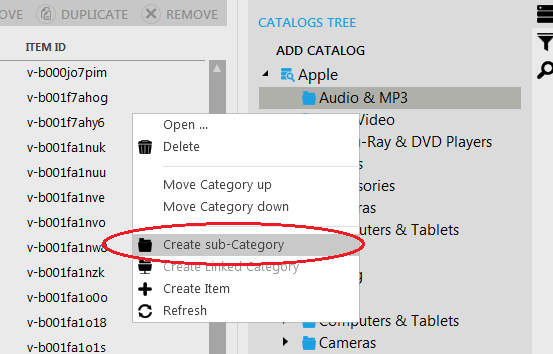

---
title: Creating a sub-category
description: Creating a sub-category
layout: docs
date: 2015-03-18T20:11:12.560Z
priority: 3
---
To create a sub-category, right-click onВ the category that you want to contain the sub-category and select "Create sub-Category" option from the context menu:

Then define values of required fields. The dialog box is identical to creating a category.
