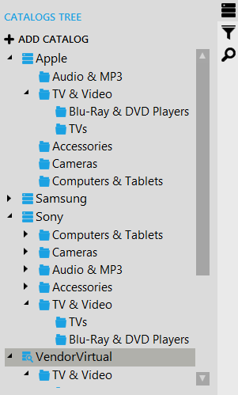
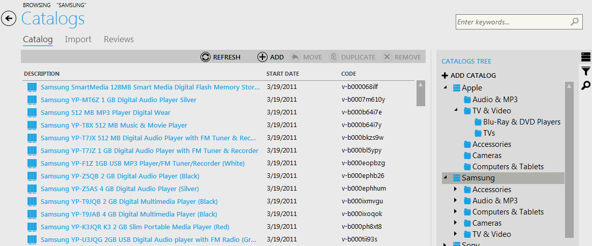
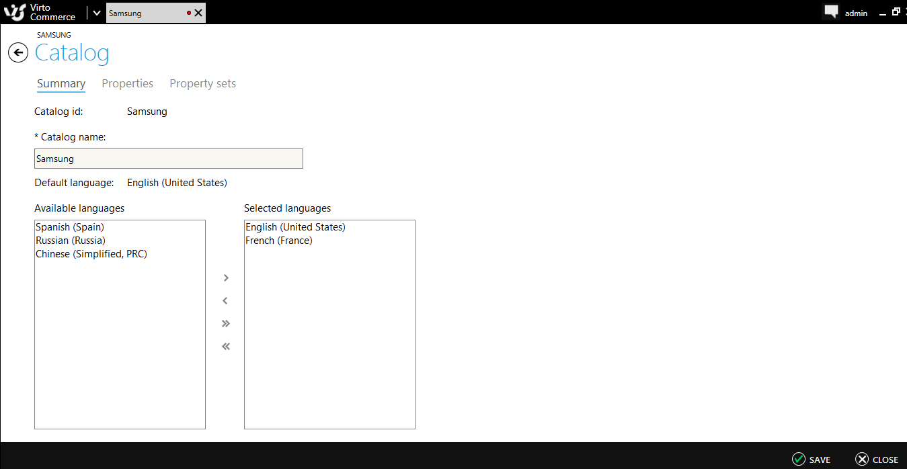

---
title: Creating, editing and deleting a Catalog
description: Creating, editing and deleting a Catalog
layout: docs
date: 2015-03-18T20:11:12.560Z
priority: 2
---
To navigate to the Catalogs block use main menu of the Virto Commerce Manager.

All the catalogs existing in your commerce manager are displayed in the catalogs tree in the right part of the page. Use the tree to navigate to the necessary catalog:

## Creating a Catalog

To create a catalog click "ADD CATALOG" button on top of the catalogs tree:

Select catalog or virtual catalog to be created and click "OK".В Then fill out the fields to define catalog properties, language that will be used by default. Created catalog will appear in the tree.

In case you need to edit a catalog, right-click on it and select "Open Catalog" option from the context menu.В Then make required modifications (for example, change the name of the catalog or add supported languages) and click "Save" to apply the changes:

## Deleting a Catalog

To delete a catalog (or virtual catalog), right-click on it in catalogs tree and select "Delete" option from the context menu. A "Delete confirmation" dialog is displayed in order to confirm the action. Confirmation dialog provides additional information about the selected catalog likeВ category count and item count:

This dialog contains an additional security field. The delete can proceed only if security field is filled in and matches the beginning of catalog name.В Catalog with all related data is deleted after the action confirmed.В Deleted catalog will disappear from the catalog tree.
