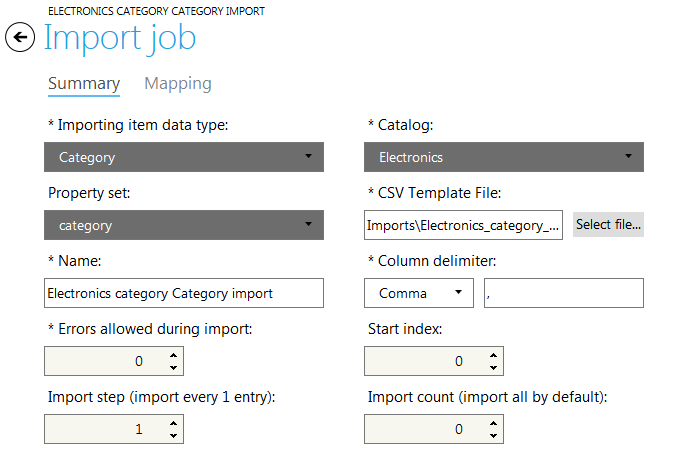
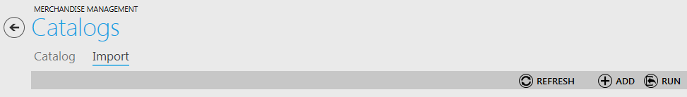
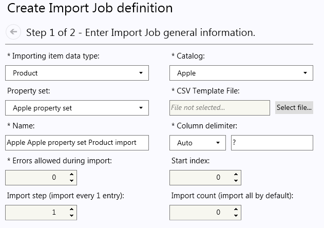

---
title: Import
description: Import
layout: docs
date: 2015-03-18T20:11:12.560Z
priority: 4
---
## Introduction

Catalog data can be created manually, but when catalogs consist of large amounts of data, manual data creationВ is an inappropriate and irrational option. That is why Virto Commerce Manager allows store administrators to import catalog data via special import manager tool from CSV (comma-separated value) files.

Before importing data you need to create a catalog import job - a special algorithm that describes how the data will be imported (from which CSV file, how the columns will be mapped to the data fields and other conditions).

## Importing Categories, Price Lists and Items

Import of categories, price lists and items is much easier when you use import jobs. Navigate to Import tab of "Catalogs" block. All previouslyВ createdВ import jobs are listed here.

* Category Import Job
* Price Import Job
* Product Import Job

Select required import job from the list and click "Run" button. Then assign CSV file and click "OK".

The import will take a few minutes depending on the imported data size.

Double click necessary import job in the list to view or edit it. Use "OK" to save the changes if they were made.

## Creating an Import Job

Open Import tab in the Catalogs block of Commerce Manager and click "Add" button to create an Import Job:

A "Create Import job definition" wizard is displayed. On the first step fill in the following fields:

* **Importing item data type**В - select the type of imported data (product, category, package, etc.);
* **Catalog**В - select a catalog where the data will be imported to;
* **Property set**В - select one of predefined property sets for imported data;
* **CSV Template File**В - define the path of the CSV template file created previously;
* **Name**В - the title of import job (it is filled automatically with the selected data type, catalog and property set properties values. So there is no need to fill this property by default;
* **Column delimiter**В - select the character that separates text values in a line. The "Auto" is selected by default, so when you select the template file the system will try to guess the delimiter, but ifВ 
* **Errors allowed during import**В - maximum number of errors that can occur during importing process.

Once all the fields marked by an asterisk are filled out, click "Next".

## Running Import Job

Open Import tab in the "Catalogs" block. You will see the list of import jobs created before.

Select an import job (by clicking on it) that you would like to run and click "Run" button:

Select a CSV file and click "OK" to initiate data importing:

