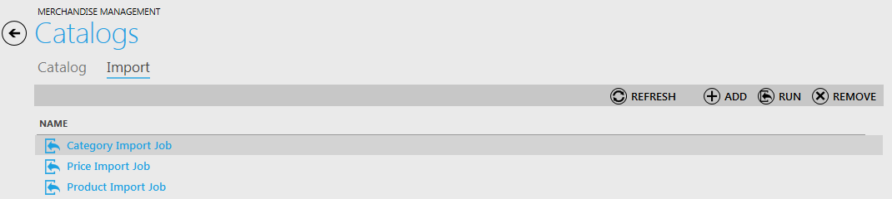
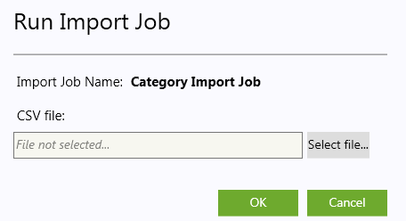
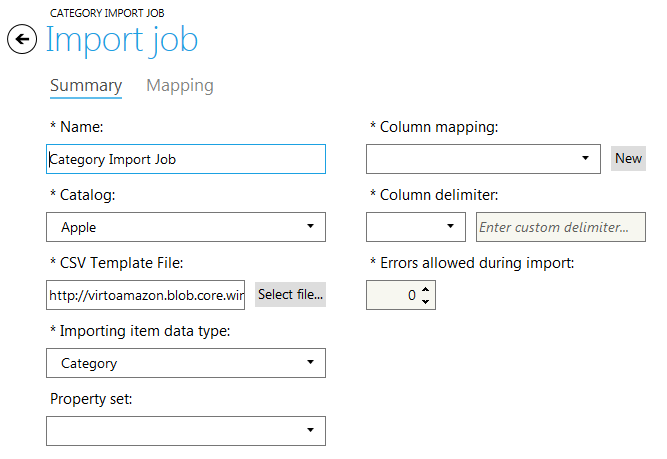

---
title: Importing Categories, Price Lists and Products
description: Importing Categories, Price Lists and Products
layout: docs
date: 2015-03-18T20:11:12.560Z
priority: 2
---
Import of categories, price lists and items is much easier when you use import jobs. Navigate to Import tab of "Catalogs" block. All previously created import jobs are listed here.

* Category Import Job
* Price Import Job
* Product Import Job

Select required import job from the list and click "Run" button. Then assign CSV file and click "OK".

The import will take a few minutes.

To view or edit an import job double click required item. Use "OK" to save the changes if they were made.

