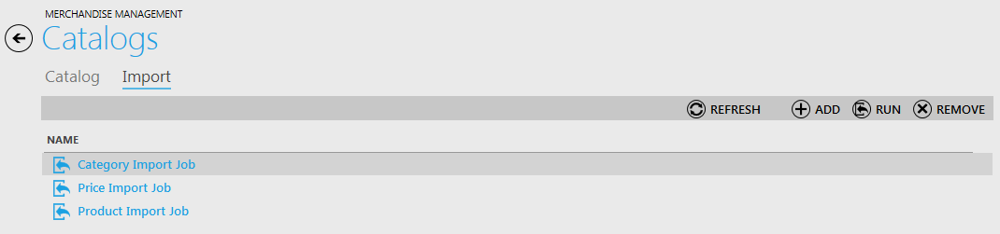
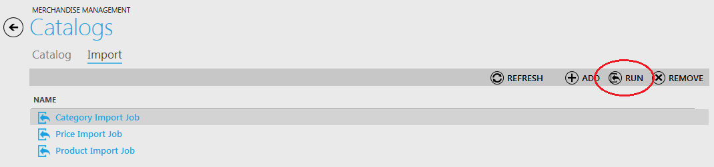

---
title: Running Import Job
description: Running Import Job
layout: docs
date: 2015-03-18T20:11:12.560Z
priority: 3
---
Open Import tab in the "Catalogs" block. You will see the list of import jobs created before.

Select an import job (by clicking on it) that you would like to run and click "Run" button:

Select a CSV file and click "OK" to initiate data importing:

