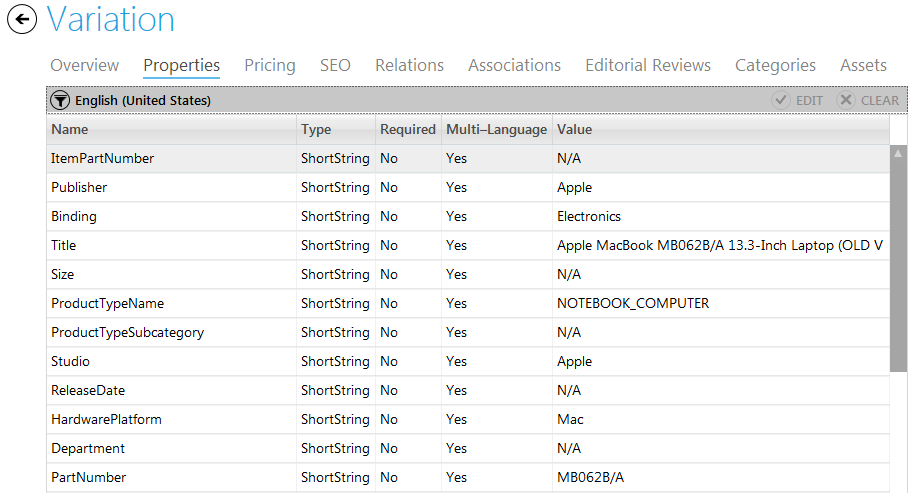
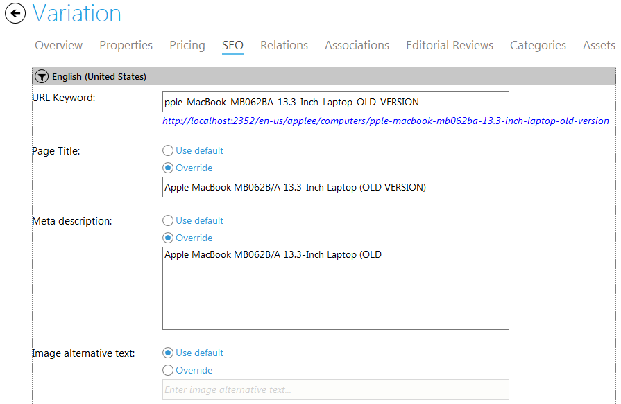

---
title: Items
description: Items
layout: docs
date: 2015-03-18T20:11:12.560Z
priority: 5
---
## Introduction

A product in the Virto Commerce corresponds to a product in the store that can be promoted and sold. Every product has its special characteristics and belongs to a product type group.

A product type defines how a particular set of products will be displayed, which tax codes will be applied and SKU options that are available for products of that type.

## Viewing and editing an Item

An item concept is a generalizationВ ofВ Variation/SKU,В Product, Bundle, Dynamic Kit or Package object in Commerce Manager.

A catalog must be selected and items list loaded before an item can be viewed.В Double-click an item in the items list to view its details.В Full information regarding each item is divided into tabs - Overview, Properties, Pricing, SEO, Product Items, Associations, Editorial Reviews, Categories and Assets.

## Overview

Item code - the code according to the catalog's convention for product codes.

Item name - descriptive name that allows to differ this item from others in the catalog.

Item type - item type contains the set of item properties. For instance, you can define whether a product of this type can be multi-SKU or not.

Enable date/time - date and time from which the item will be available in the store. Useful for seasonal products.

Disable date/time - date and time from whichВ the item will be unavailable in the store. Useful for seasonal products.

Can be purchased - select this check box to allow this item to be purchased.

Store visible - select this check box to let this item appear in the store.

Information in overview tab is filled when an item is created manually. These are the data fields of the created item itself. Other tabs - Properties, Pricing, SEO, Product Items, Associations, Editorial Reviews, Categories and Assets - are filled in with data loaded upon request from different datatables stored in a single database.В This data is loaded and can be edited by double-clicking the necessary item in the Virto Commerce Manager.

## SEO

The "SEO" tab is used to specify SEO data for the item, such as URL Keyword, Page title, Meta description, Image alternative text.

URL Keyword should not contain restricted characters, otherwise validation will not allow to save such a Keyword.

You can enter the SEO data for each language available in the catalog.

To browse the item by the SEO keyword click the hyperlink under URL Keyword textbox if available.

## Creating, editing, deleting a Product

A product in the Commerce Manager is a real-life product. Each product has its special characteristics, can be sold, and belongs to a certain item type group. A product type defines how a particular set of products are displayed, the Tax Codes that apply to it and the attributes and SKU options that are available for products of that type.

To create a product, navigate to the category that will contain the new product. The list of items within a category is displayed on the left.

To create a product click "Add" button.

Select the type of item - Product - to create.

On the first step enter product details:

1. **Item Name**В - a descriptive name of the product.
2. **Item Type**В - select type from the drop-down list.
3. **Can be purchased**В - select this check box to allow this item to be purchased.
4. **Store visible**В - select this check box to let this product appear in the store.
5. **Min. Quantity**В - minimum quantity of product that must be ordered by a customer.
6. **Max. Quantity**В - maximum quantity of product that can be ordered by a customer.
7. **Enable Date/Time**В - date and time when the product will be available in the store. Useful for seasonal products.
8. **Disable Date/Time**В - date and time when the product will be unavailable in the store. Useful for seasonal products.

On the second step an editorial review information could beВ filled. This information is not required and can be skipped.

On the step 3 property values should beВ filled. Values for required properties must be entered.

On the step 4 pricing information could beВ entered (price list has to beВ selected for that).

Click "Finish".В New product will appear in the chosen category and will be opened for editing automatically. Even more product's details can be entered or updated.

To delete a product from a category, click on it in the list and click "Remove" button. Deleting a product also removes it's prices from all price lists containing that product.

Multiple items can be deleted in similar wayВ - just use Ctrl to select items to be removed.

## Creating, editing and deleting a Bundle

Product bundling is usually used in IT marketing - that involves offering several products for sale as one combined product.

A bundle is an item that consists of one or more items that are sold as a single unit. An item can be a product or another bundle. Bundles can be searched for in the Virto Commerce Manager and stores as a common items. They have associated Search Engine Optimization terms and merchandising associations assigned to them. When an inventory needs to be tracked, it is organized either by bundle or by the items within it, according to the business policy of your company.

Virto Commerce Manager allows creating bundles and make them available in the store.

To create a bundle, navigate to the category where you would like to add a bundle to and clickВ "Add" button.

Select a type of an item - Bundle. On the first step of creating fill in the following fields:

* **Item Name**В - a descriptive name of the bundle.
* **Item Type**В - select type from the drop-down list.
* **Can be purchased**В - select this check box to allow this bundle to be purchased.
* **Store visible**В - select this check box to let this bundle appear in the store.
* **Min. Quantity**В - minimum quantity of bundle that must be ordered by a customer.
* **Max. Quantity**В - maximum quantity of bundle that must be ordered by a customer.
* **Enable Date/Time**В - date and time when the bundle will be available in the store. Useful for seasonal products.
* **Disable Date/Time**В - date and time when the bundle will be unavailable in the store. Useful for seasonal products.

On the second step enter editorial review information. This step is not required an can be skipped.

On the step 3 enter property values.

On the step 4 enter pricing information (select price list from the drop-down) and click "Finish".

To delete a bundle, click on it in the category and use "Remove" button. In case you need to delete multiple bundles, use Ctrl key to select them.

If a bundle is included in incomplete orders, it cannot be deleted. The bundle can be deleted after the orders’ statuses have been changed to Complete.

## Creating, Editing, Deleting a Dynamic Kit

AВ dynamic kitВ is a type of catalog item which can be dynamically configured by the customer. This configuration (or grouping) of products is based on the customer's needs and is sold as a single unit. The components of a dynamic kit are controlled through a set of predefined conditions and user interaction, and supplied at order entry time. Adding a dynamic kit to an order is similar to adding a package. Like a package, the individual components of a dynamic kit cannot be modified and the entire configuration must be fulfilled as a whole. It is allowed to change the dynamic kit components by reconfiguring it using the system.

To create a Dynamic Kit use "Add" option, select Dynamic Kit as a product to be created and fill out the form.

The dynamic kit has the following parameters:

* **Item Name**В - a descriptive name of the dynamic kit.
* **Item Type**В - type from the drop-down list that defines item properties.
* **Can be purchased**В - elect this check box to allow this dynamic kit to be purchased.
* **Store visible**В - select this check box to let this dynamic kit appear in the store.
* **Min. Quantity**В - minimum quantity of dynamic kits that must be ordered by a customer.
* **Max. Quantity**В - maximumВ quantity of dynamic kits that must be ordered by a customer.
* **Tax Category**В - select tax category that will be applied for this dynamic kit.
* **Packaging**В - select an option of packaging for this dynamic kit.
* **Availability**В - select an option when this dynamic kit will be available in the store.
* **Weight**В - enterВ weight for the dynamic kitВ displayed on the product page.
* **Track Inventory**В - select this check box in case you need to control this dynamic kit inventory and show it to customers.

To edit a dynamic kit double-click it in the catalog and make required modifications.

To delete a dynamic kit select it in the catalog and use "Remove" button.

## Creating, Editing, Deleting a Variation

The product variations are a way of giving your customers variations of options to choose from for your products. Each product can have multiple variations.

A variation could be size, quantity, color, shape, pattern, weight, etc. Any type of variation that you could possibly think of. They are different options for your product. Each variation has variation options.

To create a variation, navigate to a category where you would like to add a variation. Use "Add" button.

Then select "Variation" item type and click "OK".

On the step 1 define values for the following fields:

* **Item Name**В - a descriptive name of product variation;
* **Item Type**В - select a type from the dropdown list;
* **Enable Date/Time**В - date and time when the product variation will become available in the store. Useful for seasonal products.
* **Disable Date/Time**В - date and time when the product variation will become unavailable in the store. Useful for seasonal products.
* **Can be purchased**В - select this check box to allow this product variation to be purchased;
* **Store visible**В - select this check box to let this product variation appear in the store;
* **Min. Quantity**В - minimum quantity of product variation that must be ordered by a customer;
* **Max. Quantity**В - maximum quantity of product variation that must be ordered by a customer;
* **Tax Category**В - select tax category that will be applied for this product variation;
* **Packaging**В - select an option of packaging for this product variation;
* **Availability**В - select an option when this product variation will be available in the store;
* **Weight**В - enter displayed weight for the product variation;
* **Track inventory**В - select this check box in case you need to control this product variation inventory.

Click "Next" to move to the following step.

On the step 2 fill editorial review information for new product variation. Click "Next".

On the step 3 enter property values. Then click "Next".

On the step 4 define pricing information. Click "Finish" to save new variation in the system.

To edit a variation, double click on it and make all the modification you need. Don't forget to click "Save" when all is done.

To delete a variation, click on the item to be deleted and use "Remove" button.

In case you need to delete multiple items, use Ctrl to select them.

## Creating Product Associations

Product Associations are used to show related products, accessories and other types of items for a customer when he views a product page. The administrators define which types of products will be displayed as associated with an item.

This refers to marketing policy and increasing the average check of a customer’s shopping cart since customers start buying similar products of a higher price or add different accessories to the selected good.

### How the associations can be used

1. **Creating cross sells and up sells.**

Cross sells offer alternative goods that are similar to the product the customer is viewing. This is the way to promote overstocked items.

**Example**: a customer viewing a TV Samsung LN32D403 can be recommended overstocked TV Samsung LN37D550.

Up sells promote similar items for a higher price, more expensive ones. These could be higher-end products.

**Example**: a customer viewing digital camera Samsung for $149.00 and can be recommended a similar but more expensive Samsung edition for $199.00.

2. **Adding accessories.**

You can promote complementary products for the goods that are currently being viewed. This approach makes shoppers add more products to their shopping carts.

**Example**: a customer viewing a bicycle can be offered special equipment, such as helmet, bike suit and bike glasses.

3. **Making replacements.**

When a customer is viewing a product and finds out it is overstocked, he can leave the shop and not add any items to his cart. In this case substitute goods are offered.

**Example**: a customer can be offered a similar model of a cell phone instead of the one that occurred to be out of stock.

### How to create product associations

Open a product in a Virto Commerce catalog and in the "Associations" tab use "Add new" button to define a new association group.

Then fill in the form with name and description. This association group will be able to use for products in your catalog.

Association groups that are planned to be used in your online shop according to your company policy can also be added in the "Settings" of Virto Commerce Manager.

