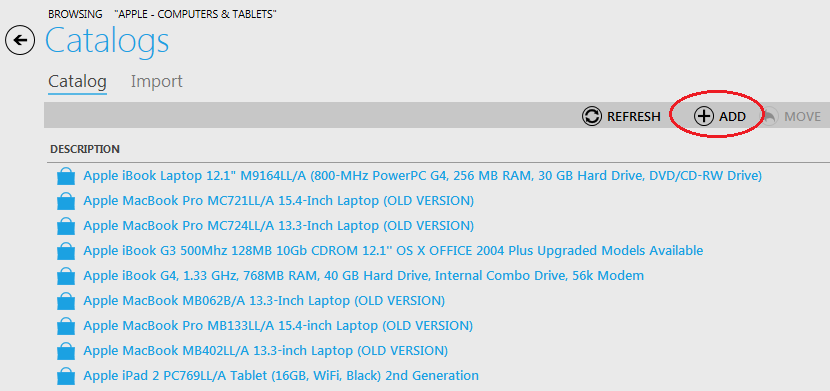

---
title: Creating, Editing, Deleting a Bundle
description: Creating, Editing, Deleting a Bundle
layout: docs
date: 2015-03-18T20:11:12.560Z
priority: 1
---
Product bundling is usually used in IT marketing - that involves offering several products for sale as one combined product.

A bundle is an item that consists of one or more items that are sold as a single unit. An item can be a product or another bundle. Bundles can be searched for in the Virto Commerce Manager and stores as a common items. They have associated Search Engine Optimization terms and merchandising associations assigned to them. When an inventory needs to be tracked, it is organized either by bundle or by the items within it, according to the business policy of your company.

Virto Commerce Manager allows creating bundles and make them available in the store.

## Creating a Bundle

Navigate to the category where you would like to add a bundle to. Use "Add" button.

Select a type of an item - Bundle. On the first step of creating fill in the following fields:

* **Item Name** - a descriptive name of the bundle.
* **Item Type** - select type from the drop-down list.
* **Can be purchased** - select this check box to allow this bundle to be purchased.
* **Store visible** - select this check box to let this bundle appear in the store.
* **Min. Quantity** - minimum quantity of bundle that must be ordered by a customer.
* **Max. Quantity** - maximum quantity of bundle that must be ordered by a customer.
* **Enable Date/Time** - date and time when the bundle will be available in the store. Useful for seasonal products.
* **Disable Date/Time** - date and time when the bundle will be unavailable in the store. Useful for seasonal products.

On the second step enter editorial review information. This step is not required an can be skipped.

On the step 3 enter property values.

On the step 4 enter pricing information (select price list from the drop-down) and click "Finish".

## Editing a Bundle

To edit a bundle double click on it and make all the modifications you need. Then click "Save".

## Deleting a Bundle

To delete a bundle, click on it in the category and use "Remove" button. In case you need to delete multiple bundles, use Ctrl key to select them.

If a bundle is included into incomplete orders, it cannot be deleted. The bundle can be deleted after the orders statuses have been changed to Complete.
