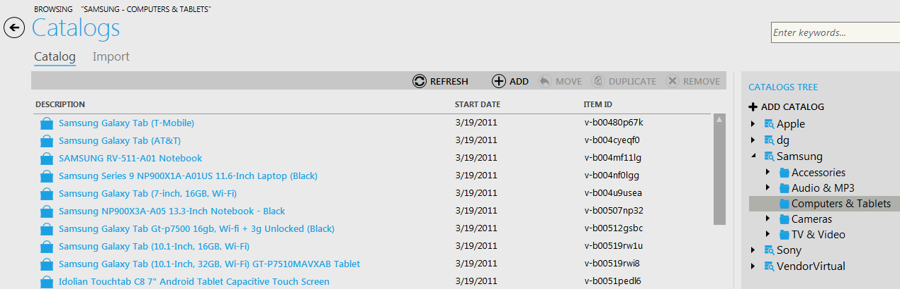
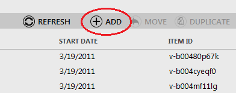
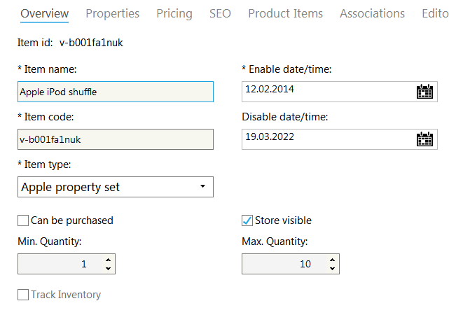
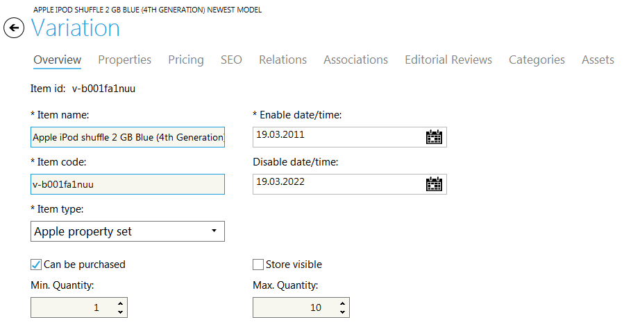
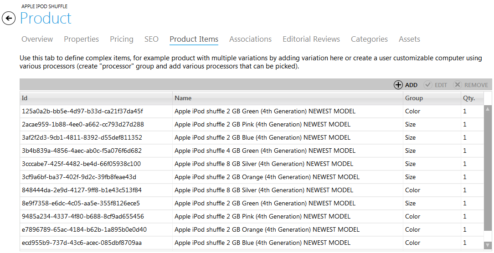
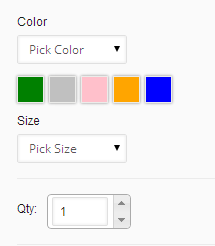

---
title: Creating, Editing, Deleting a Product
description: Creating, Editing, Deleting a Product
layout: docs
date: 2015-03-18T20:11:12.560Z
priority: 3
---
A product in the Commerce Manager is a real-life product. Each product has its special characteristics, can be sold, and belongs to a certain item type group. A product type defines how a particular set of products are displayed, the Tax Codes that apply to it and the attributes and SKU options that are available for products of that type.

## Creating a Product

Navigate to the category that will contain new product. The list of products within a category is displayed on the left.

To create a product use "Add" button.

Select the type of item - Product - to create.

On the first step enter product details:

1. **Item Name**В - a descriptive name of the product.
2. **Item Type**В - select type from the drop-down list.
3. **Can be purchased**В - select this check box to allow this item to be purchased.
4. **Store visible**В - select this check box to let this product appear in the store.
5. **Min. Quantity**В - minimum quantity of product that must be ordered by a customer.
6. **Max. Quantity**В - maximum quantity of product that can be ordered by a customer.
7. **Enable Date/Time**В - date and time when the product will be available in the store. Useful for seasonal products.
8. **Disable Date/Time**В - date and time when the product will be unavailable in the store. Useful for seasonal products.

On the second step enter editorial review information. This step is not required, you can skip it.

On the step 3 enter property values. On the step 4 enter pricing information (select price list from the drop-down) and click "Finish".

New product will appear in the chosen category.

## Editing a Product

To edit a product from the category in your catalog, double click on it and in the displayed product window make all the modifications you need.

## Deleting a Product

To delete a product from a category click on it in the category and use "Remove" button. Deleting a product also removes prices for it from all price lists containing that product.

This way you can delete multiple products - just use Ctrl to select items to be removed.

## Creating a Product with Variations sample

There is a product in the sample "Apple" store "apple ipod shuffle"В where you can pick color and size options.

Below is described the way to do such a product.

Create a product that will be the "parent" for all the variations of the product. Check the "Store visible" checkbox and don't check the "Can be purchased" checkbox, so the product could be available under the store but couldn't be purchased directly.

Next create variations of the product with available options of the properties that can be selected. That is color and size in the sample product. Check "Can be purchased" and don't check "Store visible" for variations, so they could be purchased but couldn't be browsed directly, only by selecting the options of the "parent" product.

Then go to the "parent" product, select the "Product Items" tab. And add all the created variations to the list of product items. Grouping them by property name. In the sample that is "Size" and "Color" properties.

The variations will be grouped by the grouped properties, and will be available in the frontend like that:

