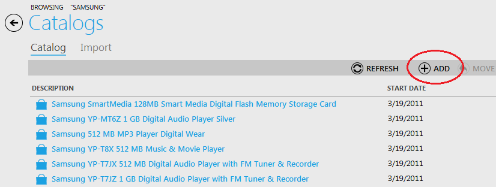

---
title: Creating, Editing, Deleting a Variation
description: Creating, Editing, Deleting a Variation
layout: docs
date: 2015-03-18T20:11:12.560Z
priority: 4
---
The product variations are a way of giving your customers variations of options to choose from for your products. Each product can have multiple variations.

A variation could be size, quantity, color, shape, pattern, weight, etc. Any type of variation that you could possibly thing of. They are different options for your product. Each variation has variation options.

## Creating a Variation

Navigate to a category where you would like to add a variation. Use "Add" button.

Then select "Variation" item type and click "OK".

On the step 1 define values for the following fields:

* **Item Name**В - a descriptive name of product variation;
* **Item Type**В - select a type from the dropdown list;
* **Enable Date/Time**В - date and time when the product variation will become available in the store. Useful for seasonal products.
* **Disable Date/Time**В - date and time when the product variation will become unavailable in the store. Useful for seasonal products.
* **Can be purchased**В - select this check box to allow this product variation to be purchased;
* **Store visible**В - select this check box to let this product variation appear in the store;
* **Min. Quantity**В - minimum quantity of product variation that must be ordered by a customer;
* **Max. Quantity**В - maximum quantity of product variation that must be ordered by a customer;
* **Tax Category**В - select tax category that will be applied for this product variation;
* **Packaging**В - select an option of packaging for this product variation;
* **Availability**В - select an option when this product variation will be available in the store;
* **Weight**В - enter displayed weight for the product variation;
* **Track inventory**В - select this check box in case you need to control this product variation inventory.

Click "Next" to move to the following step.

On the step 2 fill editorial review information for new product variation. Click "Next".

On the step 3 enter property values. Then click "Next".

On the step 4 define pricing information. Click "Finish" to save new variation in the system.

## Editing a Variation

To edit a variation, double click on it and make all the modification you need. DOn't forget to click "Save" when all is done.

## Deleting a Variation

To delete a variation, click on a item to be deleted and use "Remove" button.

In case you need to delete multiple items, use Ctrl to select them.
