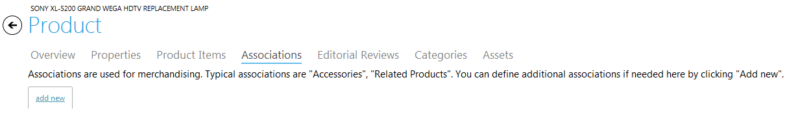
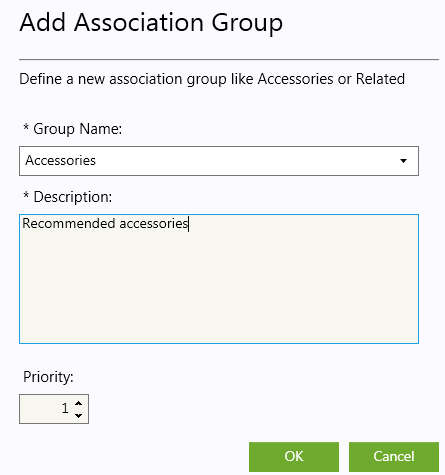
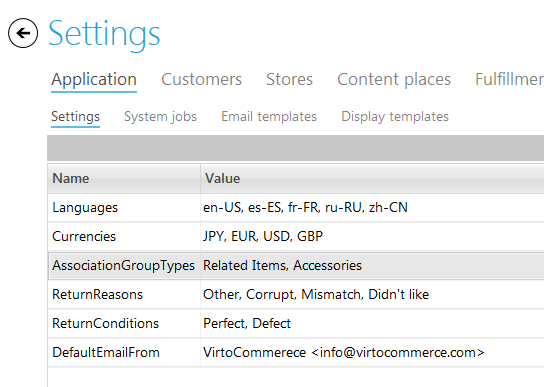

---
title: Creating product associations
description: Creating product associations
layout: docs
date: 2015-03-18T20:11:12.560Z
priority: 5
---
Product Associations are used to show related products, accessories and other types of items for a customer when he views a product page. The administrators define which types of products will be displayed as associated with an item.

This refers to marketing policy and increasing the average check of a customers shopping cart since customers start buying similar products of a higher price or add different accessories to the selected good.

## How the associations can be used

1. **Creating cross sells and up sells.**

Cross sells offer alternative goods that are similar to the product the customer is viewing. This is the way to promote overstocked items.

**Example**: a customer viewing a TV Samsung LN32D403 can be recommended overstocked TV Samsung LN37D550.

Up sells promote similar items for a higher price, more expensive ones. These could be higher-end products.

**Example**: a customer viewing digital camera Samsung for $149.00 and can be recommended a similar but more expensive Samsung edition for $199.00.

2. **Adding accessories.**

You can promote complementary products for the goods that are currently being viewed. This approach makes shoppers add more products to their shopping carts.

**Example**: a customer viewing a bicycle can be offered special equipment, such as helmet, bike suit and bike glasses.

3. **Making replacements.**

When a customer is viewing a product and finds out it is overstocked, he can leave the shop and not add any items to his cart. In this case substitute goods are offered.

**Example**: a customer can be offered a similar model of a cell phone instead of the one that occurred to be out of stock.

## How to create product associations

Open a product in a Virto Commerce catalog and in the "Associations" tab use "Add new" button to define a new association group.

Then fill in the form with name and description. This association group will be able to use for products in your catalog.

Association groups that are planned to be used in your online shop according to your company policy can also be added in the "Settings" of Virto Commerce Manager.

