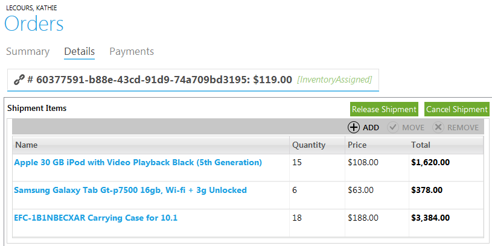

---
title: Order details
description: Order details
layout: docs
date: 2015-03-18T20:11:12.560Z
priority: 2
---
## Introduction

To view order information, double-click it in the "Orders" block of Commerce Manager. Full order information is divided into three tabs.

Actions available from order details dialog **Summary** tab:

* Place order "On Hold"
* Release order Hold
* Cancel order
* Create return
* Create exchange order
* Create refund
* Edit customer information
* Edit order billing address

**Summary** tab contains basic information about the order. This overview usually helps customer service representatives make a picture of the order and assist customer who placed it. Here you cal also find customer's billing address and contact information.

**Details** tab contains shipping information: which items will be included into the shipment, where it will be delivered and what will be the cost for the items and their shipment.

Actions available from **Details** tab:

* Release shipment
* Cancel shipment
* Add shipment
* Move item to another shipmen
* Send item to another shipping address
* Change shipment method
* Remove shipment
* Change shipping method/address
* Edit shipping address

**Payments** tab displays the list of payments (transactions) within the current order.

## Create Exchange Order

To create an exchange order, user must have an appropriate permission and the order must be in a state of Complete. Creating exchange order combines two separate activities:

* Create return
* Place an order

## Adding, Editing and Removing Items in the Shipment

To add an item into a shipment, open Details tab and use "Add" button. In the add shipment item dialog select catalog where the item will be taken ordered from, define the SKU with help of Search function and then add item from the full list to the cart list.

To edit an item in the shipment, choose it in the list of shipment items and use "Move" button.
 
The actions you can do with shipment items:
 
* Move to another shipment;
* Choose another shipping address;
* Change shipment method;
* Change quantity.
 
To remove an item from a shipment, choose item that you need to remove and use "Remove" button.

## Releasing Shipment

According to the fulfillment lifecycle of Virto Commerce Manager, a shipment is released for pick or pack by a Customer Service Representative (CSR) and then included into the picklist and packed.

To release a shipment, open order details and use "Release Shipment" button.

After that the shipment will be ready for adding to picklist and packing.

## Canceling Shipment

There may be occasions in the web store when shipment has to be canceled. This state is set when a shipment cannot be shipped on account of several reasons - for instance, the inventory was marked as available one but after the check-up was not found. Or supplier declined the shipping because of weather conditions and etc.

In Virto Commerce Manager shipment can be set to "Canceled" state from any other state except "Shipped". To cancel a shipment, open the order details and use "Cancel Shipment" button in "Details" tab.

## Refunds

Refund is a special type of payment when money is transferred back to a buyer. Typically a refund is initiated as a consequence of an item return. It's also possible to issue a refund because of other reasons, without a return. Refund must be credited to the purchase medium used in the original purchase. In special situations, you may issue a refund to a new payment source. For example, if the buyer used a now-expired credit card for the purchase, you may issue the refund to a new credit card.
 
To create a refund, you must have appropriate permission and the order must be in a status of Complete.
 
Steps to create refund:

1. Open **Orders** module, select an Order from the list and open it.
2. Click **Refund** button inside **Summary** tab. 
3. A 2-step wizard appears. Enter refund amount, select a refund option: original source or a new credit card:
  
4. Fill all new credit card data if Refund to a new credit card was chosen.
  
5. Click **Next**. In the next step of the wizard carefully recheck the payment data and click **Submit** to issue the payment.
  
6. Payment data is processed and operation result is displayed shortly. If the transaction succeeded, the **Back** button disappears and **Finish** button gets enabled. All data is saved, a new payment is added to the list inside the order **Payments** tab. Click **Finish**. An example of successful transaction:
  
7. A payment could fail because of various reasons. In such case the error message is displayed:
  
8. Click **Back** to correct the payment data or **Cancel** to withdraw.

## Viewing Payment Details

Every order in the Virto Commerce Manager includes "Payments" tab that contains payment history and summary. Go to an order details and open "Payments" tab to view payment details.

* **Payment method** - the way transaction was made through (credit cards, electronic money, purchase orders, international payment systems, and etc. according to the list of payment methods accepted in your store.
* **Transaction type** - type of operation according to cash flow (credit, sale, refund, store bonuses accounting and etc.)
* **Amount** - the sum of transaction in applied currency.
* **Status** - the state of transaction (failed, completed, in progress and etc.)

Besides the list of transaction here you can find summary information with total order cost, paid sum and balance due.

The information in this order tab can be used by a CSR, for instance when a customer wishes to find out the reason why the order is not being processed yet. This may be occurred by failed payment transaction. In this case the CSR may refer to a specialist who is charge of payment control in the store to resolve the issue.
