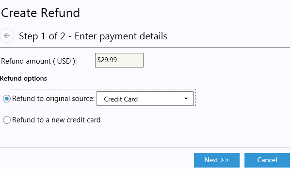
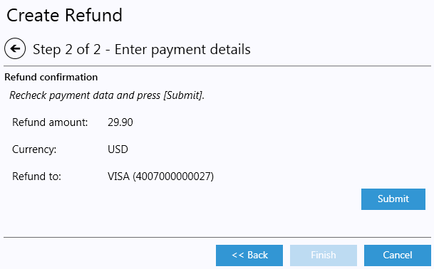
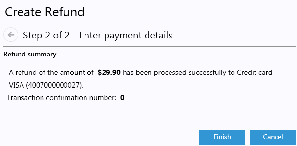
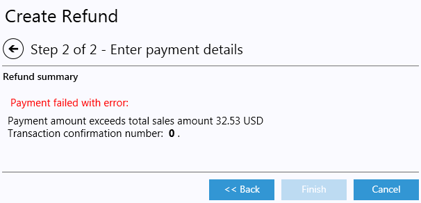

---
title: Refunds
description: Refunds
layout: docs
date: 2015-03-18T20:11:12.560Z
priority: 3
---
## Introduction

Refund is a special type of payment when money is transferred back to a buyer. Typically a refund is initiated as a consequence of an item return.В It's also possible to issue a refundВ because of other reasons, without a return.В Refund must be credited to the purchase medium used in the original purchase.В In special situations, you may issue a refund to a new payment source. For example, if the buyer used a now-expired credit card for the purchase, you may issue the refund to a new credit card.

## Creating a refund

To create a refund, you must have appropriate permission and theВ order must be in a status of Complete.

Steps to create refund:

1. Open **Orders** module, select an Order from the list andВ open it.
2. Click **Refund** button inside **Summary** tab.В 
3. A 2-step wizard appears. Enter refund amount, select a refund option: original source or a new credit card:
  
4. Fill all new credit card data if Refund to a new credit card was chosen.
  
5. Click Next. In the next step of the wizard carefully recheck the payment data and click **Submit** to issue the payment.
  
6. Payment data is processed and operation result is displayed shortly. If the transaction succeeded, the **Back** button disappears and **Finish** button gets enabled. All data is saved, a new payment is added to the list inside the order **Payments** tab. Click **Finish**. An example of successful transaction:
  
7. A payment could fail because of various reasons. In such case the error message is displayed:
  
8. Click **Back** to correct the payment data or **Cancel**В to withdraw.
