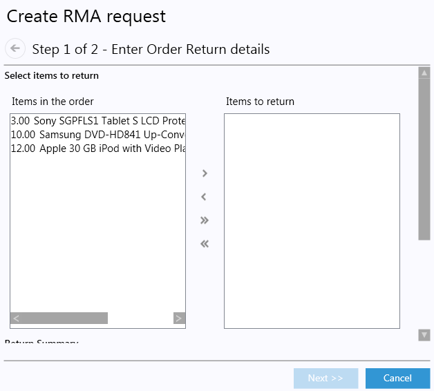
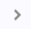
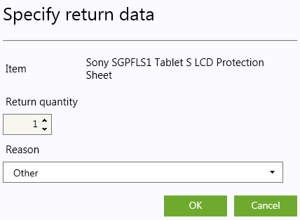
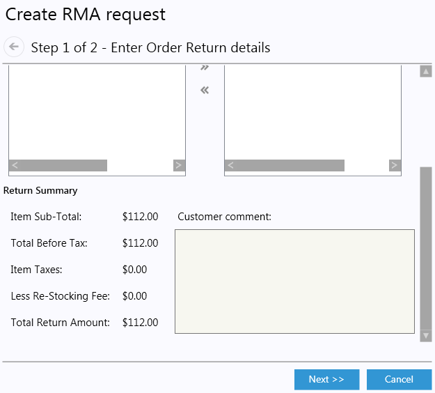
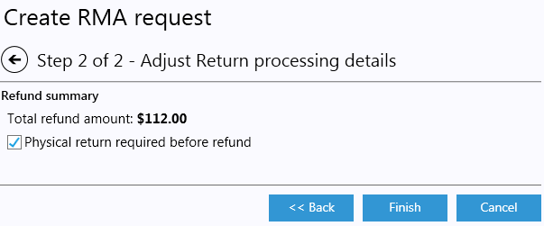
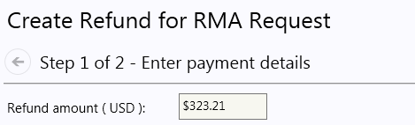
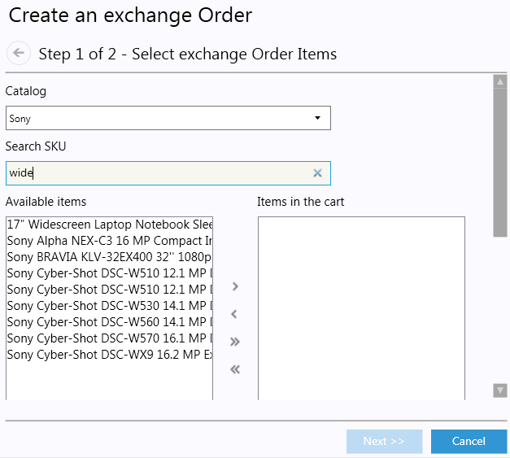

---
title: Return / Exchange
description: Return / Exchange
layout: docs
date: 2015-03-18T20:11:12.560Z
priority: 3
---
## Introduction

A positive experience delivered to a customer determines whether that customer will come back or not. Online shop can enhance the user experience prior to purchase but focus on the post-purchase experience is the most important part in keeping the quality of service at satisfactory levels. Commerce Manager users may perform returns from **Orders** module and returns are processed in **Fulfillment** module.

User must have an appropriate permissions to create a return or exchange. The system automatically creates a unique code, called the Return Merchandise Authorization (RMA) code, for all such transactions. Typically, the RMA number is recorded on the physical return to assist fulfillment center employees in matching the receipt of the return to the correct customer account.

## Create return

To create a Return, user must have appropriate permission and the order must be in a status of **Complete**. Steps to create a return: 

1. Open **Orders** module, select an Order from the list and open it.
2. Click **Create return** button inside **Summary** tab.
3. A 2-step wizard appears. **Items in the order** list contains bought items with quantities. **Items to return** list contains returning items:
  
4. Select an item from the list and press
  
  button. Tip: alternatively can double-click on item.
5. A "Specify return data" dialog pops up:
  
6. Specify **Return quantity** and **Reason** fields. Press OK to confirm.
7. A new record is added to **Items to return** list (or updated an exchsting one). It displays Quantity, Item name and return reason. Also the "Return summary" section underneath the list is updated:
  
8. Enter **Customer comment**, if any.
9. Click **Next**. "Adjust Return processing details" step is displayed:
  
10. **Total refund amount** is repeated from previous step. User can specify whether a **Physical return** is **required before refund**. This option is checked by default.
11. Click **Finish**. A new RMA request created is saved in DB automatically. Also, the **Return / Exchange** tab is activated.

## Cancel return

RMA request processing can be canceled at any state except it's in state of **Completed**. Steps to cancel:

1. Select the right RMA request to cancel inside **Return / Exchange** tab.
2. Click **Cancel** button inside selected RMA request. The return is set state of **Canceled**.

## Complete return

RMA request processing can be completed if it's in a state of AwaitingCompletion. Steps to complete:

1. Select the right RMA request to complete inside **Return / Exchange** tab.
2. Click **Complete** button inside selected RMA request. If Refund is needed, a "Create Refund for RMA Request" wizard is displayed. This is a "Create Refund" wizard with a **Refund amount** field set to RMA request total return amount initially:
  
3. Follow Refunds instructions for completing the refund.
4. If refunding succeeded, then:
  * the RMA request state is set to Completed;
  * changes are saved;
  * order payments list is updated.

## Create exchange order

To create an exchange order, user must have an appropriate permission and the RMA request must be in a state of **AwaitingStockReturn** or **AwaitingCompletion**. Steps to create an exchange order:

1. Select the right RMA request to create an exchange inside **Return / Exchange** tab.
2. Click **Create Exchange Order** button inside selected RMA request.
3. A 2-step wizard "Create an exchange Order" appears. In the wizards step 1 select items (Products) to buy: Select catalog, enter search keyword and add items to a cart. **Available items** list contains (filtered) available items to buy. **Items in the cart** list contains current shopping cart items:
  
