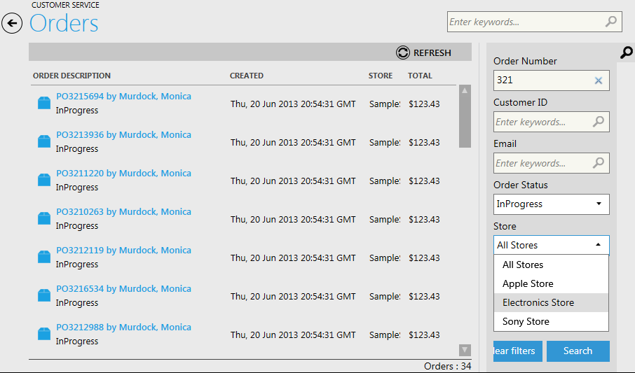

---
title: Searching for an Order
description: Searching for an Order
layout: docs
date: 2015-03-18T20:11:12.560Z
priority: 4
---
Usually the list of orders in a web store is very large. This means that Commerce manager users with access to the list need to use search tools to find required order. This especially concerns CSRs who need for instance to view orders while customer's calling and etc.

Use search filters on the right in "Orders" block to find an order. Here you can enter keywords to search by:

* Order number
* Customer ID
* Email

Or select order status or store in dropdown filters.

