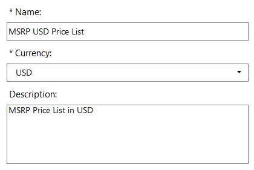
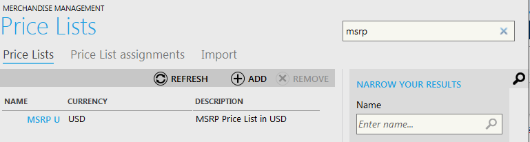
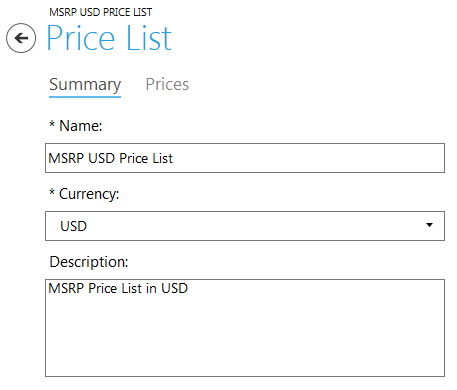
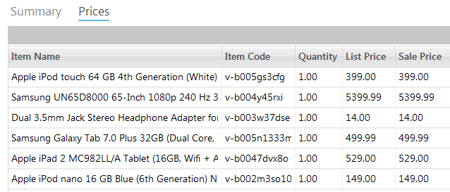

---
title: Price lists - Virto Commerce 1.13 User Guide
description: Price lists
layout: docs
date: 2015-03-18T20:11:12.560Z
priority: 9
---
## Introduction

In the Virto Commerce Manager, a price list is a set of pricing details that can be assigned to items. All prices are stored in a price list, which is associated with a catalog and a currency. The item (SKU) code links the price in a selected price list to the item inside catalog. Moreover it is possible to configure prices for an item in it's details view directly.

When a customer views an item in the storefront, applied pricing settings are showcased as item's price.

Price lists are managed in "Price Lists" block:

## Creating and deleting a Price List

Click "Add" button in the Price Lists block in order to create a price list. Fill in the required fields (Name, Currency) and Description where:

* **Name** - descriptive name for the price list;
* **Currency** - currency to be used in this price list. Pick one from the currencies drop down (according to the list of currencies available in the system);
* **Description** - brief or full description of the price list. For instance, your price list will be applied for Manufacturer's Suggested Retail Prices (MSRP).

Prices for items are added later to this price list.

In order to delete a price list, select it and click "Remove".

## Searching for Price Lists

When the list of existing price lists is too long, a necessary price list can be found using a "quick search" tool on the top right corner. More precise search is situated on the right side where filtering by Name and Currency is available:

## Viewing a Price List

Use any search tool to detect the necessary price list. Double-click it to open detailed view. Price list details dialog has two tabs - "Summary" with price list overview information and "Prices" where the pricing options for items are defined:

Summary tab contains a descriptive name of the price list, selected currency (according to currency options applied in your shop) and description of the price list.

Prices tab shows the list of items' prices. The table includes Item name, code, quantity for defined price, list price and sale price.

**Item Name** - the name of an item for which the price will be applied.

**Item Code** - code (SKU code) of the item according to your system policy.

**Quantity** - minimum quantity of the item that must be ordered for the List or Sale price to take effect. Every item should have one price list entry with a quantity `1` to provide a default price.

**List Price** - this is often Manufacturers Suggested Retail Price (MSRP). In case this is the only price list entry for the item, this price will be the default price.

**Sale Price** - not required, usually this amount would be the offered selling price of the store as opposed to the MSRP specified in the List Price field.

## Managing Prices

When the price list is created in the Virto Commerce Manager, you need to define which items will be included in this price list and what prices will be defined for them. Open the price list and activate "Prices" tab. Click "Add" button to create a new price entry.

Then fill in the following dialog:

**Item** - pick the item from the existing items in your catalogs (using "..." button). Search for the required item, select it and click "Choose":

**List price** - often this is MSRP (Manufacturers Suggested Retail Price). If this is the only price list entry for the item, this price will be the default price.

**Sale price** - the price you offer this item in your store for.

**Min. Quantity** - should be at least "1". Minimum quantity of the item that must be ordered for the List or Sale price to take effect.

Double-click the price entry in the prices list to update it.

Select the necessary price in the prices list and click "Remove" button to delete it.

In case you delete a product/SKU from a catalog, all price list entries for that product/SKU are automatically deleted from the corresponding price list.

## Managing Price List Assignments

When price lists are created, you need to create Price List Assignments in order to link them to a specific catalog. Price list assignment identifies the price list from which a product price is shown for customers. Moreover, price list assignments can do much more than simply provide default list and sale prices for items. This feature allows you to provide custom prices to targeted customers according to customer's characteristics such as age, gender, geographic location and searched terms.

For instance, you can create two different price list assignments. Each of them could provide different prices for customers based on the customers attributes, such as age. So, customers with student profile might receive deeper price discounts on laptops of economy class, while customers of 35 and older could get preferred pricing on luxury options of laptops.

How does it work? The set of price lists is assigned to a customer. For example, Price List A has prices for all products in a catalog and is assigned to all customers. Price List B has different prices for certain products and is only assigned to customers with special characteristics (as defined in the price list assignment). Price List B is configured with a higher priority than Price List A. When a customer visits the storefront, the system builds the customer's set of price lists by evaluating the price list assignment conditions of all price lists. According to this set some customers have a set containing only Price List A. Other customers have both price lists A and B. When the customer views a product, the system examines the price lists in the set and displays the price from the price list with the highest priority. If the price list does not contain a price for that item, then the system will descend the price list stack until it locates a price list that contains a price for the item.

To define the conditions under which a particular price list will be shown, you need to determine:

* who will have access to the price list (customers of what age, gender, and location);
* When this price list will be available (the period of time that the price list is active);
* where this price list will be available (in which store or stores).

In order to create a price list assignment activate "Price List Assignments" tab in the "Price Lists" block. Then click "Add" button:

A 3 steps "Create Price List Assignment" wizard is displayed.

On the first step fill in the following fields:

* **Name** - descriptive name of the price list assignment;
* **Price List** - select a price list from the drop down. This price list will be used to retrieve prices when the conditions are met for this price list assignment.
* **Catalog** - choose a catalog that will be used for the selected price list.
* **Priority** - define whether this price list assignment will take precedence over other applicable price list assignments.
* **Description** - brief or full description of the price list assignment.

On the second step you need to define price list assignment availability conditions. Click "+ add condition" button to build the scheme of conditions that will be applied to the new price list assignment. For example, you need this price list to work for women aged from 18 to 25. At this stage you define **who** will have access to this price list.

On the step 3 define **when** this price list will be available. Use date picker to define enabling and expiration dates of the new price list assignment. In case you leave these fields empty, it will always be available.

In order to edit price list assignment, double-click it in the list of assignments and make necessary modifications.

In order to delete an assignment, select it in the list of price list assignments and click "Remove" button.
