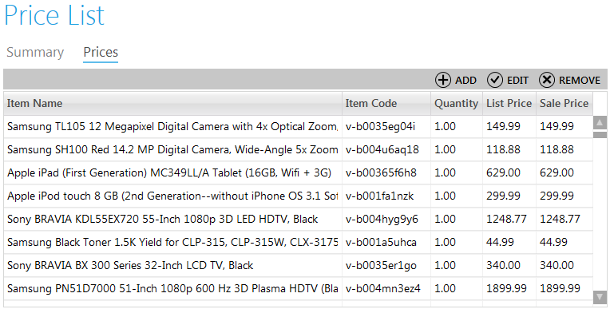
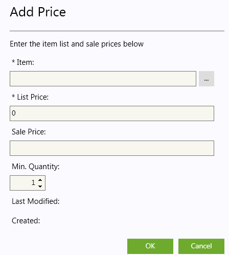
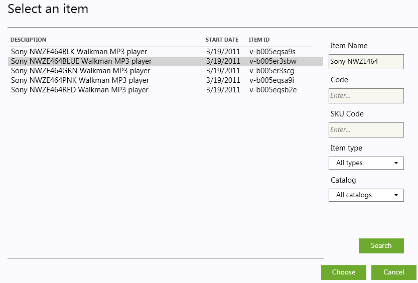

---
title: Adding, Editing, Removing Prices
description: Adding, Editing, Removing Prices
layout: docs
date: 2015-03-18T20:11:12.560Z
priority: 1
---
## Adding Prices

When the price list is created in the Virto Commerce Manager, you need to define which products will be included into this price list and what prices will be defined for them. To add prices double-click required price list or use serach tool before to find required item. Then open "Prices" tab. Use "Add" button" to create new price entry.

Then fill in the following fields.

**Item** - select it from the list of product items in your catalog (using "..." button). Search for required item and use "Choose" button".

**List price** - often this is MSRP (Manufacturers Suggested Retail Price). If this is the only price list entry for the product, this price will be the default price.

**Sale price** - the price you offer this product in your store for.

**Min. Quantity** - should be at least "1".Miinimum quantity of the item that must be ordered for the List or Sale price to take effect.
