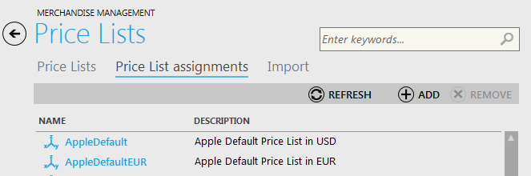
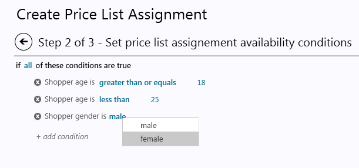

---
title: Creating Price List Assignments
description: Creating Price List Assignments
layout: docs
date: 2015-03-18T20:11:12.560Z
priority: 3
---
## Price List Assignment

When price lists are created, you need to create Price List Assignments in order to link price lists to products for a specific catalog. Price list assignment identifies the price list from which a product price is shown for customers. Moreover, price list assignments can do much more than simply provide default list and sale prices for products. This feature allows you to provide custom prices to targeted customers according to customer's characteristics such as age, gender, geographic location and searched terms.

For instance, you can create two different price list assignments. Both of assignments will provide different prices for customers based on the customers attributes, such as age.So, customers with student profile might receive deeper price discounts on laptops of economy class, while customers who are 35 years of age and older will get preferred pricing on luxury options of laptops.

How does it work? The set of price lists is assigned to a customer. For example, Price List A has prices for all products in a catalog and is assigned to all customers. Price List B has different prices for certain products and is only assigned to customers with special characteristics (as defined in the price list assignment). Price List B is configured with a higher priority that Price List A. When a customers visits the storefront, the system builds the customer's set of price lists by evaluating the price list assignment conditions of all price lists. According to this set some customers have a set containing only Price List A. Other customers have both Price List A and B. When the customer views a product, the system examines the price lists in the set and displays the price from the price list with the highest priority. If the price list does not contain a price for that product, then the system will descend the price list stack until it locates a price list that contains a price for the product.

To define the conditions under which a particular price list will be shown, you need to determine:

* who will have access to the price list (customers of what age, gender, and location);
* when this price list will be availble (the period of time that the price list is active);
* where this price list will be available (in which store or stores)

## Creating Price List Assignment

To create a price list assignment navigate to the "Price Lists" block of Virto Commerce Manager and open "Price List Assignments" tab. Use "Add" button to create new asignment.

Then follow 3 steps of price list assignment creating.

On the first step fill in the following fields:

* **Name** - descriptive name of the price list assignment;
* **Price List** - select a price list from the drop down. This price list will be used to retrieve prices when the conditions are met for this price list assignment.
* **Catalog** - choose a catalog that will be used for the selected price list.
* **Priority** - define whether this price list assignment will take precedence over other applicable price list assignments.
* **Description** - brief or full description of the price list assignment.

On the second step you need to define price list assignment availability conditions. Use "Add condition" button to build the scheme of conditions that will be applied ti the new price list assignment. For example, you need this price list to work for women aged 18 to 25 years. On this stage you define **who** will have acces to this price list.

On the step 3 define **when** this price list will be available. Use date picker to define enable and expiration dates of the new price list. In case you leave this fields empty. the price list will always be available.

## Editing Price List Assignment

To edit price list assignment, double-click in in the list of assignments and make required modifications.

## Deleting Price List Assignment

To delete an assignment, choose in the list of price list assignments and use "Remove" button.
