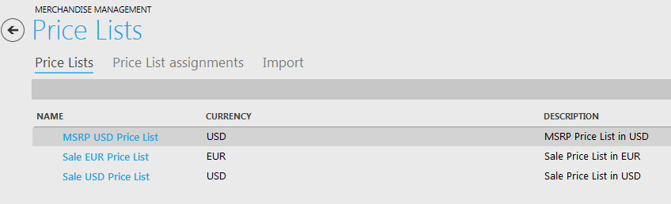

---
title: Viewing a Price List
description: Viewing a Price List
layout: docs
date: 2015-03-18T20:11:12.560Z
priority: 5
---
Price lists are created with help of "Price Lists" block where all price lists are stored. Products and SKUs are added later to these price lists and customers see the price applied for products that being viewed.

To view all the price lists open "Price Lists" block.

You can add price lists and manage them with "Add" and "Remove" buttons.

To view a price list double-click it. Each price list has two tabs - "Summary" with price list overview information and "Prices" where the pricing options for products are defined.

Summary tab contains descriptive name of the price list, selected currency (according to currency options appplied in your shop) and description of the price list.

Prices tab shows the list of products and their prices. The table includes Item name, quantity for defined price, list price and sale price.

**Item Name** - the name of a product for which the price list will be applied.

**Item Code** - code of the product according to your system policy.

**Quantity** - minimum quantity of the item that must be ordered for the List or Sale price to take effect. Every item should have at least one price list entry with a quantity `1` to provide a default price.

**List Price** - this is often Manufacturers Suggested Retail Price (MSRP). In case this is the only price list entry for the product, this price will be the default price.

**Sale Price** - not required, usually this amount would be the offered selling price of the store as opposed to the MSRP specified in the List Price field.

