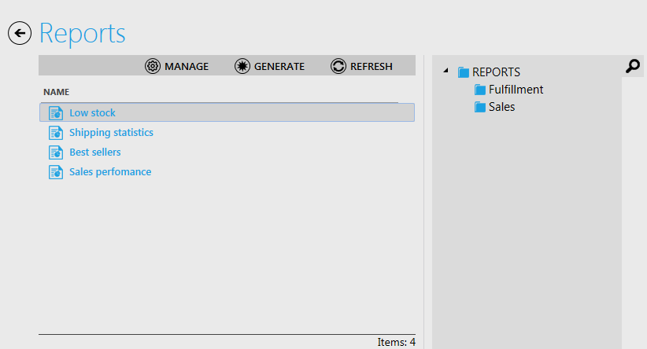
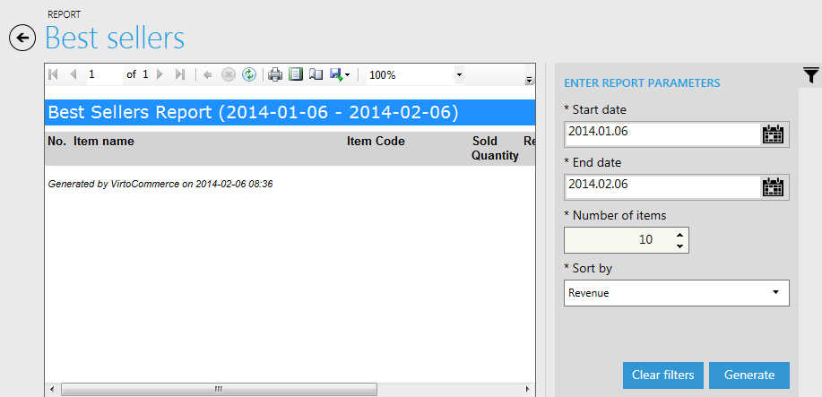
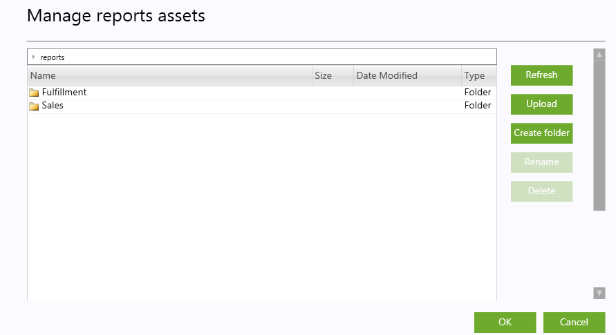

---
title: Reporting - Virto Commerce 1.13 User Guide
description: Reporting
layout: docs
date: 2015-03-18T20:11:12.560Z
priority: 13
---
## Introduction

Reporting module is accesible from top menu. The module shows list of reports that are uploaded to Virto Commerce storage. It also allow to generate report preview, print it or export data to PDF, Excel or Word file.В User must have appropriate permission to view this module and list of reports, generate and manage them (seeВ [Available Permissions](docs/old-versions/vc113userguide/users-management-roles-and-role-assignment/available-permissions)).

## View reports list

Reports view shows list of reports files.The right part of the page contains the tree of folders. By selecting a folder, the list will show reports that are placed in selected folder and its subfolders. There are three buttons on top of the list:

* Manage. Opens assets manager.В See section below for more details.
* Generate. Generates data for selected report and shows its preview page. See section below for more details.
* Refresh. It renew list of reports and folders.

## Generating report

Double click on reports in the list or click "Generate" button. That will show preview of report. If it has parameters then they will be shown on the right of the page. Parameter is mandatory if its name starts with В "*". Buttons "Clear filters" restore parameters values to default. Button "Generate" prepares reports with provided parameters values. Even if parameters were not changed it will simple requery report data.

There are toolbar on top of report viewer. It provides additional functions over report preview:В select page, zoom, print, change layout mode, change page settings, export data to selected format file.

## Manage reports

This function requires special permission "Manage reports". It opens assets manager which helps to manage reports files and folders

Asset Manager shows Reports storage content. Here you navigate to needed folder and upload there a report file. It also allows to create folders, rename folder or report name, delete them. Folder is selected to delete, then all folder content with reports file and subfolders will be deleted automatically.
