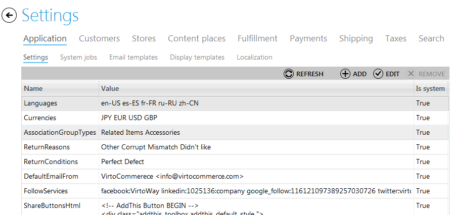
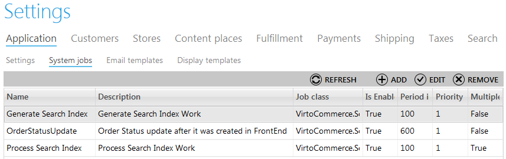
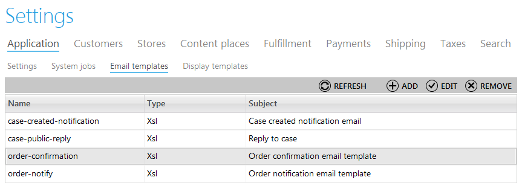
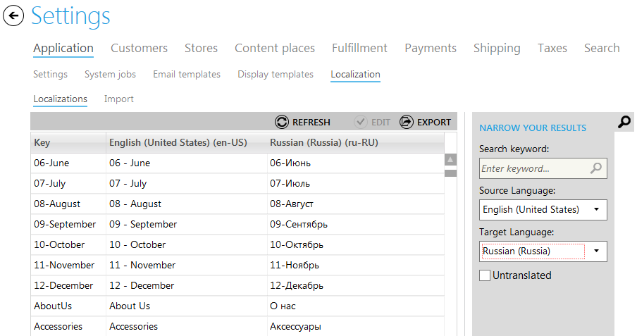
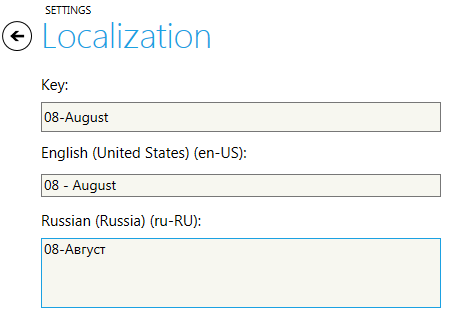
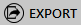

---
title: Application settings
description: Application settings
layout: docs
date: 2015-03-18T20:11:12.560Z
priority: 2
---
## Introduction

Application settings include setting up languages and currencies, types of association groups, return reasons, customize system jobs, adjust email templates and create templates for displaying content in the store. To find this block open "Settings" module and click "Application".

These settings are grouped into tabs by their means for quick and easy navigation to required settings block. Here are the tabs:

* Settings (include basic configuration settings);
* System jobs (the list of jobs applied in the store, for instance, search process);
* Email templates (adjustment of email templates, for instance, hot customers will be notified about their orders);
* Display templates (adjusted templates applied for displaying different objects in the store such as categories, product or product variations);
* Localization (localize frontend labels, messages and other text to system's available languages here).

## Settings

The "Settings" sub-tab is intended for creating and keeping the list of custom settings that can be applied in the frontend or backend. For example available languages list, available Currencies list. Administrator or user with appropriate permissions can add more settings. Settings can be system (or required) that can't be deleted and user settings (not required) that can be deleted. If the setting set as system during creation it can't be set as user setting later in the edit view. So you should be careful in this respect while creating the setting.

To add new setting click "Add" button and fill in all the fields of the wizard. 

To edit a setting, select it in the list by and click "Edit" button. To delete a setting, select it and clidk "Delete" button.

## System jobs

The "System jobs" tab is intended for creating and keeping the list of jobs applied in the store for the most frequently used or essential processes. For instance, this way you can create system job for generation of search Index, define how the status of an order will be updated or adjust search index process.

To add new system job click "Add" button and fill in all the fields shown on two steps of the wizard. The fields are:

* Name - a descriptive name of the system job you create;
* Class type - the type of class applied to this system job according to the system of categorization used in the Virto Commerce by your company;
* Description - description of the process started up with this system job;
* Priority - set the priority to define in which turn this system job will be used;
* Recurrence period - how often the process will be run (set in seconds);
* Is active - use this checkbox to make the system job available for running;
* Allow multiple instances - use this checkbox to run multiple system jobs simultaneously;
* Parameters (name, alias and value of the system job).

To edit a system job, select it in the list by and click "Edit" button. To delete a system job, select it and clidk "Delete" button.

## Email templates

Every online store uses special email templates for sending various notifications to customers in order to inform about changes of status etc. All you need to do is create a code of email message in appropriate format (xsl,html or text) and adjust in the Virto Commerce Manager. Open "Email templates" tab of "Application" block in "Settings" module.  You will see the list of email templates existing in the system.

To add a new email template click "Add" button and fill in all the fields shown on two steps of the wizard. The fields are:

* Name - a descriptive name of the system job you create;
* Type - use appropriate format of email text message (xsl,html or text);
* Body - enter the body text using required format;
* Default language code - use one of predefine language codes that will be used for localized items.
* Subject - subject ot the email message displayed.

To edit an email template, select it in the list and click "Edit" button. To delete a template, select it and click "Remove" button.

## Display templates

The "Display templates" tab contains the list of applied templates created for displaying various objects in the store, such as categories, products, product variations etc.

To add a new display template click "Add" button and fill in all the fields shown on the first step of the wizard. The fields are:

* Name - system name of the template in the data base;
* Template name -  a descriptive name of the system job you create;
* Target type - select a type of the target for which the template will be used. Types are defined earlier;
* Priority - set the priority to define in which turn this template will be used;
* Is active - use this checkbox to make the email templates available for applying;
* Description - description of the template;

Define conditions on the second step and save the template.

To edit an email template, select it in the list and click "Edit" button. To delete a template, select it and click "Remove" button.

## Localization

In the localization tab you can localize the frontend texts to different system's available languages.

In order to localize the frontend to the new language you need to select the source and the target languages in the filter pane.

Then double-click on the entry you want to translate. The entry edit view will open:

Enter the translation and click "Save" button to save the changes.

Another option to localize the frontend would be exporting the list of text to be translated to the CSV file using

button. Translate the saved file in the text editor. After all the text has been translated import it into the system using Localization import funcionality. To import the translation go to "Import" tab which is under Localization tab. Create an import job and run it.
