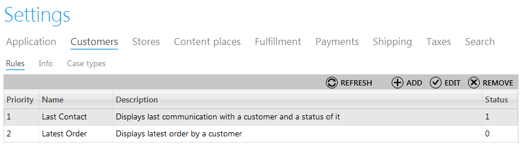
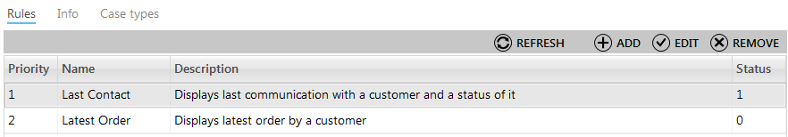
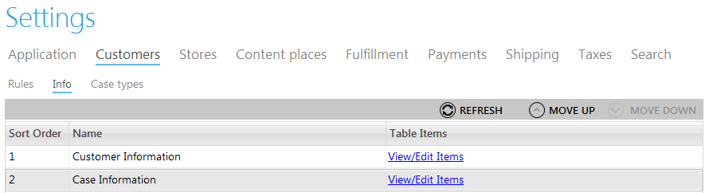
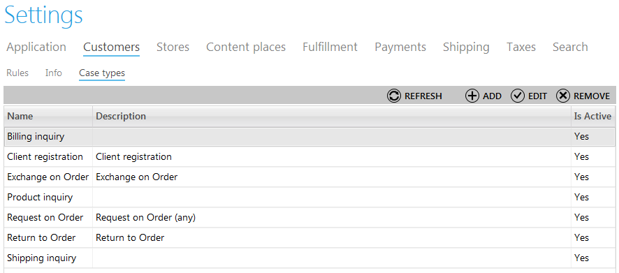

---
title: Customer profile attributes
description: Customer profile attributes
layout: docs
date: 2015-03-18T20:11:12.560Z
priority: 3
---
## Introduction

Customer profile attributes are defined in the "Customers" tab in the "Settings" module. This block of settings is intended for managing alerts sent to customers with help of rules, adjustment all required fileds that will be used for customer profiles and creating case types used for working with customers.

## Creating, Editing and Deleting Rules

The "Rules" tab is intended for creating rules that define conditions of displaying various information, such as contacts, orders and etc. Using these rules users can manage different cases without help of developers. 

To create a rule use "Add" button and fill in all the required fields. The fields are:

* Name - a descriptive name of the rule;
* Description - details of the rule;
* Is active - use this checkbox to make the rule available for applying;
* Priority - define in which turn this rule will be used with others.

Then define conditions that will be applied in this rule, for instance, you wish to send alerts if the status of an order changes to "In process".

To edit a rule, select it in the list and click "EDIT" button. To delete a rule, select in and click "REMOVE" button.

## Viewing and Editing Customer Information

It is required to adjust the list of fields that will be used for customer information (will be viewed or edited by CSRs or other Commerce users). This group of settings is filled in the "Info" tab.

Double click "Customer Information" to edit settings. Here you can add more data fields that will be used for customerВ  information, such as name, contact information, birthday, address etc. This information will be used by CSRs later on. Depending on your store's requirements, you can add any fields and build reporting system then to analyze the effectiveness of your store according to various report results.

Click "ADD" button to add more fields. To edit or remove a field, click it in the list and click "EDIT" ir "REMOVE" buttons accordingly.

## Viewing and Editing Case Information

The fields used for cases in Customer Service module are also managed in the "Info" tab of Settings. 

Double click "Case information" to add or edit data fields used for viewing and editing items in various cases. Click "ADD" and "EDIT" buttons to add and edit fields. This way you can manage case information without any help of system developers. Just decide which data fields are supposed to be used in the Commerce Manager.

## Case Types

The "Customer Service" module also needs to have case types predefined. Later on this will help to differentiate cases and improve effectiveness of customer service. Open "Case types" tab of Customers settings block and find the list of all case types defined in your system. Manage case types by adding new items and editing existing ones. To add a case type, click "ADD" button and enter name of type, use "Is Active" checkbox to make this type available in the list, enter the description and define propertines of the case type.

Examples of case types used in Commerce Manager:

* client registration;
* exchange or order;
* request on order;
* product inquiry;
* shipping inquiry and etc.
