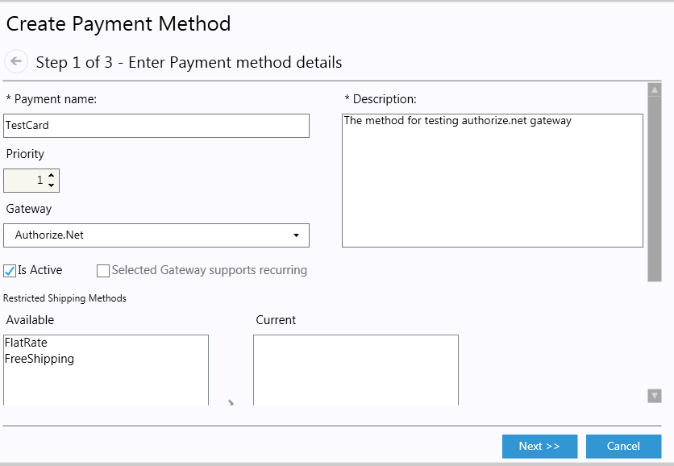

---
title: Payment gateway configuration
description: Payment gateway configuration
layout: docs
date: 2015-03-18T20:11:12.560Z
priority: 1
---
## Introduction

Payment gateway is part of order process used for transferring the actual payment to outside provider that is responsible for completing the payment transaction based on given context. Every payment method must be associated with payment gateway and configuration is based on payment gateway that it uses. Virto Commerece comes with many gateways already setup that use iCharge payment integrator module. For more information visit <a href="http://www.nsoftware.com/kb/help/BPN5-A/intro.rst" rel="nofollow">http://www.nsoftware.com/kb/help/BPN5-A/intro.rst</a>

## Supported gateways

The first thing you must do is select one (or more) of the many gateways supported, and set up an account with that gateway vendor. Once you have an account set up with a valid (or test) login Id and password, you can use that configuration and setup payment method in management tool. Below is the list of supported gateway:

| | |
|-|-|
|Authorize.Net AIM(1)|<a href="http://www.authorize.net" rel="nofollow">http://www.authorize.net</a>|
|eProcessing Transparent Databse Engine(3)|<a href="http://www.eProcessingNetwork.com" rel="nofollow">http://www.eProcessingNetwork.com</a>|
|GoRealTime (Full-pass) (4)|<a href="http://www.gorealtime.com" rel="nofollow">http://www.gorealtime.com</a>|
|Intellipay ExpertLink (6)|<a href="http://www.intellipay.com" rel="nofollow">http://www.intellipay.com</a>|
|iTransact RediCharge HTML (8)|<a href="http://www.itransact.com" rel="nofollow">http://www.itransact.com</a>|
|NetBilling DirectMode(9)|<a href="http://www.netbilling.com" rel="nofollow">http://www.netbilling.com</a>|
|Verisign PayFlow Pro (10)|<a href="https://www.paypal.com/cgi-bin/webscr?cmd=_payflow-pro-overview-outside" rel="nofollow">https://www.paypal.com/cgi-bin/webscr?cmd=_payflow-pro-overview-outside</a>|
|USA ePay CGI Transaction Gateway(13)|<a href="http://www.usaepay.com" rel="nofollow">http://www.usaepay.com</a>|
|Plug 'n Pay (14)|<a href="http://www.plugnpay.com" rel="nofollow">http://www.plugnpay.com</a>|
|Planet Payment iPay(15)|<a href="http://planetpayment.com/" rel="nofollow">http://planetpayment.com/</a>|
|MPCS (16)|<a href="http://merchantcommerce.net/" rel="nofollow">http://merchantcommerce.net/</a>|
|RTWare (17)|<a href="http://www.rtware.net/" rel="nofollow">http://www.rtware.net/</a>|
|ECX (18)|<a href="http://www.ecx.com" rel="nofollow">http://www.ecx.com</a>|
|Bank of America eStores (Form Post)(19)|<a href="http://bankofamerica.com/merchantservices" rel="nofollow">http://bankofamerica.com/merchantservices</a>|
|Innovative Gateway (PHP)(20)|<a href="http://www.innovativegateway.com" rel="nofollow">http://www.innovativegateway.com</a>|
|Merchant Anywhere (Transaction Central) (21)|<a href="http://www.merchantanywhere.com/" rel="nofollow">http://www.merchantanywhere.com/</a>|
|SkipJack (22)|<a href="http://www.skipjack.com" rel="nofollow">http://www.skipjack.com</a>|
|ECHOnline NVP API(23)|<a href="http://www.echo-inc.com" rel="nofollow">http://www.echo-inc.com</a>|
|3 Delta Systems (3DSI) EC-Linx(24)|<a href="http://www.3dsi.com" rel="nofollow">http://www.3dsi.com</a>|
|TrustCommerce API(25)|<a href="http://www.trustcommerce.com" rel="nofollow">http://www.trustcommerce.com</a>|
|PSIGate XML(26)|<a href="http://www.psigate.com" rel="nofollow">http://www.psigate.com</a>|
|PayFuse XML(27)|<a href="http://www.firstnationalmerchants.com/" rel="nofollow">http://www.firstnationalmerchants.com/</a>|
|PayFlowLink (28)|<a href="http://www.verisign.com" rel="nofollow">http://www.verisign.com</a>|
|Paymentech Orbital Gateway V4.3(29)|<a href="http://www.paymentech.com" rel="nofollow">http://www.paymentech.com</a>|
|LinkPoint (30)|<a href="http://www.linkpoint.com" rel="nofollow">http://www.linkpoint.com</a>|
|Moneris eSelect Plus Canada(31)|<a href="http://www.moneris.com" rel="nofollow">http://www.moneris.com</a>|
|uSight Gateway Post-Auth(32)|<a href="http://gateway.usight.com" rel="nofollow">http://gateway.usight.com</a>|
|Fast Transact VeloCT (Direct Mode)(33)|<a href="http://www.fasttransact.com/" rel="nofollow">http://www.fasttransact.com/</a>|
|NetworkMerchants Direct-Post API(34)|<a href="http://www.nmi.com/" rel="nofollow">http://www.nmi.com/</a>|
|Ogone DirectLink(35)|<a href="http://www.ogone.be" rel="nofollow">http://www.ogone.be</a>|
|Concord EFSNet (36) (Depreciated, use LinkPoint)|<a href="https://secure.todaysebiz.com" rel="nofollow">https://secure.todaysebiz.com</a>|
|TransFirst Transaction Central Classic (formerly PRIGate) (37)|<a href="www.transfirst.com" rel="nofollow">www.transfirst.com</a>|
|Protx (38) (Depreciated, use SagePay (67) instead)|<a href="http://www.sagepay.com" rel="nofollow">http://www.sagepay.com</a>|
|Optimal Payments / FirePay Direct Payment Protocol (39)|<a href="http://www.optimalpayments.com/" rel="nofollow">http://www.optimalpayments.com/</a>|
|Merchant Partners (Transaction Engine) (40)|<a href="http://www.merchantpartners.com/" rel="nofollow">http://www.merchantpartners.com/</a>|
|CyberCash (41)|<a href="http://www.cybercash.net/" rel="nofollow">http://www.cybercash.net/</a>|
|First Data Global Gateway (Linkpoint) (42)|<a href="http://www.firstdata.com" rel="nofollow">http://www.firstdata.com</a>|
|YourPay (43) (Depreciated, use Linkpoint (42) instead)|<a href="http://www.yourpay.com" rel="nofollow">http://www.yourpay.com</a>|
|ACH Payments AGI (44)|<a href="http://www.ach-payments.com" rel="nofollow">http://www.ach-payments.com</a>|
|Payments Gateway AGI(45)|<a href="https://www.paymentsgateway.net/" rel="nofollow">https://www.paymentsgateway.net/</a>|
|Cyber Source SOAP API (46)|<a href="http://www.cybersource.com" rel="nofollow">http://www.cybersource.com</a>|
|eWay XML API (Australia) (47)|<a href="http://www.eway.com.au/" rel="nofollow">http://www.eway.com.au/</a>|
|goEmerchant XML(48)|<a href="http://www.goemerchant.com/" rel="nofollow">http://www.goemerchant.com/</a>|
|TransFirst eLink(50)|<a href="http://www.transfirst.com" rel="nofollow">http://www.transfirst.com</a>|
|Chase Merchant Services (Linkpoint) (51)|<a href="http://www.chase.com" rel="nofollow">http://www.chase.com</a>|
|PSIGate XML Interface (52)|<a href="http://www.psigate.com" rel="nofollow">http://www.psigate.com</a>|
|Thompson Merchant Services NexCommerce (iTransact mode) (53)|<a href="http://www.thompsonmerchant.com" rel="nofollow">http://www.thompsonmerchant.com</a>|
|WorldPay Select Junior Invisible (54)|<a href="http://www.worldpay.com" rel="nofollow">http://www.worldpay.com</a>|
|TransFirst Transaction Central (55)|<a href="http://www.transfirst.com" rel="nofollow">http://www.transfirst.com</a> (This is different from TransFirst eLink, supported above. The TransactionCentral gateway is also used by MerchantAnywhere and PRIGate)|
|Paygea (56)|<a href="http://www.paygea.com/" rel="nofollow">http://www.paygea.com/</a>|
|Sterling SPOT API (HTTPS POST)(57)|<a href="http://www.sterlingpayment.com" rel="nofollow">http://www.sterlingpayment.com</a>|
|PayJunction Trinity Gateway (58)|<a href="http://www.payjunction.com" rel="nofollow">http://www.payjunction.com</a>|
|SECPay (United Kingdom) API Solution(59)|<a href="http://www.secpay.com" rel="nofollow">http://www.secpay.com</a>|
|Payment Express PXPost (60)|<a href="http://www.paymentexpress.com" rel="nofollow">http://www.paymentexpress.com</a>|
|Elavon/NOVA/My Virtual Merchant (61)|<a href="http://www.myvirtualmerchant.com" rel="nofollow">http://www.myvirtualmerchant.com</a>|
|Sage Payment Solutions (Bankcard HTTPS Post protocol)(62)|<a href="http://www.sagepayments.com" rel="nofollow">http://www.sagepayments.com</a>|
|SecurePay (Script API/COM Object Interface) (63)|<a href="http://securepay.com" rel="nofollow">http://securepay.com</a>|
|Moneris eSelect Plus USA (64)|<a href="http://www.moneris.com" rel="nofollow">http://www.moneris.com</a>|
|Beanstream Process Transaction API(65)|<a href="http://beanstream.com" rel="nofollow">http://beanstream.com</a>|
|Verifi Direct-Post API(66)|<a href="http://www.verifi.com" rel="nofollow">http://www.verifi.com</a>|
|SagePay Direct (Previously Protx) (67)|<a href="http://www.sagepay.com" rel="nofollow">http://www.sagepay.com</a>|
|Merchant E-Solutions Payment Gateway (Trident API)(68)|<a href="http://merchante-solutions.com/" rel="nofollow">http://merchante-solutions.com/</a>|
|PayLeap Web Services API (69)|<a href="http://www.payleap.com" rel="nofollow">http://www.payleap.com</a>|
|PayPoint.net (Previously SECPay) API Solution (70)|<a href="http://paypoint.net" rel="nofollow">http://paypoint.net</a>|
|Worldpay XML (Direct/Invisible) (71)|<a href="http://www.worldpay.com" rel="nofollow">http://www.worldpay.com</a>|
|ProPay Merchant Services API (72)|<a href="http://www.propay.com" rel="nofollow">http://www.propay.com</a>|
|Intuit QuickBooks Merchant Services (QBMS) (73)|<a href="http://payments.intuit.com/" rel="nofollow">http://payments.intuit.com/</a>|
|Heartland POS Gateway (74)|<a href="http://www.heartlandpaymentsystems.com/" rel="nofollow">http://www.heartlandpaymentsystems.com/</a>|
|Litle Online Gateway (75)|<a href="http://www.litle.com/" rel="nofollow">http://www.litle.com/</a>|
|BrainTree DirectPost (Server-to-Server) Gateway (76)|<a href="http://www.braintreepaymentsolutions.com/" rel="nofollow">http://www.braintreepaymentsolutions.com/</a>|
|JetPay Gateway (77)|<a href="http://www.jetpay.com/" rel="nofollow">http://www.jetpay.com/</a>|
|Sterling XML Gateway (78)|<a href="http://www.securenet.com" rel="nofollow">http://www.securenet.com</a>|
|Landmark Flat File HTTPS Post (79)|<a href="http://landmarkclearing.com/" rel="nofollow">http://landmarkclearing.com/</a>|
|HSBC XML API (80)|<a href="http://www.business.hsbc.co.uk/1/2/business-banking/business-payment-processing/business-debit-and-credit-card-processing" rel="nofollow">http://www.business.hsbc.co.uk/1/2/business-banking/business-payment-processing/business-debit-and-credit-card-processing</a>|
|BluePay 2.0 Post (81)|<a href="http://www.bluepay.com" rel="nofollow">http://www.bluepay.com</a>|
|Adyen API Payments (82)|<a href="http://www.adyen.com" rel="nofollow">http://www.adyen.com</a>|
|Barclay XML API (83)|<a href="http://www.barclaycard.co.uk/business/" rel="nofollow">http://www.barclaycard.co.uk/business/</a>|
|PayTrace Payment Gateway (84)|<a href="http://www.paytrace.com/" rel="nofollow">http://www.paytrace.com/</a>|
|YKC Gateway (85)|<a href="http://www.ykc-bos.co.jp/" rel="nofollow">http://www.ykc-bos.co.jp/</a>|
|Cyberbit Gateway (86)|<a href="http://www.cyberbit.eu/" rel="nofollow">http://www.cyberbit.eu/</a>|
|GoToBilling Gateway (87)|<a href="http://www.gotobilling.com/" rel="nofollow">http://www.gotobilling.com/</a>|
|TransNational Bankcard (88)|<a href="http://www.tnbci.com/" rel="nofollow">http://www.tnbci.com/</a>|
|Netbanx (89)|<a href="http://www.netbanx.com/" rel="nofollow">http://www.netbanx.com/</a>|
|MIT (90)|<a href="http://www.centrodepagos.com.mx" rel="nofollow">http://www.centrodepagos.com.mx</a>|
|DataCash (91)|<a href="http://www.datacash.com/" rel="nofollow">http://www.datacash.com/</a>|
|ACH Federal (92)|<a href="http://www.achfederal.com/" rel="nofollow">http://www.achfederal.com/</a>|
|Global Iris (HSBC) (93)|<a href="http://www.globalpaymentsinc.com/UK/customerSupport/globaliris.html" rel="nofollow">http://www.globalpaymentsinc.com/UK/customerSupport/globaliris.html</a>|

## Configuring payment method

The tutorial assumes that you already have account to one of the gateway providers. As an example authorize.net will be used in this tutorial.

To create new payment method do the following steps:

* Open management tool and login with user that has permissions to manage payments
* Go to Settings/Payments and click add
* Fill in Name, description and select the gateway you want for that payment method to use
* Check Active and click next button

* Add localizations for payment method display name if needed and continue
* In the final page you have to configure selected gateway (assuming you have selected Authorize.Net)
  * Fill in Extra security key for Authorize.Net's AIM (3.1) protocol. or leave empty if not configured with Authorize.net
    * This gateway has a unique security feature. To use it, you must add the secret hash value provided by the Authorize.Net merchant web interface.В If no hash secret is supplied in the config method, the hash value returned by the server will **NOT** be checked.
  * Fill in Merchant's Gateway login (API Login ID) and Merchant's Gateway password (Transaction Key)
  * The field "Default URL for a specific Gateway" should only be changed to override default gateway used by iCharge. For example testing authorize.Net you should provide "https://test.authorize.net/gateway/transact.dll"
  * Check "Identifies if transaction is in test mode" only when testing gateway. Otherwise leave it unchecked. In test mode no real transaction are made.

All information for configuring specific gateway can be found here <a href="http://www.nsoftware.com/kb/help/BPN5-A/pg_icgatewaysetup.rst" rel="nofollow">http://www.nsoftware.com/kb/help/BPN5-A/pg_icgatewaysetup.rst</a>
