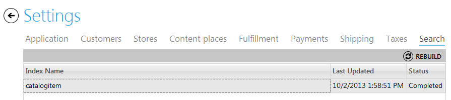

---
title: Search settings
description: Search settings
layout: docs
date: 2015-03-18T20:11:12.560Z
priority: 4
---
To control the behavior of searching and catalog browsing, use Search Settings. Open "Search" tab in the "Settings" module. Here are the search settings for storefront and Virto Commerce Manager are stored. If indexes should be rebuilt click "REBUILD" button.

