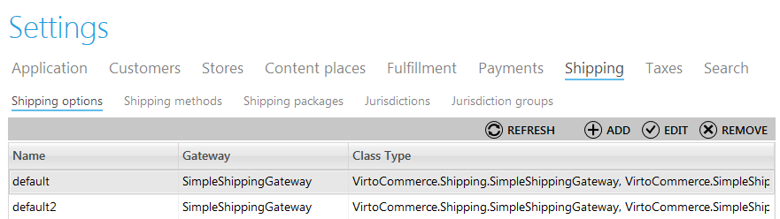
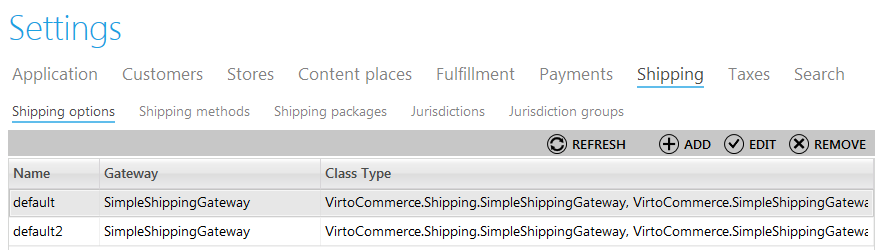
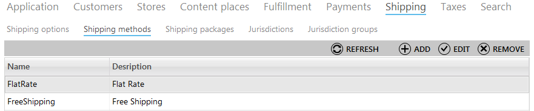
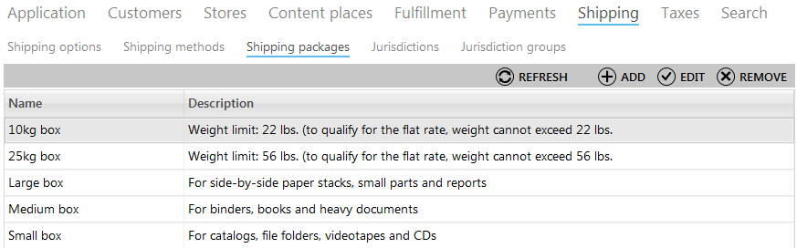
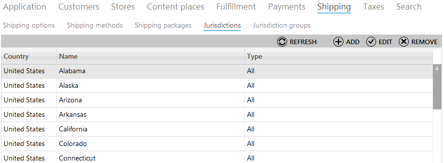
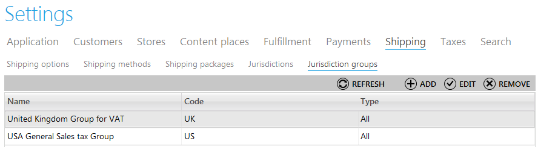

---
title: Shipping
description: Shipping
layout: docs
date: 2015-03-18T20:11:12.560Z
priority: 7
---
## Introduction

Virto Commerce Manager allows adjustment of shipping block for the store. Now you need no developer's assistance to define which shipping methods will be used in the store, how the parcels will be packaged, what are the jurisdictions and jurisdiction groups. Now all the shipping settings are easy to manage in a single place with the help of "Shipping" tab in the Settings module.

## Shipping Options

The shipping options tab allows users to create a list of options used in the web store and define gateways applied for them.

To add a new shipping option, use "Add" button and fill in the data fields:

* **Name** -В a descriptive name of the shipping option;
* **Gateway** - select a gateway that will be used for this shipping option;
* **Description** - a description of the shipping option;
* **Available packages** - define which packages will be available for usage with this shipping option (for example, small box or medium box).

To edit a shipping option, click it in the list and use "Edit" button to make all required modifications. To delete a shipping option use "Remove" button after selection.

## Shipping Methods

The specific character of every online store is that the purchased products need to be shipped to the customer. It may be organized throughout store's special delivery service, post or any other way. These shipping methods should be included into the list of available ones in the web store and then adjusted according to the company politics and conditions. This can be done in the "Shipping methods" tab of shipping settings block.

To add a new shipping method use "Add" button and fill in the following fields:

* **Name** - a descriptive name of the shipping method;
* **Description** - brief or full description of the shipping method;
* **Shipping option** - selected from the dropdown list created in previous settings tab;
* **Currency** - which currency will be used for this shipping method;
* **Base price** - a fundamental cost of shipping without any taxes, fees, discounts and etc.;
* **Is active** - pick this checkbox to make this shipping method available for selection in the store;
* **Available payments** - choose which payment methods will be available for this shipping method. You can select multiple payments.
* **Languages** - define which localization will be applied to this kind of shipping.

To edit a shipping method, click it in the list and use "Edit" button to make all required modifications. To delete a method use "Remove" button after selection.

## Shipping Packages

The "Shipping Packages" tab contains the list of adjusted package options that can be chosen for shipping methods. This allows to manageВ and use effectively various options of packaging. For instance, it will help to choose the most optimal package for the parcel and exclude an ability of sending small products in a large box.

To add a shipping package use "Add" button and fill in all the required fields:

* **Name** - a descriptive name of the package, for example, "Small box";
* **Description** - description of basic parameters for this package, for example, weight limit and type of products to be packed in it;
* **Set Dimensions** - pick this checkbox if you need to specify **Width**, **Length** and **Height** of the package.

If you need to make any modifications to a package, click it in the list and use "Edit" button. Use "Remove" button for deleting a package after selection.

## Jurisdictions

The "Jurisdictions" tab of Shipping settings is intended for adjustment of shipping jurisdictions of the web store.

To add a new jurisdiction use "Add' button and fill in the following fields:

* **Code** - a code of the jurisdiction applied in the system;
* **Name** - descriptive name of the jurisdiction;
* **Jurisdiction Type** - is selected from the dropdown list and defines the specific parameters of the jurisdiction;
* **City** - for which city this jurisdiction will be applied (not required);
* **Country** - for which country this jurisdiction will be applied;
* **State, region** - state or region of the jurisdiction not required);
* **County** - county where the jurisdiction will be applied (not required);
* **District** - district where the jurisdiction will be applied (not required);
* **Zip Code Start** and **Zip Code End** - the zip code according to which the jurisdiction will be identified;
* **Geo code** - the geographical code according to which the jurisdiction will be identified.

In case you would like to edit a jurisdiction parameters, click it in the list of all jurisdictions and use "Edit" button. To delete a jurisdiction use "Remove" button.

## Jurisdiction Groups

Sometimes jurisdictions apply for a group of regions or states instead of a single city. In this case jurisdiction groups can be applied. They are adjusted in the "Jurisdiction groups" tab of Shipping settings.

To add a new jurisdiction group, use "Add" button and fill in the following fields:

* **Code** - a code of the jurisdiction applied in the system;
* **Name** - descriptive name of the jurisdiction group;
* **Jurisdiction Type** - is selected from the dropdown list and defines the specific parameters of the jurisdiction;
* **Available Jurisdictions** - form the list of the jurisdictions which will be combined in this group of jurisdiction.

To make any modifications to a jurisdiction group, select it from the list and use "Edit" button. To delete a group use "Remove" button after selection.
