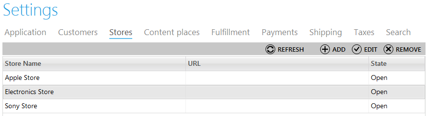
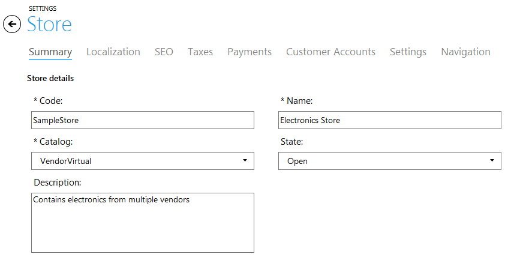
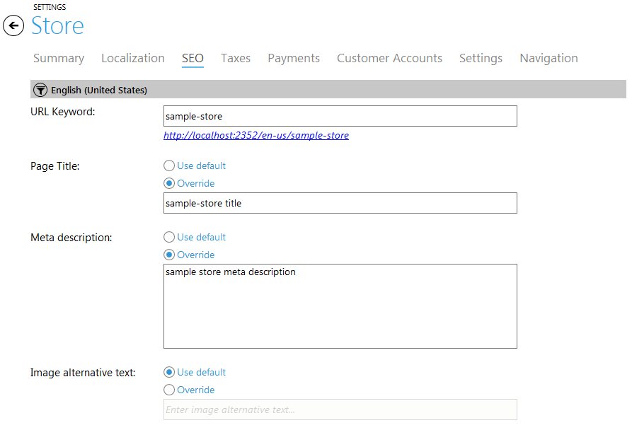
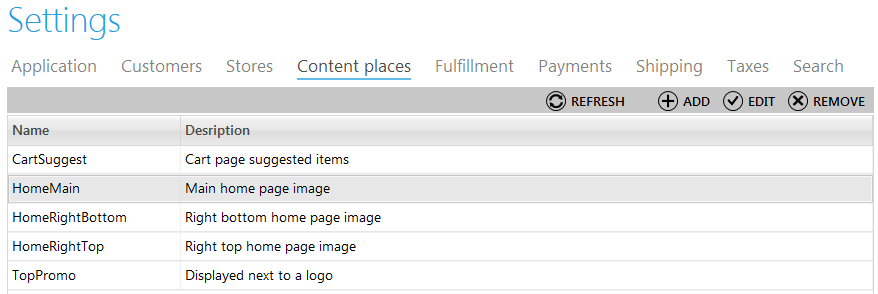
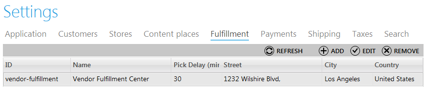
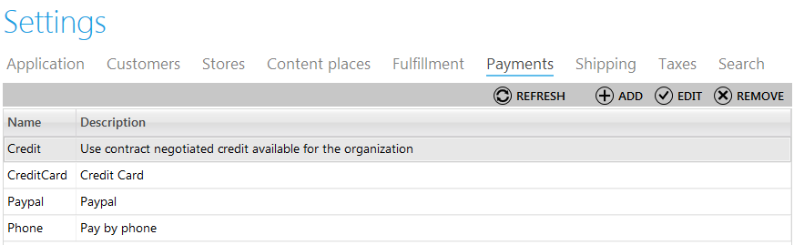

---
title: Stores
description: Stores
layout: docs
date: 2015-03-18T20:11:12.560Z
priority: 5
---
## Introduction

A store in the Virto Commerce Manager is supposed as the web page (Storefront) that allows customers to purchase products drawn from a particular catalog. A default storefront is provided with the Commerce Manager. The store layout can be adjusted by editing special templates upon which the stores are based, but the most common parts of a store are configured through the "Stores" tab of Settings module. These settings include localization, taxes, payment gateways, customer accounts,  and other system information to be set.

To find the block of store settings, open Settings module and navigate to "Stores" tab.

## Viewing Stores

Open "Stores" tab to view the list of storefronts existing in your commerce manager. Double click a store to view full information about it.

The settings applied for each store are grouped in tabs by their means:

### Summary

In this tab you can find store details such as:

* Code (the unique identifier for the store, cannot be changed once the store is created),
* Catalog ((which catalog of products is used for this storefront),
* Description (the description of the store, this field is optional and is not displayed to customers),
* Name (descriptive name of the store),
* State (status of the store, for example, "Open", "Closed" or "Access restricted").

Here you can also view contact information added for this store including the fields as follows:

* Store URL (this URL will be used by customers to access the storefront),
* Secure URL (secure URL used to access the store),
* Store Country (where the store is located, selected from the list of countries in the dropdown),
* Store Region (you can specify store region to show where the store is located),
* Store Email (email address which can be used by customers and partners to contact the store),
* Fulfillment Center (which fulfillment center will be used in the store),
* Returns Fulfillment Center (which fulfillment center will be used for returns in the store),
* Operational Timezone (the time zone used for setting timestamps).

### Localization

The "Localization" tab is used to specify the languages used in the store. If the store supports the ability for customers to switch between different localizations, you need to define available languages here. The default language will be shown before a customer selects another language.

Here the currencies are defined as well. Just select default currency and define the list of currencies which will be available for customers to choose from.

### SEO

The "SEO" tab is used to specify SEO data for the store, such as URL Keyword, Page title, Meta description, Image alternative text.

URL Keyword should not contain restricted characters, otherwise validation will not allow to save such a Keyword.

You can enter the SEO data for each language available in the store.

To browse the store by the SEO Keyword click the hyperlink under URL Keyword textbox, if available.

### Taxes

This block is used to specify the tax jurisdictions and tax codes for the store. Enabled tax codes and tax jurisdictions are selected by checkboxes.

### Payments

The "Payments" tab is used to configure payment options for the store. Just pick payment gateways available for the store (for example, credit, credit card, paypal, phone). If you pick a credit card payment gateway, choose supported card types as well (Visa, Master Card, etc.). Check the box "Enable CVV code validation" to allow customers to purchase products with CVV supported cards.

Here you can also define credit card saving policy to exclude the ability of storing credit card data. For example, you can save only 4 digits of the credit card number or do not save it at all after the payment is proceeded.

### Customer Accounts

In this tab you can define with which other stores of the Commerce Manager the customer accounts of the current store will be shared. By default, customer profiles are not shared. To share customer accounts between stores, select items in the Available Stores list, then click "Move" arrow to add them to the Linked Stores list.

### Settings

This block includes general settings of the store.

### Navigation

This block adjusts the navigation settings in the store.

## Creating a Store

To create a store, open "Stores" tab of Settings module and use "Add" button.

Then fill in all the required fields with information on each of the steps.

**Step 1 (store general information)**:

1. Code (the unique identifier for the store, cannot be changed once the store is created),
2. Catalog ((which catalog of products is used for this storefront),
3. Description (the description of the store, this field is optional and is not displayed to customers),
4. Name (descriptive name of the store),
5. State (status of the store, for example, "Open", "Closed" or "Access restricted").
6. Store URL (this URL will be used by customers to access the storefront),
7. Secure URL (secure URL used to access the store),
8. Store Country (where the store is located, selected from the list of countries in the dropdown),
9. Store Region (you can specify store region to show where the store is located),
10. Store Email (email address which can be used by customers and partners to contact the store),
11. Fulfillment Center (which fulfillment center will be used in the store),
12. Returns Fulfillment Center (which fulfillment center will be used for returns in the store),
13. Operational Timezone (the time zone used for setting timestamps).

**Step 2 (localization information)**:

Define the list of available languages which will be used by customers to select a language from. Define the default language. Choose available currencies and define default currency used in the store.

**Step 3 (taxes information)**:

Pick enabled tax codes and jurisdictions used in the store.

**Step 4 (payments information)**:

Pick payment gateways available for the store, select supported card types, check the box "Enable CVV Code Validation" if you need to make it available, select credit card saving policy as described in the viewing stores section.

**Step 5 (navigation information)**:

Define navigation settings on this step and click "Finish" to save the parameters and finish creating.

## Editing a Store

To edit a store, click a store in the list and use "Edit" button. Save the changes after making all required modifications.

## Deleting a Store

To delete a store, select it in the list and use "Remove" button. If a store is in use, the system will not allow its deletion.

## Creating, Editing and Deleting Content Places

Content Places define where the content will be placed on the store front. For example, the banner can be placed on top of the main page; the text of promotion can be displayed next to the logo and etc. This feature allows users of Virto Commerce Manager to manage store front content without developers assistance.

Open `Content Places` tab of the Settings module to view the list of all content places added to the system. To add a content place use `Add` button and fill in two fields as follows:

* **Content place name** - name of the content place in the database.
* **Content place description** - a description of the content place to identify which one is supposed.

To edit a content place click it in the list and use `Edit` Button. Delete a content place the same way with `Remove` button.

## Creating, Editing and Deleting Fulfillment Centers

The "Fulfillment" tab of Settings module contains the list of fulfillment centers - places where the orders are fulfilled.

To create a fulfillment center use "Add" button and fill in the following fields:

* **Fulfillment center name** - a descriptive name of the center;
* **Fulfillment center description** - a description of the center;
* **Maximum releases per pick batch** - the maximum quantity of products released in a pick;
* **Pick delay** - minimum period of time for product pick delay;
* **Day phone number** - a telephone number that can be used to contact the center;
* **Address** - address of the fulfillment center;
* **City, region or state and country** - where the center is located;
* **Zip code** - the zip code of the fulfillment center.

To edit a fulfillment center, click it in the list and use "Edit" button. If you need to delete a fulfillment center, click it and use "Remove" button.

## Managing Payment Methods

A payment gateway processes and authorizes payments made from a customer. Payment gateways must encrypt sensitive information (such as credit card numbers) and ensure that the information is transferred securely.

The list of payment methods available in the store is managed in the "Payments" tab of Settings module.

To create a new payment method, use "Add" button and fill in the following fields on the first step:

* **Payment name** - a descriptive name of the payment method. For instance, "Credit Card".
* **Description** - a description of the payment method.
* **Priority** - you can define the order of payment methods for selection. This field is not required.
* **Gateway** - select a gateway used for this payment method from the list.
* **Is Active** - pick this checkbox if you need to make this method available in the store.
* **Selected Gateway support recurring** - when the gateway is selected, this checkbox is enabled or disabled depending on the gateway parameters.
* **Restricted Shipping Methods** - you can manage shipping methods according to selected payment methods and allow or restrict some of them depending on the selected payment method. For instance, enable express delivery only for orders paid with a credit card.

Then define the **localizations** by entering a language code and the localization descriptive name. At last define the **payment parameters** special for each of payment methods (for instance, will be different for PayPal and credit cards). Click "Finish" to save a new method.

To make several modifications with a payment method, use "Edit" button after a single click on a method you need to edit. To delete use "Remove" button.
