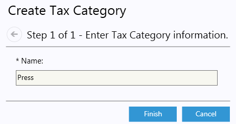
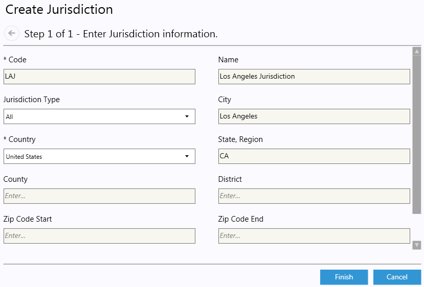
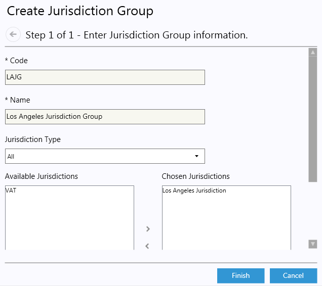
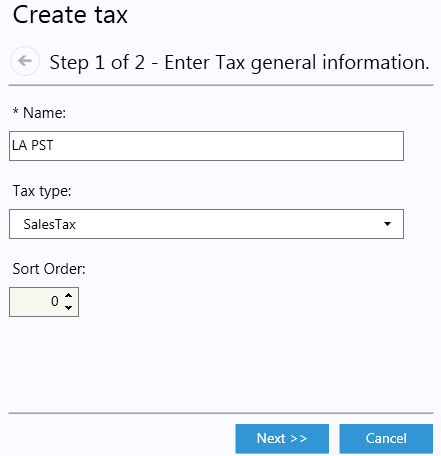
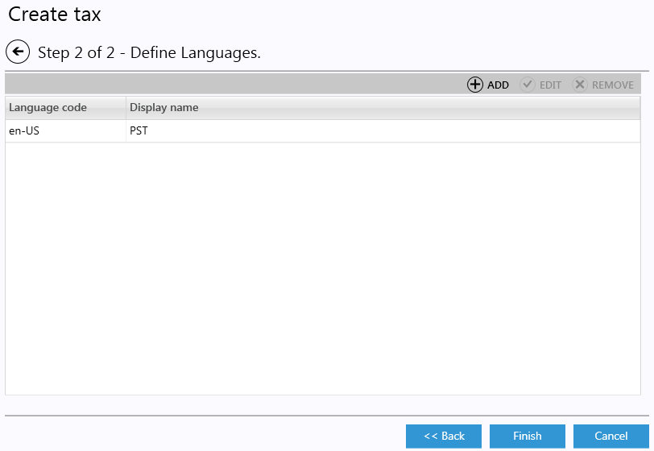
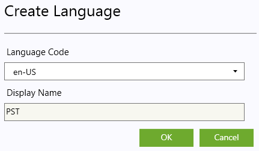

---
title: Taxes
description: Taxes
layout: docs
date: 2015-03-18T20:11:12.560Z
priority: 8
---
## Introduction

Store administrators need to configure taxes for jurisdictions that have the right to impose a tax on taxpayers.

To configure a tax system for their store, administrators can use the following:

* Tax Categories: Tax Categories determine the taxes that are applicable for an item or shipping method in each Tax Jurisdiction Group. Each item should be assigned to one of the Tax categories.
* Tax Jurisdictions: Tax Jurisdictions are hierarchical, so it is possible to have different Tax Categories applied at various levels.
* Tax Jurisdiction groups: Tax Jurisdiction groups combine Tax Jurisdictions.
* Tax Values: The tax rate applied to a Tax Category in a particular jurisdiction group.

There is an address properties hierarchy in Jurisdictions. Here is how they checked by priority from low to high:

* Country
* State/Province
* County
* District
* City
* Zip/Postal code
* Geo code

So the tax jurisdiction with the higher priority match will be applied to the order.

## Taxes and Order Refunds

If the customer returns the entire order, the system refunds all the taxes paid. If they are returning only a portion of the order, the Commerce Manager returns only a portion of the taxes. This is determined by looking at the total item taxes paid on the line item they are returning and then multiplying those taxes by the portion they are returning.

By default, shipping costs and taxes are not refunded.

## Tax Categories

### Creating a Tax Category

1. Open **Settings** module.
2. Open **Taxes** tab.
3. Open **Taxes** child tab.
4. Click **Add** button.
  
5. In the first and the only step of the wizard enter self-explanatory Name of the Tax Category.
  
6. Click **Finish**.

The Category will be displayed in the list of Tax Categories.

### Editing Tax Category

1. Open **Settings** module.
2. Open **Taxes** tab.
3. Open **Taxes** child tab.
4. Double click the selected Category.
5. Edit Name of the Category.
6. Save changes.

### Deleting Tax Category

1. Open **Settings** module.
2. Open **Taxes** tab.
3. Open **Taxes** child tab.
4. Click the Tax Category you want to delete.
5. Click **DELETE** button
6. Confirm deletion.

## Tax Jurisdictions

### Creating a Tax Jurisdiction

1. Open **Settings** module.
2. Open **Taxes** tab.
3. Open **Jurisdictions** child tab.
4. Click **Add** button.
  
5. In the first and the only step of the wizard setup Jurisdictions properties by your needs.
  

|Property|Description|
|--------|-----------|
|Code|Unique code of the Jurisdiction|
|Name|Name of the Jurisdiction|
|Jurisdiction Type|The type of the Jurisdiction. If the Jurisdiction group is applicable to Taxes and Shipping methods - select All, otherwise - select appropriate|
|Country|Required field. Setup the target country for the Jurisdiction|
|State, Region|State, province code/name (E.g. For California state enter CA code)|
|County|County name. Set it if the Jurisdiction is limited to specific County|
|District|District name. Set it if the Jurisdiction is limited to specific District|
|City|City name. Set it if the Jurisdiction is limited to specific City|
|Zip Code Start|Zip Code range start. Set it if the Jurisdiction is limited to specific zip codes range|
|Zip Code End|Zip Code range end. Set it if the Jurisdiction is limited to specific zip codes range|
|Geo Code|Unique Geo Code. Set it if the Jurisdiction is limited to the specific Unique Geo Code|

6. Click **Finish**.

The created Jurisdiction will be displayed in the list.

### Editing Jurisdiction

1. Open **Settings** module.
2. Open **Taxes** tab.
3. Open **Jurisdictions** child tab.
4. Double click the selected Jurisdiction.
5. Edit required fields.
6. Save changes.

> Jurisdiction type can't be edited.

### Deleting Jurisdiction

1. Open **Settings** module.
2. Open **Taxes** tab.
3. Open **Jurisdictions** child tab.
4. Click the Jurisdiction you want to delete.
5. Click **DELETE** button
6. Confirm deletion.

## Tax Jurisdiction Groups

### Creating a Tax Jurisdiction Group

1. Open **Settings** module.
2. Open **Taxes** tab.
3. Open **Jurisdiction** groups child tab.
4. Click **Add** button.
  
5. In the first and the only step of the wizard setup Jurisdiction group properties
  

|Property|Description|
|--------|-----------|
|Code|Unique code of the Jurisdiction Group|
|Name|Name of the Jurisdiction Group|
|Jurisdiction type|The type of the Jurisdiction Group. If the Jurisdiction group is applicable to Taxes and Shipping methods - select All, otherwise - select appropriate|
|Chosen Jurisdictions|Jurisdictions that this group should aggregate|

6. Click **Finish**.

The created Jurisdiction group will be displayed in the list.

### Editing Jurisdiction group

1. Open **Settings** module.
2. Open **Taxes** tab.
3. Open **Jurisdiction** groups child tab.
4. Double click the selected Jurisdiction group.
5. Edit required fields.
6. Save changes.

> Jurisdiction group type can't be edited.

### Deleting Jurisdiction group

1. Open **Settings** module.
2. Open **Taxes** tab.
3. Open **Jurisdiction** groups tab.
4. Click the Jurisdiction group you want to delete.
5. Click **DELETE** button
6. Confirm deletion.

## Tax

### Creating a Tax

1. Open **Settings** module.
2. Open **Taxes** tab.
3. Open **Taxes** child tab.
4. Click **Add** button.
  
5. In the first step of the wizard setup the Tax properties
  

|Property|Description|
|--------|-----------|
|Name|Make the name of the tax to be self-explanatory the best practice is to use the name of the real tax|
|Tax type|Select if the tax is applied to Items of the order or to a Shipping|
|Sort Order|The order the tax will be displayed in the frontend|

6. Click **Next**.
7. In the second step of the wizard setup the display names for the Tax for available languages if any.
  
  * Click Add button above the list of display names
    
  * In the popup dialog select the target language and enter the Display name value
    
  * Click **OK**
    The created display name will be displayed in the list.
8. Click **Finish**.
  The created Tax will be displayed in the list. 
  Open it to setup Tax values for different Tax categories and Jurisdiction groups.
9. Open **Tax** (see Editing Tax section of this guide page to open tax).
10. Open **Tax values** tab.
11. Click **Add** button.
  
12. In the popup dialog setup properties
  

|Property|Description|
|Tax Category|Select target tax category in the list of available|
|Jurisdiction Group|Select target Jurisdiction Group in the list of available|
|Percentage|Enter tax value|
|Effective Date|Enter the date from which the tax is effective. If no date entered the tax will be applied immediately|

13. Click **OK**.
  Reapeat the steps 9-13 for all target Tax Categories and Jurisdiction Groups.
14. Click **Save** in the Tax edit view to save changes.

### Editing Tax

1. Open **Settings** module.
2. Open **Taxes** tab.
3. Select **Taxes** child tab.
4. Double click the selected Tax.
5. Edit required fields.
6. Save changes.

### Deleting Tax

1. Open **Settings** module.
2. Open **Taxes** tab.
3. Select **Taxes** child tab.
4. Click the Tax you want to delete.
5. Click **DELETE** button
6. Confirm deletion.

After Taxes has been configured assign catalog items to specific Tax Category, so only taxes that should be applied to the item would be calculated in the order.
