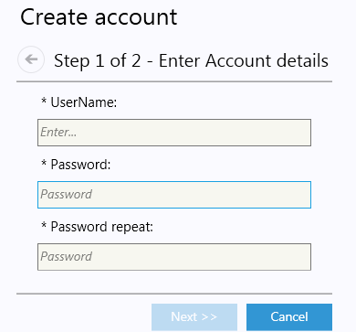
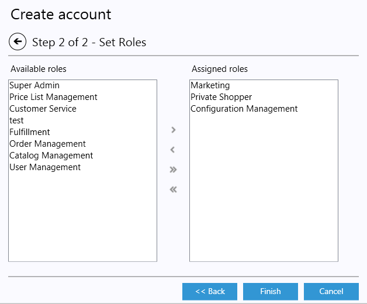
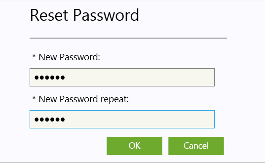
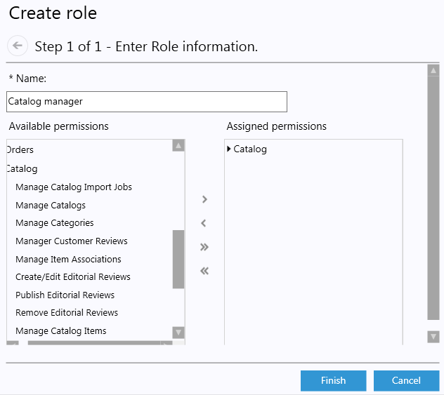

---
title: Users Management, Roles and Role Assignment - Virto Commerce 1.13 User Guide
description: Users Management, Roles and Role Assignment
layout: docs
date: 2015-03-18T20:11:12.560Z
priority: 5
---
## Introduction

Users are individuals working with Virto Commerce management application and services. Users are internal to organization and should not be confused with customers.

In order to manage Virto Commerce functionality each user must be assigned to at least one role. Each role provides the user with certain access permissions.These permissions allow or restrict the user's access to functionalities within Virto Commerce client application. E.g. user can be permitted to view catalog Items but restricted to manipulate Items. These permissions allows to ensure, for example, that the Catalog functionality is not available to warehouse users who do not have Catalog Management related roles.

Common Roles are provided by default with each Virto Commerce installation. User roles can be created or edited to provide their staff with permissions reflecting only the tasks they perform within Virto Commerce management application.

## User management and permissions assignement

This section will explain the different security considerations that affect the Virto Commerce management application and the steps you need to take to ensure that permissions are appropriately assigned for users.

This section is intended to assist Virto Commerce administrators with setting up proper permissions on application data and functionality. These individuals must at least be able to create Users and User Roles in the Virto Commerce administration tool, so they must have User Management permissions in the Virto Commerce administration tool.

## Permissions

Permissions are controlled by assigning Roles to users. A Role is a collection of permissions. A Role can be assigned to multiple users. Each user can have more than one assigned Role.

Through the combination of assigned Roles, you can ensure that users only have access to the information and functionality they need.

This model provides considerable flexibility, but in complex environments with multiple stores and catalogs, each with their own distinct sets of users, it is critical to establish best practices for managing permissions.

> Available permissions and their descriptions can be found in [Available Permissions](docs/old-versions/vc113userguide/users-management-roles-and-role-assignment) page of the manual.

## Users

All individuals in your organization who need access to the Virto Commerce administration tool should have their own personal user accounts.

Each user has certain permissions, defined by their role, which are specified at users profile creation. These Virto Commerce users should be configured so that they only have access to the data they need to perform their tasks See the Roles section for more information.

## Administrator users

After installation, there is one user in the system with Super User (administrator) privileges. Only administrator users have permission to manage users and roles.

> It is strongly recommended that you create a second user with Super User privileges. If one of the administrator user accounts is locked, the other administrator user will be able to unlock it.

## Creating a user

To create a user you must have appropriate permissions.

Steps to create user:

1. Select **Users** module from the modules list.
2. Select **Accounts** tab inside Users module.
3. Click **Add** button in the upper right corner of the list of users.
  
4. In the wizard popup view first step fill in required fields (Login/Password):
  
5. In the wizard popup view step 2 select roles that should be assigned to the user from the list of predefined roles:
  
6. After all required roles has been assigned click **Finish** button.

The just created user will appear in the list of users.

## Editing user

1. Open **Users** module.
2. Select **Accounts** tab.
3. Double click the selected user.
4. Edit the required fields.
5. Save changes.

## Disabling/Enabling user

1. Open **Users** module.
2. Select **Accounts** tab.
3. Double click the selected user.
4. Click **Reject user**/**Approve user** button.
5. Save changes.

## Reset user's password

1. Open **Users** module.
2. Select **Accounts** tab.
3. Double click the selected user.
4. Click **Reset password** button.
5. Enter new password and repeat it.
6. Press OK to save changes.
  

## Roles

In order to access Virto Commerce administration application features, users must first be granted permissions. You can grant permissions to users indirectly by assigning Roles to them in the Virto Commerce administration application.

Users can be assigned multiple Roles. The creation of a new Role includes specifying which Permissions it has. Permissions refer to the access rights of a user to a particular feature in the Virto Commerce administration tool.

## Built-in Roles

The Virto Commerce installation includes the following User Roles:

* Super User (also referred to as the administrator role), which grants all permissions to all areas of the Virto Commerce administration tool. Do not assign this Role unless you want the user to have full access to all areas and all application data.
* Catalog manager (role for creating and editing catalogs, categories, items and prices)
* Store marketing (manage promotions and dynamic content, price list assignment and configure store settings)
* Customer service agent (manage customers and cases)
* Shipping receiving (manage fulfillment, complete shipments and edit returns & exchanges)
* Configuration (manage settings)
* Private shopper (access restricted stores in storefront)

## Permissions structure

Permissions has a hierarchical structure, so if Catalog permission is assigned to the Role, all sub-permissions of this permission will also be assigned to the role.

## Creating a Role

To create a user you must have appropriate permissions.

Steps to create user:

1. Select Users module from the modules list.
2. Select Roles tab inside Users module.
3. Click Add button in the upper right corner of the list of roles.
  
4. In the wizard popup view fill in required fields (Name, Permissions)
5. Click **Finish** button:
  

## Editing a Role

1. Open **Users** module.
2. Select **Roles** tab.
3. Double click the selected Role.
4. Edit the required fields.
5. Save changes.

## Assigning multiple Roles to the user

If the user has multiple responsibilities and requires permissions of more than in a Role, Virto Commerce system allows user to have multiple Roles.

## Deleting a Role

1. Open **Users** module.
2. Select **Roles** tab.
3. Click the selected Role.
4. Click Remove button in the menu strip of the Roles list.
5. Confirm delete.

## Modules

Modules are the top level menu items on the Virto Commerce administration tool. Each module has features, features has permissions. If the user doesn't have permission to any of the module features that module won't be available to the user entirely.

## Example of commonly used Roles and permissions assignment

The following table shows examples of Roles that an organization might need and the catalog/store/fulfillment assignments that users assigned to those Roles might have.

|Role|Modules|Has catalog assignments|Has store assignments|Has fulfillment assignments|
|----|-------|-----------------------|---------------------|---------------------------|
|Administrator|Settings|No|No|No|
|Catalog manager|Catalog|Yes|No|Yes|
|Customer service agent|Customer service|Yes|Yes|Yes|
|Marketer|Marketing|Yes|Yes|No|
|Merchandiser|Maketing Catalog Reporting|Yes|Yes|Yes|
|Receiver|Fulfillment|No|No|Yes|
|Shipper|Fulfillment|No|No|Yes|

## Available Permissions

|Permissions by modules|Description|Effect|
|----------------------|-----------|------|
|Users| |Hide menu item if no permission selected|
|Manage Accounts|Grants permission to create, remove or edit user accounts|Show tab|
|Manage Roles|Grants permission to create, remove or edit roles|Show tab|
| | |
|Order Management| |Hide menu item if no permission selected|
|Manage Orders|Grants permission to create, edit, and delete orders|Show tab|
|Issue Order Refunds|Grants permission to create refunds on orders|Enables **Refund** button|
|Create Order Exchange|Grants permission to create and edit exchanges for items in orders|Enables **Create Exchange** button on Summary tab and Return tab of the order edit view|
|Create Order Returns|Grants permission to create and edit returns on orders|Enables **Create Return** button|
|Complete Order Returns|Grants permission to complete order returns|Enables **Complete** button in Return tab of the order edit view|
|Cancel Order Returns|Grants permission to cancel order returns|Enables **Cancel** button in Return tab of the order edit view|
| | |
|Catalog Management| |Hide Catalog menu item if no permission selected|
|Manage Catalogs|Grants permission to create catalogs, edit and delete catalogs|Enables catalog context menu items (**Open**, **Delete catalog**). Enables **Add catalog** button|
|Manage Categories|Grants permission to create, edit, and delete categories in catalogs|Enables catalog context menu items (**Create**, **Edit**, **Delete Category**)|
|Manage Catalog Items (Products and SKUs)|Grants permission to create catalogs, edit and delete products in catalogs|Enables items management buttons in catalog items list (**Add**, **Edit**, **Remove**)|
|Manage Virtual Catalogs|Grants permission to create virtual catalogs and to create, edit, and delete linked categories in virtual catalogs|Enables Virtual catalog management (**Create**, **Edit**, **Remove**)|
|Manage Linked Categories|Grants permission to create linked categories|Enables Linked categories management|
|Manage Catalog Import Jobs|Grants permission to create, edit, and delete catalog import jobs in catalogs|Enables import jobs management of catalog items|
|Run Catalog Import Jobs|Grants permission to run catalog import jobs in catalogs|Enables import jobs run button in import|
|Manage Item Associations|Grants permission to create, edit, and delete product associations in catalogs|Shows associations tab on product edit dialog|
|Create/Edit Editorial Reviews|Grants permission to create, edit and delete editorial reviews in items|Shows Editorial Review tabs management buttons|
|Publish Editorial Reviews|Grants permission to publish editorial reviews in items|Enables manage active ediorial reviews, Enables **Publish Editorial** and **Mark as Draft** buttons inside Editorial Review|
|Remove Editorial Reviews|Grants permission to delete editorial reviews|Enables **Remove** button on Editorial Review tab|
|Manage Customer Reviews|Grants permission to manage customers reviews|Show Reviews tab in Catalog|
| | |
|Price List Management| |Hide if "Manage Price Lists" or "Manage PriceList Assignments" not selected|
|Manage Price Lists|Grants permission to add, edit, delete prices|Show pricelist tab|
|Manage Item Pricing|Grants permission to add, edit, delete item prices|Show tab in edit view details and wizard|
|PriceList Import Jobs|Grants permission to import a price list|Show Import tab in price lists|
|Run PriceList Import Job| |Enable **Run** button on Import tab|
|Manage PriceList Assignments|Grants permission to to add, edit, delete price list assignments|Show Pricelist assignments tab|
| | |
|Fulfillment| |Hide if "Manage Fulfillment Inventory" or "Manage Fulfillment Picklists" or "Receive Fulfillment Inventory" not selected|
|Manage Fulfillment Inventory|Grants permission to manage inventory item|Enables Inventory tab if "Receive Fulfillment Inventory" permission granted|
|Manage Fulfillment Picklists|Grants permission to create picklists|Show tab|
|Receive Fulfillment Inventory|Grants permission to Receive inventory within Inventory tab|Enables **Add** button|
|Complete Shipment|Grants permission to Complete shipments|Enables **Complete shipment** button|
|Edit Returns and Exchanges|Grants permission to edit returns and exchanges inside orders|Show "Returns and Exchanges" tab in order edit view|
| | |
|Marketing| |Hide menu item if no permission selected|
|Manage Content Publishing|Grants permission to manage content publishing conditions|Show tab|
|Manage Dynamic Content|Grants permission to manage in Dynamic Content|Show tab|
|Manage Promotions|Grants permission to manage promotions in Promotions in stores and catalogs|Show tab|
| | |
|Customer Service| |Hide if no permission selected|
|View all cases|Grants permission to see all cases|View cases of all users|
|View cases only assigned to a user|Grants permission to see cases assigned to currently logged in agent|View cases of only currently logged in user|
|Search cases|Grants permission to search all cases|Show filters|
|Create new case|Grants permission to create new case|Enables **Create case** in menus|
|Edit case properties|Grants permission to edit case properties|Enables case edit controls|
|Delete existing case|Grants permission to delete existing case|Enables **Case Options** commands|
|Add public and private case comments|Grants permission to create public and private comments|Enables adding new public and private comments|
|Add private comments|Grants permission to create only private comments|Enables adding new private comments|
|Create customer|Grants permission to create new contact|Enables **Add customer** button|
|Edit customer properties|Grants permission to manage contact properties|Enables customer edit controls|
|Delete existing customer|Grants permission to delete contact|Enables **Delete customer** button in "Contact Options" menu in customer's edit view|
|Create and reset passwords|Grants permission to create/edit edit password|Enables **Create Login/Password** button in "Contact Options" menu in customer's edit view|
|Suspend and restore access for customers|Grants permission to suspend and unsuspend contact|Enables **Suspend Access** and **Restore Access** buttons in "Contact Options" menu in customer's edit view|
|Create account for a contact|Grants permission to create new account|Enables "Contact Options"|
| | |
|Configuration| |Hide menu item if no permissions selected|
|Configure Application Settings|Grants permission to manage application settings|Show **Application/Settings** tab|
|Configure Application System Jobs|Grants permission to manage application system jobs|Show **Application/System** jobs tab|
|Configure Application email templates|Grants permission to manage application email templates|Show **Application/Email** templates tab|
|Configure Application display templates|Grants permission to manage application display templates|Show **Application/Display** templates tab|
|Configure Customer Rules|Grants permission to manage application customer rules|Show **Customers/Rules** tab|
|Configure Customer Info|Grants permission to manage application customer info settings|Show **Customers/Info** tab|
|Configure Customer Case types|Grants permission to manage application customer case types|Show **Customers/Case** types tab|
|Configure Content places|Grants permission to manage content places|Show **Content places** tab|
|Configure Fulfillment|Grants permission to manage fulfillment settings|Show **Fulfillment** tab|
|Configure Payments|Grants permission to manage payments|Show **Payments** tab|
|Configure Shipping options|Grants permission to manage shipping options|Show **Shipping/Shipping options** tab|
|Configure Shipping methods|Grants permission to manage shipping methods|Show **Shipping/Shipping methods** tab|
|Configure Shipping packages|Grants permission to manage shipping packages|Show **Shipping/Shipping packages** tab|
|Configure Jurisdictions|Grants permission to manage shipping jurisdictions|Show **Shipping/Jurisdictions** tab|
|Configure Jurisdiction groups|Grants permission to manage shipping jurisdiction groups|Show **Shipping/Jurisdiction groups** tab|
|Configure Tax categories|Grants permission to manage tax categories|Show **Taxes/Tax categories** tab|
|Configure Taxes|Grants permission to manage taxes|Show **Taxes/Taxes** tab|
|Configure Tax import|Grants permission to import taxes|Show **Taxes/Import** tab|
