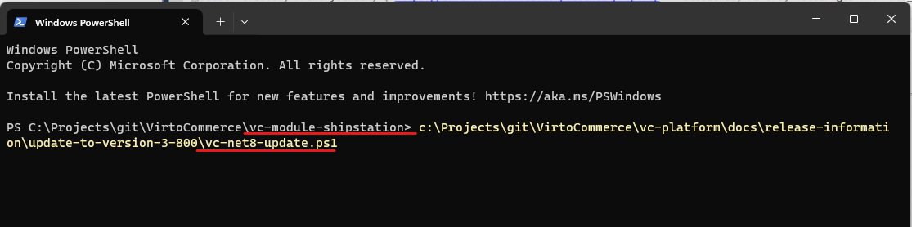
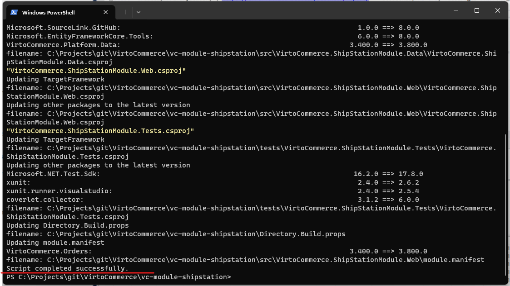
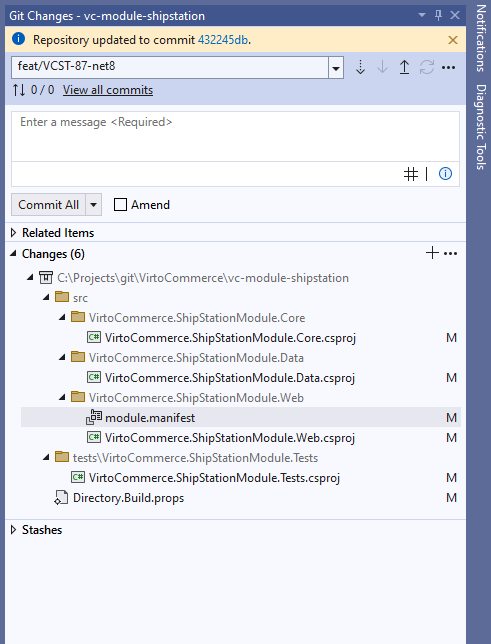
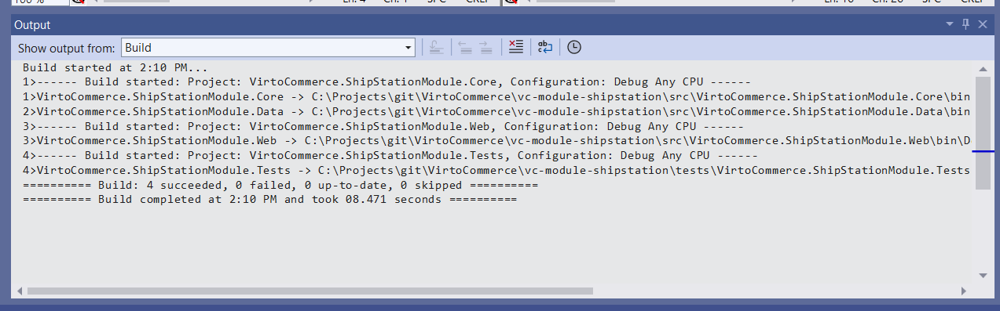

# Upgrading to Virto Commerce on .NET 8

## Overview

Virto Commerce on NET 8 (3.800+) introduces a significant technical update by transitioning the platform to .NET 8. This update focuses on enhancing performance and stability while maintaining backward compatibility. It involves updating the Target Framework to .NET 8 and integrating the latest LTS releases of third-party libraries. Importantly, no code refactoring or alterations to the API and internal structure have been made.

The release has undergone extensive testing, including unit, end-to-end, regression, and performance tests to ensure a seamless transition as well as for other stable releases.

## Explore What's New in .NET 8

Discover the exciting features and improvements introduced in .NET 8 to maximize the benefits of the upgrade. Refer to:

* [What's new in NET8](https://learn.microsoft.com/en-us/dotnet/core/whats-new/dotnet-8)
* [What's new in EF8 Core](https://learn.microsoft.com/en-us/ef/core/what-is-new/ef-core-8.0/whatsnew)
* [What's new in ASP.NET Core 8](https://learn.microsoft.com/en-us/aspnet/core/release-notes/aspnetcore-8.0?view=aspnetcore-8.0)

## Benefits

### 1. Enhanced Performance

The upgrade to .NET 8 brings substantial improvements in performance, resulting in faster response times and optimized resource utilization. This ensures a smoother and more efficient e-commerce experience for both customers and administrators.

### 2. Improved Stability

Stability is a cornerstone of this update. By leveraging the advancements in .NET 8, Virto Commerce offers enhanced system reliability and robustness. This translates to fewer disruptions, improved error handling, and increased overall system stability.

### 3. Optimized Bulk Operations

With the transition to .NET 8, bulk operations such as select, update, and delete are optimized for efficiency. This improvement is particularly beneficial for scenarios involving large datasets, providing a noticeable boost in processing speed and resource efficiency.

## Known Limitations and Breaking Changes

1. **Entity Framework Packages Update:** To prevent "System.MissingMethodException: Method not found errors" when call MigrationBuilder.CreateIndex, it is essential to update Entity Framework packages from version 6 to version 8.
2. **Kestrel HTTPS Binding:** Note that the default HTTPS binding has been removed. Refer to [Microsoft Learn](https://learn.microsoft.com/en-us/dotnet/core/compatibility/aspnet-core/7.0/https-binding-kestrel) for more details.


If you find any new breaking changes, submit an question on [Virto Commerce Community](https://www.virtocommerce.org/c/support/12). 

## Update Path

1. **Install .NET 8:** Begin by ensuring that you have .NET 8 installed on your system. Follow the official installation guidelines to set up the environment for the upgrade. https://dotnet.microsoft.com/en-us/download/dotnet/8.0
2. **Update Virto Commerce Platform and Modules**
3. **Update Custom Modules**

## Update Virto Commerce Platform and Modules

### Option 1. vc-build Update command
Utilize the vc-build Update command for an automated update. This method streamlines the update process, ensuring that all components are seamlessly transitioned to the new version.

```cmd
vc-build Update -Stable -v 8
```

### Option 2. Update via package.json
If you use package.json file for automated deployment, change versions of the platform and Virto Commerce modules to 3.800.0+. Based on latest Stable 8 or Edge release strategy.

### Option 3. Manually update
Alternatively, manually download update the platform and modules to version 3.800+. This method provides more control over the update process, allowing for a step-by-step transition.

## Update Custom Modules

If you develop a custom module, update can be required primary to update .NET dependencies.

### Update Solution to NET8

Download and execute the [vc-net8-update.ps1 Power Shell script](vc-net8-update.ps1) in your solution folder. 

!!! info "How to enable execution of PowerShell scripts"
    Set powershell script as trusted if required, by running this power shell command:
    ```ps1
      Set-ExecutionPolicy -Scope Process -ExecutionPolicy Bypass
    ```
  

```ps1
./vc-net8-update.ps1
```





This script automates several these tasks, including (of course you can do it manually):

1. Updating the Target Framework to .NET 8 for every project.
2. Updating project dependencies, including Microsoft NuGet dependencies to version 8.0.0 and VirtoCommerce NuGet dependency to version 3.800.0 and latest.
3. Updating other third-party dependencies to save version that used by Virto Commerce Platform.
4. Updating the module.manifest file to align with the changes in .NET 8.



### Build Solution

1. Build the solution and meticulously address any compilation errors and warnings if required. This step ensures that the solution is compatible with the updated framework.
2. Verify Tests for Issues Perform a thorough verification of tests to identify and address any issues introduced by the update. This step guarantees that the updated solution maintains the expected functionality and performance.



### Create Module Package

Generate a module package by running vc-build Compress. This step finalizes the update process, creating a package that encapsulates the updated modules for deployment.

```cmd
vc-build Compress
```

## Run and Enjoy Virto Commerce on .NET 8

With the update process completed, you can now run and enjoy the enhanced capabilities of Virto Commerce on the .NET 8 platform. Explore the platform's new features and optimizations to leverage its full potential for a resilient and efficient e-commerce solution.
