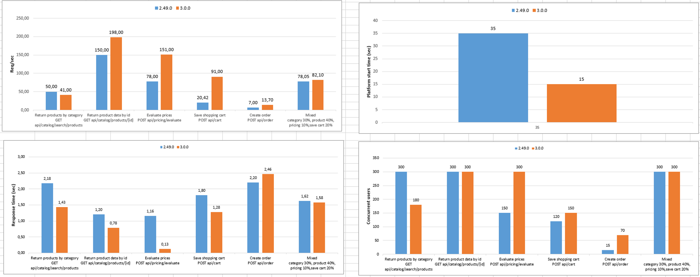

# What's new

!!! note
    Welcome to v3.0. Meet the new major version of Virto Commerce Platform. Our development efforts were focused on moving to ASP&#46;NET Core, performance, architecture improvements and further enhancements. The changes below are a subset of the larger list of changes in update to ASP&#46;NET Core.

## Architectural and conceptual changes

### For developers and architects

- Improved extensibility and unification
- Increase in development speed and decrease in time to market
- Unified architecture and usage of good architecture practices leads to shorter learning curve for developers who are new to Virto Commerce
- Cross-Platform Support: run on Windows, Mac or Linux

### Technology stack

#### Application & Data

- .NET Core 3.1.X
- ASP&#46;NET Core 3.1.X
    - ASP&#46;NET Core Identity
    - ASP&#46;NET Core SignalR
- OpenIddict 2.0.X
- Entity Framework Core 3.1.X
- HangFire 1.7.X
- AngularJS 1.4

#### DevOps and Utilities

- Docker
- npm
- Webpack
- xUnit
- Jenkins
- Nuke-based utility VirtoCommerce.GlobalTool (aka vc-build)
- Swagger UI

### Techniques

#### Caching
  - ASP&#46;NET Core in-memory caching is used
  - Strongly typed *cache regions* and *change tokens* for cache dependencies
  - Ability to manage cached objects' expiration time and disabling the caching
  - Hybrid caching policy for keeping cached data consistent in multiple Platform instances
  - The dedicated "VirtoCommerce.Cache" module was removed; now caching is implemented in place where it is needed
#### Dependency injection (DI)
  - Unity DI replaced by built-in .NET Core DI (*Microsoft.Extensions.DependencyInjection*)
#### Development
  - Virto Commerce developmet switched to [GitFlow Workflow](https://nvie.com/posts/a-successful-git-branching-model/) model
  - [GitVersion](https://github.com/GitTools/GitVersion) tool to ease Semantic Versioning
  - Both Platform and all modules repository structure unified to have *build*, *docs*, *src*, *tests* folders on the top.
  - The recommended structure of a module solution was updated:
     - *Permissions*, *Settings* and other constants should be defined in the *.Core* project
     - *Caching* should be defined and done in the *.Data* project
     - All v3 modules were refactored to follow the recommended structure
  - All methods in search and CRUD services made asynchronous:
     - Returning *async Task* or *async Task<T\>*
     - The methods renamed to end with "Async"
  - All API controller methods made asynchronous:
     - Returning *async Task* or *async Task<T\>*
     - The endpoint names left unchanged for backward compatibility (**not ending** with "Async")
#### DevOps
  - Nuke - [Build Automation System for C#/.NET aka VirtoCommerce.GlobalTool](/build/README.md)
#### Dynamic properties
  - Dynamic properties registration logic changed. Now manual registration used instead of reflection
#### Export/Import
  - Export/Import is now streamed for all modules
#### Security
  - Now permissions are defined only in design-time using a special fluent syntax
  - Localization for permissions added
  - Storefront switched to work using barrier token authentication
#### Settings
  - Settings are defined in design-time, using special fluent syntax
  - Localization for settings added
  - Now setting value can be changed using any .NET Core configuration provider
#### Modularity
  - *Module.manifest* file structure changed (scripts, styles, settings and permissions declarations removed)
  - *IModule* abstraction changed to have only *Initialize* and *PostInitialize* methods; *Module.cs* structure simplified.
#### Persistency infrastructure
  - Object-relational mapper (ORM) switched to Entity Framework Core (EF Core)
  - New EF Core migrations generated
  - Only Table per Hierarchy (TPH, hierarchy mapping to a single table) inheritance model now supported
  - DbContext defined separately from repository
  - [EntityFramework.Triggers](https://github.com/NickStrupat/EntityFramework.Triggers) for auditing and change logging
  - Calls to DbContext methods refactored to be asynchronous

## Changes in VC Platform

### Solution code structure
  - Functionality specific implementations were split into dedicated projects (Assets, Modules, etc.)
### Configuration and Options
  - [ASP.NET Core configuration providers](https://docs.microsoft.com/en-us/aspnet/core/fundamentals/configuration/?view=aspnetcore-2.2) used together with the [options pattern](https://docs.microsoft.com/en-us/aspnet/core/fundamentals/configuration/options?view=aspnetcore-2.2).
### Modularity
  - Assembly and dependency loading completely reworked into platform process
### Security
  - Authentification and authorization fully updated to ASP&#46;NET Core Identity without any extensions
  - OpenIddict used as an OpenID Connect server to support all OAuth flows; it's also used for token based authentication
  - OAuth2 Password and Client credentials flow for Machine to Machine (M2M) applications
  - HMAC and simple key authorization support removed for API calls
### Logging
  - Built-in .NET Core *ILogger* abstraction and logic instead of *ICommonLogging* and *NLog*
### Virto Commerce Manager app
  - Webpack + npm instead of Gulp + Bower
  - New make-up for Commerce Manager app UI

## New modules

### Notifications module
  - Functionality, which was spread across the system, now gathered into a dedicated module
  - Unlimited channel types for notification sending (email, SMS, social networks, etc.):
  - Notification availability management for each store
  - Possibility to activate/deactivate each notification individually for each store
  - New flexible extendibility model
  - Notification template preview with data
  - Support of LIQUID syntax for templates based on Scriban engine
  - New notification messages feed enables to search and preview individual messages
  - Enhanced notifications management UI
### Tax module
  - Tax calculation functionality, which was spread across the system, now gathered into a dedicated module, responsible for tax settings and calculation
  - The new module is a single integration point for third party software and custom extensions
### Shipping module
  - Shipping costs calculation functionality, which was spread across the system, now gathered into a dedicated module, responsible for shipping methods, related settings and shipping costs calculation
  - The new module is a single integration point for third party software and custom extensions 
### Payment module
  - Payment methods functionality and integrations, which were spread across the system, now gathered into a dedicated module, responsible for payment methods and related settings
  - The new module is a single point for payment gateways integrations
### Search module
  - Provides a generic UI and programming components for indexed search
  - The new module is a single point for search engine integrations

## Major changes in modules

### Commerce core module
  - `VirtoCommerce.Domain` project removed
    - Now each module self-defines domain model and abstractions in corresponding `.Core` projects. Multiple packages from corresponding modules will be distributed instead.
    - Nuget package `VirtoCommerce.Domain` was left unupdated from previous version. There won't be any update to v3, nor any replacement package in v3.
  - Common functionality and model moved from `Virto Commerce dynamic expression library module`
### Catalog module
  - support for model extending added
  - `VirtoCommerce.CatalogModule.Web.Core` project removed. Model from `.Core` project used in API directly
### Marketing module
  - "Dynamic expression" building refactored to "compile time" expressions
  - New serialization logic for expressions. Serialized expression format changed to JSON (backwards compatible)

## Removed modules

- `Smart caching module`
  - Now caching is implemented in place where it is needed (Platform and modules)
- `Virto Commerce dynamic expression library module`
  - Common functionality and model moved to `Commerce core module`
  - Module specific functionality was split to corresponding modules (Marketing, Pricing, etc.)

## Platform v2 and v3 versions compatibility

### The list of code breaking changes
- The following [list of breaking changes](../update-to-version-3/code-breaking-changes-included-in-v3) have the potential to break existing solutions when upgrading them to 3.x

### API

- Both versions are compatible on API level. API clients should be able to switch between the versions only by changing the Platform endpoint URL and credentials
- v2 and v3 swagger API specifications comparison generated by [swagger-diff](https://github.com/Sayi/swagger-diff) tool: [v2v3Changelog.html](../media/v2v3Changelog.html)

### Database
  - The v2 and v3 databases have structural differences;
  - Special migrations were added to upgrade Platform and VC modules from v2 database to v3 *automatically*;
  - Any database related extensions made in custom modules, should be upgraded by adding special DB migrations in module code (no manual changes to DB)
  - Any custom existing v2 database should be upgraded before using by Platform v3
 
## Current v3 modules

|  Id      |      Title    | Version |
|:---------|:-------------:|:-------:|
|[vc-module-core](https://github.com/VirtoCommerce/vc-module-core/releases/tag/3.1.0) |Commerce core module|3.1.0|
|[vc-module-tax](https://github.com/VirtoCommerce/vc-module-tax/releases/tag/3.1.0) |Tax general logic module|3.1.0|
|[vc-module-search](https://github.com/VirtoCommerce/vc-module-search/releases/tag/3.1.0) |Search module|3.1.0|
|[vc-module-azure-search](https://github.com/VirtoCommerce/vc-module-azure-search/releases/tag/3.1.0) |Azure Search module|3.1.0|
|[vc-module-lucene-search](https://github.com/VirtoCommerce/vc-module-lucene-search/releases/tag/3.1.0) |Lucene Search module|3.1.0|
|[vc-module-elastic-search](https://github.com/VirtoCommerce/vc-module-elastic-search/releases/tag/3.1.0) |Elastic Search module|3.1.0|
|[vc-module-inventory](https://github.com/VirtoCommerce/vc-module-inventory/releases/tag/3.1.0) |Inventory module|3.1.0|
|[vc-module-image-tools](https://github.com/VirtoCommerce/vc-module-image-tools/releases/tag/3.1.0) |Image tools module|3.1.0|
|[vc-module-notification](https://github.com/VirtoCommerce/vc-module-notification/releases/tag/3.1.0) |Notifications module|3.1.0|
|[vc-module-export](https://github.com/VirtoCommerce/vc-module-export/releases/tag/3.1.0) |Export module|3.1.0|
|[vc-module-content](https://github.com/VirtoCommerce/vc-module-content/releases/tag/3.1.0) |CMS Content module|3.1.0|
|[vc-module-payment](https://github.com/VirtoCommerce/vc-module-payment/releases/tag/3.1.0) |Payment module|3.1.0|
|[vc-module-store](https://github.com/VirtoCommerce/vc-module-store/releases/tag/3.1.0) |Store module|3.1.0|
|[vc-module-customer](https://github.com/VirtoCommerce/vc-module-customer/releases/tag/3.1.0) |Customer management module|3.1.0|
|[vc-module-bulk-actions](https://github.com/VirtoCommerce/vc-module-bulk-actions/releases/tag/3.1.0) |Bulk Actions general logic module|3.1.0|
|[vc-module-catalog](https://github.com/VirtoCommerce/vc-module-catalog/releases/tag/3.1.0) |Catalog management module|3.1.0|
|[vc-module-shipping](https://github.com/VirtoCommerce/vc-module-shipping/releases/tag/3.1.0) |Shipping general logic module|3.1.0|
|[vc-module-sitemaps](https://github.com/VirtoCommerce/vc-module-sitemaps/releases/tag/3.1.0) |Sitemaps module|3.1.0|
|[vc-module-pricing](https://github.com/VirtoCommerce/vc-module-pricing/releases/tag/3.1.0) |Pricing module|3.1.0|
|[vc-module-cart](https://github.com/VirtoCommerce/vc-module-cart/releases/tag/3.1.0) |Shopping cart module|3.1.0|
|[vc-module-order](https://github.com/VirtoCommerce/vc-module-order/releases/tag/3.1.0) |Orders management module|3.1.0|
|[vc-module-marketing](https://github.com/VirtoCommerce/vc-module-marketing/releases/tag/3.1.0) |Marketing management module|3.1.0|
|[vc-module-subscription](https://github.com/VirtoCommerce/vc-module-subscription/releases/tag/3.1.0) |Subscriptions management module|3.1.0|
|[vc-module-customer-review](https://github.com/VirtoCommerce/vc-module-customer-review/releases/tag/3.1.0) |Customer reviews module|3.1.0|
|[vc-module-Authorize.Net](https://github.com/VirtoCommerce/vc-module-Authorize.Net/releases/tag/3.1.0) |Authorize.Net DPM payment gateway integration|3.1.0|
|[vc-module-avatax](https://github.com/VirtoCommerce/vc-module-avatax/releases/tag/3.1.0) |Avalara Tax automation integration|3.1.0|
|[vc-module-catalog-personalization](https://github.com/VirtoCommerce/vc-module-catalog-personalization/releases/tag/3.1.0) |Catalog personalization|3.1.0|
|[vc-module-catalog-publishing](https://github.com/VirtoCommerce/vc-module-catalog-publishing/releases/tag/3.1.0) |Catalog publishing module|3.1.0|
|[vc-module-catalog-csv-import](https://github.com/VirtoCommerce/vc-module-catalog-csv-import/releases/tag/3.1.0) |Imports management module-catalog-csv|3.1.0|
|[vc-module-quote](https://github.com/VirtoCommerce/vc-module-quote/releases/tag/3.1.0) |Quotes module|3.1.0|

*List of currently released v3 modules till the moment of writing. Additional modules might have been added.* 

## Performance benchmark

