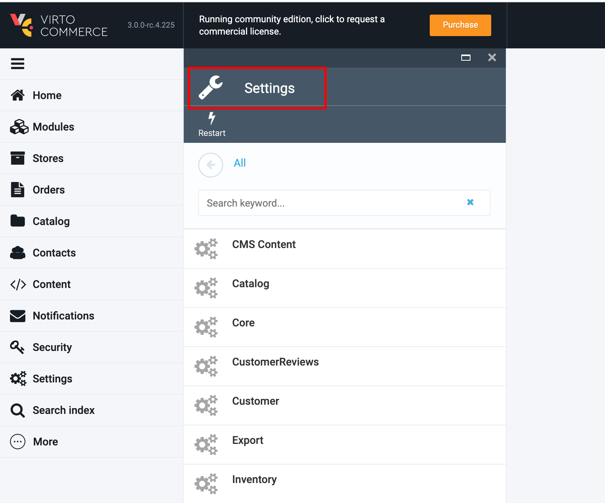
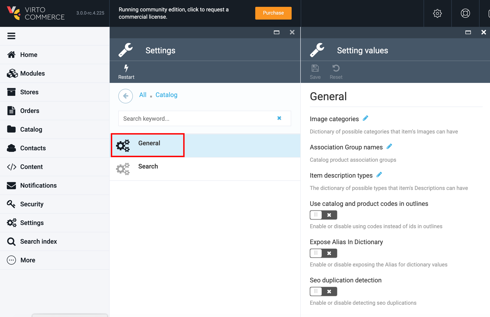

# Module Settings

## Overview

Platform settings are collected and delivered to Settings module by all platform modules.
Each module can add settings to a standard UI by declaring them in the module manifest.

In VC3 settings are declared in ModuleConstants.cs

**Example**

```C#
public static SettingDescriptor ModuleNameEnabled { get; } = new SettingDescriptor
                {
                    Name = "ModuleName.ModuleNameEnabled",
                    GroupName = "ModuleName|General",
                    ValueType = SettingValueType.Boolean,
                    DefaultValue = false
                };
```                

To view the Platform settings go to VC admin->More->Settings.



Standard UI allows to view and edit simple settings. As an example, Catalog module settings are displayed on the screenshot below:



## Settings Description

1. **Name**- The system name of the setting. Example, **"Catalog.ImageCategories"**;
1. **Group Name**- Defines a named group of settings. Can contain multiple setting elements. Example, **"Catalog|General"**;
1. **Value type**-  Supported types are: string - for short text (up to 512 characters); secureString - for short text masked with asterisks or circles in UI; text - for long text (longer than 512 characters); integer; decimal; boolean;
1. **Allowed value** (optional)- Defines a list of allowed values. Can contain multiple value elements. User can select one of the values in standard UI;
1. **Default Value**- Defines the default value which will be returned by **GetValue()** method if the value has not been stored in database yet.
1. **Is Dictionary**- is a Dictionary field type.

You can see the settings definition code:
[Example](https://github.com/VirtoCommerce/vc-module-catalog/blob/release/3.0.0/src/VirtoCommerce.CatalogModule.Core/ModuleConstants.cs#L30)


