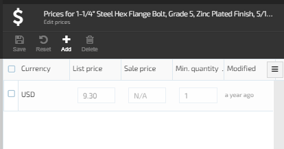
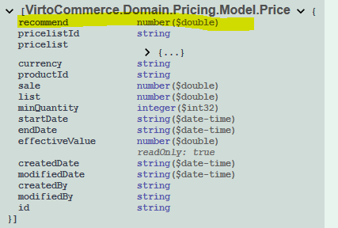

---
title: As an admin, I want to set a recommended price for products in the price list so that customer see it in storefront
description: As an admin, I want to set a recommended price for products in the price list so that customer see it in storefront
layout: docs
date: 2019-06-04
priority: 1
---
## Audience

For Business Analyst, Solution Consultant, Solution Architect.

## Overview
Give your users more control and flexibility around product prices by adding a new price's type. Then, manager can do things like set recommended product price with default prices and display it on sales channel.

## Functional overview

### User stories

#### As an admin, I want to set a recommended price for products in the price list to show it to a customer in a storefront

**Scenario 1.** Admin registers a recommended price for a product

1. Admin goes to a price list
1. Admin inserts/edits a recommended price for a product

**Generalization:** This is the story about adding a new price column into the price list, similar to "sales price" or other kinds of prices

#### As a storefront client, I want to VirtoCommerce Price Module API returns the VirtoCommerce.Domain.Pricing.Model.Price model with a recommended price

**Scenario 1.** VirtoCommerce Price model is extended with the recommended price property.
1. Open VirtoCommerce Solution REST API documentation.
1. See that VirtoCommerce.Domain.Pricing.Model.Price model is extended with the recommended price property

**Scenario 2.** CRUD Operations are available for recommended price property. 
1. Call API to create a product price with a recommended price
1. Call API to read the product price with the recommended price
1. Call API to update the product price with the recommended price
1. Call API to delete the product and recommended price should be deleted from persistent storage.

**Generalization:** This is the story about extending Price model with a new property "recommend" price.

## Non-functional overview

**Effort (story points):**

2 – Small changes, development is required (1-2 days)

## For Team Lead

This case study shows how to extend the standard Pricing Module by adding a field to the Price entity.

### How to implement: an overview

This is one of the simplest examples how to extend the Pricing Module. To implement the example, you should use the standard template Pricing Module extension https://github.com/VirtoCommerce/vc-visualstudio-templates

### How to implement: step by step instruction for Developers

#### Pre-conditions
Nope

#### Steps
1.	Create Pricing Module extension solution from the template 
1.	Fill in **module.manifest** file
1.	Connect extension module with the platform
1.	Extend Domain model with **Recommended** field (**Core project**)
1.	Extend Persistence layer with **Recommended** field (**Data Project**)
1.	Extend Repository (**Data Project**)
1.	Create Migration (**Data Project**)
1. Check that all exist Price records are converted to the extension, add string *Sql("INSERT INTO dbo.PriceEx (Id) SELECT Id FROM dbo.Price")* to conversion if not exists (**Data Project**)
1.	Check that cascade delete to the price entity created (**Data Project**)
1. Check the migration. Delete creation of existing tables (**Data Project**)
1.	Create Unit tests (**Tests project**)
1.	Check connection string (**Web project, Module.cs**)
1.	Check DB registration (**Web project, Module.cs**)
1.	Check type overriding (**Web project, Module.cs**)
1.	Add **Recommended** column into **Price** grid in Platform manager UI (**Web project, module.js**)
1.	Extend Localization file for **Recommended** field (**Web project**)

#### Expected Result
Recommended column added into the Price

### How to implement: Source Code (Code examples)
You can use this sample https://github.com/VirtoCommerce/vc-samples/tree/master/External.PriceModule

You can use ready to use Visual Studio Template to create Virto Commerce 2.x Pricing Module extension https://github.com/VirtoCommerce/vc-visualstudio-templates
