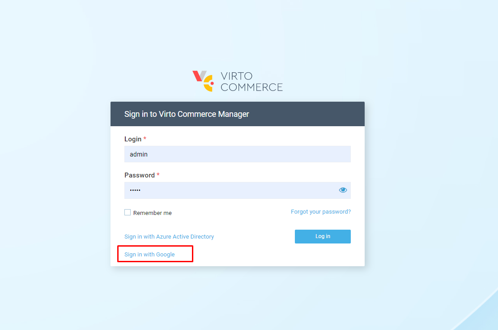

# How to Add New SSO Provider
This tutorial shows you how to implement a new single sign-on (SSO) provider to an extension module using Google as an example.

## Creating Google OAuth 2.0 Client
Any application that uses OAuth 2.0 to access Google APIs must have authorization credentials that identify the application for Google's OAuth 2.0 server. The following steps explain how to create such credentials for your project. Your applications can then use these credentials to access APIs that you have enabled for that project.

-   Go to  [Google API & Services](https://console.cloud.google.com/apis).
    
-   Create a new project and open the dashboard.
    
-   In the ***OAuth consent screen*** of the dashboard:
    
    -   Select ***User Type: External*** and hit ***CREATE***.
    -   In the ***App Information*** dialog, provide the app name, user support email, and developer contact information.
    -   Skip the ***Scopes*** step.
    -   Skip the ***Test users*** step.
    -   Review the ***OAuth consent screen*** and go back to the app dashboard.
    -   In the ***Credentials*** tab of the application dashboard, select ***CREATE CREDENTIALS > OAuth client ID***.
-   Select ***Application type > Web application*** and choose a name.
    
-   In the ***Authorized redirect URIs*** section, select ***ADD URI*** to set the redirect URI (e.g., if your platform is running on a local machine, put  [https://localhost:10645/signin-google](https://localhost:10645/signin-google)). Run the platform using the **https** scheme; otherwise, the SSO won't work.
    
-  Click ***CREATE***.
    
-   Save ***Client ID*** and ***Client Secret*** to use them in the module.

## Google Sign-in Configuration

At this step, you need to store sensitive settings, such as the Google client ID and secret values, inside **KeyVault Storage**. In our example, we will be using the `appsettings.json` configuration file. Add the following section to the configuration:

```json
"Google": {
    "Enabled": true,
    "AuthenticationType": "Google",
    "AuthenticationCaption": "Google",
    "ClientId": "<your Client ID>",
    "ClientSecret": "<your Client Secret>",
    "DefaultUserType": "Manager"
}
```

## Module Extensions

Now you need to add the `Microsoft.AspNetCore.Authentication.Google v6.0` and `VirtoCommerce.Platform.Security` (latest version) packages to `.web` project of the custom extension module, and then provide the following code:

-   Add the basic **GoogleOptions.cs** class:
    
    ```csharp
    public class GoogleOptions
    {
        public bool Enabled { get; set; }
        public string AuthenticationType { get; set; }
        public string AuthenticationCaption { get; set; }
        public string ClientId { get; set; }
        public string ClientSecret { get; set; }
        public string DefaultUserType { get; set; }
    }
    ```
    
-   Add the **GoogleExternalSignInProvider.cs** class. The **IExternalSignInProvider** interface describes the external provider custom behavior:
    
    ```csharp
    public class GoogleExternalSignInProvider : IExternalSignInProvider
    {
        private readonly GoogleOptions _options;
    
        public bool AllowCreateNewUser => true;
        public int Priority => 200;
        public bool HasLoginForm => false;
    
        public GoogleExternalSignInProvider(IOptions<GoogleOptions> options)
        {
            _options = options.Value;
        }
    
        // Use this method to retrieve the username claim
        public string GetUserName(ExternalLoginInfo externalLoginInfo)
        {
            return externalLoginInfo.Principal.FindFirstValue(ClaimTypes.Email);
        }
    
        // Use this method to get the default user type that'll be assigned to a new user
        public string GetUserType()
        {
            return _options.DefaultUserType;
        }
    }
    ```
    
-   Configure Google authentication by adding the following code to the  **module.cs** `Initialize` method:
    
    ```csharp
    var googleAuthEnabled = Configuration.GetValue<bool>("Google:Enabled");
    if (googleAuthEnabled)
    {
        // add options
        var optionsSection = Configuration.GetSection("Google");
        var options = new GoogleOptions();
        optionsSection.Bind(options);
        serviceCollection.Configure<GoogleOptions>(optionsSection);
    
        // add app builder google sso
        var authBuilder = new AuthenticationBuilder(serviceCollection);
    
        authBuilder.AddGoogle(googleOptions =>
        {
            googleOptions.ClientId = options.ClientId;
            googleOptions.ClientSecret = options.ClientSecret;
        });
    
        // register Google external provider implementation
        serviceCollection.AddSingleton<GoogleExternalSignInProvider>();
        serviceCollection.AddSingleton(provider => new ExternalSignInProviderConfiguration
        {
            AuthenticationType = options.AuthenticationType,
            Provider = provider.GetService<GoogleExternalSignInProvider>(),
        });
    }
    ```

## Sign in with Google

Finally, run the platform and open the ***Log in*** screen. An option to sign in with Google will show up. Select the ***Google*** button, which will redirect you to Google for authentication. After entering your Google credentials, you will be redirected back to the platform:

