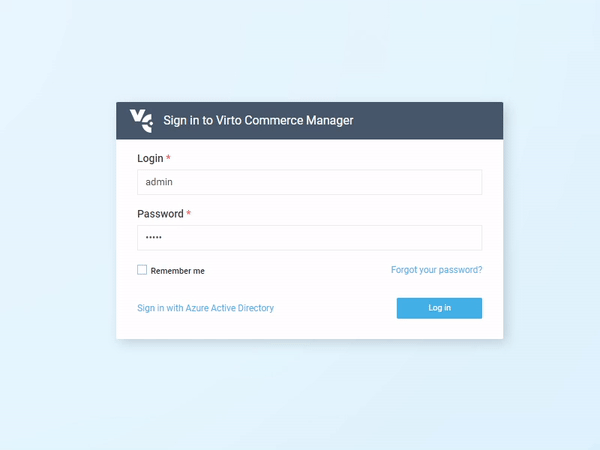

# Configuring and Managing Azure AD Authentication
This article provides you with information about the single sign-on (SSO) options that are available to you, and an introduction to planning a single sign-on deployment when using Azure Active Directory (Azure AD).

## Introduction
By default, Virto Commerce Platform Manager authenticates users with login and password. This method does have some downsides:

- Each Virto Commerce Platform account has to be created manually by an administrator.
- Each user has to memorize their login and password and enter it every single time they want to sign in to Virto Commerce Platform Manager.

These issues can be solved by enabling sign-in with Azure Active Directory. This way, Virto Commerce Platform will allow users of a certain company to sign in or sign up using their Azure Active Directory account.

Azure Active Directory authentication provides the following advantages:

- Virto Commerce Platform Manager will create a new Virto Commerce Platform account automatically when the owner of that account signs in for the first time, so that the Virto Commerce Platform administrator does not have to create it themselves.
- Users will not have to memorize yet another password, as they will use their existing Azure Active Directory account.
- Azure Active Directory uses the [single sign-on](https://en.wikipedia.org/wiki/Single_sign-on) flow, which means, if a user already uses any Microsoft's services, such as Office 365 or Outlook.com, they will not have to enter their password to sign in to Virto Commerce Platform Manager.

To implement single sign-on, Virto Commerce Platform uses the [OpenID Connect](https://openid.net/connect/) protocol implemented by the [Microsoft.AspNetCore.Authentication.OpenIdConnect](https://www.nuget.org/packages/Microsoft.AspNetCore.Authentication.OpenIdConnect) library.


## Prerequisites
To enable Azure Active Directory authentication, you will need to make sure that:

- Your company has a valid Azure Active Directory tenant. If it does not, follow this [quickstart quide](https://docs.microsoft.com/en-us/azure/active-directory/fundamentals/active-directory-access-create-new-tenant) to create one.
- You have an Azure account that belongs to your company's Azure Active Directory tenant. If you do not have an Azure account yet, you can [start a free Azure subscription](https://azure.microsoft.com/free/).
- You have a Virto Commerce Platform instance running, either locally or with Azure. You will need to modify its configuration, so make sure you have privileges to do that.
- You have an administrator access to Virto Commerce Platform Manager if you want to manage roles and privileges for the users signed up with Azure AD.

## Setup
To set up the Azure Active Directory based authentication in Virto Commerce Platform Manager, go through these three simple steps:

1. Add registration for Virto Commerce Platform in Azure Active Directory.
1. Configure Virto Commerce Platform to use Azure AD authentication.
1. Test it.

### Adding Registration for Virto Commerce Platform in Azure Active Directory
1. Sign in to the [Azure Portal](https://portal.azure.com/) using your Azure account.
2. Select **Azure Active Directory**, which will open a screen with the overview of your company's Azure AD tenant.
3. Select **App registrations**.
4. Click the **New registration** button on the **App registrations** screen:

	

5. Provide the following information on the **Register an application** screen:

	- **Name**: Application name for your Virto Commerce Platform instance. Note that Virto Commerce Platform users will see that name on the Azure Active Directory sign-in page.
	- **Supported account types**: Leave the default value.
	- **Redirect URI**: Select **Web** in the first dropdown and enter the external sign-in URL of your Virto Commerce Platform (*<Platform URL>/signin-oidc*), e.g., *http://localhost:10645/signin-oidc*.
  
	
	
    > Important: If your URL is not localhost, then **https** is required.

6. Once you have filled these fields and registered your application, you will see its details:

	

	Copy the values from the **Application (client) ID** and **Directory (tenant) ID** fields, as you will need them in the next step.

6. In **Authentication**, check **ID tokens** and hit **Save**:

	

### Configuring Virto Commerce Platform to Use Azure AD Authentication
1. Open **appsettings.json** for the Virto Commerce Platform instance.
2. Navigate and find the **AzureAd** node:
    
```json
	"AzureAd": {
		"Enabled": false,
		"AuthenticationType": "AzureAD",
		"AuthenticationCaption": "Azure Active Directory",
		"ApplicationId": "(Replace this with Application (client) ID, e.g. 01234567-89ab-cdef-0123-456789abcdef)",
		"TenantId": "(Replace this with Directory (tenant) ID, e.g. abcdef01-2345-6789-abcd-ef0123456789)",
		"AzureAdInstance": "https://login.microsoftonline.com/",
		"DefaultUserType": "Manager",
		"UsePreferredUsername": false
	},
```
    
3. Modify the following settings:
	- Set **Enabled** to **true**
	- Paste the value of **Application (client) ID** from app registration in Azure to **ApplicationId**
	- Paste the value of **Directory (tenant) ID** to **TenantId**
	
	The updated configuration should look like this:
```json
	"AzureAd": {
		"Enabled": true,
		"AuthenticationType": "AzureAD",
		"AuthenticationCaption": "Azure Active Directory",
		"ApplicationId": "b6d8dc6a-6ddd-4497-ad55-d65f91ca7f50",
		"TenantId": "fe353e8f-5f08-43b4-89d1-f4acec93df33",
		"AzureAdInstance": "https://login.microsoftonline.com/",
		"DefaultUserType": "Manager",
		"UsePreferredUsername": false,
		"Priority": 0
	},
```

4. Restart your Virto Commerce Platform instance, so that it could read and apply the updated settings.

## Testing

1. Navigate to the login page of your Virto Commerce Platform Manager and locate the **Sign in with Azure Active Directory** link:

	
	
2. Once you click that link, you will be redirected to the Microsoft sign in page. You might be asked to sign in with your Microsoft account if you did not sign in with it earlier:

	
    
	Provide the credentials of your Azure account. Make sure this account belongs to the same domain where you registered the application.

4. When signing in for the first time, you will also be asked to grant your application a permission to sign you in and read your account information. Just accept it:

	
	
5. If everything went fine, you will be redirected back to the Virto Commerce Platform, where you will be already signed in:

	

	Please note that the account created by signing in using Azure Active Directory is just a regular Virto Commerce Platform account. By default, it has no roles and almost no permissions. You will have to ask your Virto Commerce Platform administrator to adjust permissions and roles for this account:
	
	

## Multitenant Azure AD
If you use the Azure AD authentication and want to allow users from any tenant to connect to your Virto Commerce application,
you need to configure the Azure AD app as multi-tenant and use a *wildcard* tenant ID, such as `organizations` or `common` in the authority URL.

Also, you need to switch *Validate Issuer* from *Default* to *MultitenantAzureAD* mode.


```json
	"AzureAd": {
		"TenantId": "common",
		"ValidateIssuer" : "MultitenantAzureAD",
	},
```

The updated configuration can look like this:
    
```json
	"AzureAd": {
		"Enabled": true,
		"AuthenticationType": "AzureAD",
		"AuthenticationCaption": "Azure Active Directory",
		"ApplicationId": "b6d8dc6a-6ddd-4497-ad55-d65f91ca7f50",
		"TenantId": "common",
		"ValidateIssuer" : "MultitenantAzureAD",
		"AzureAdInstance": "https://login.microsoftonline.com/",
		"DefaultUserType": "Manager",
		"UsePreferredUsername": false,
		"Priority": 0
	},
```

## Configuring Login Scheme Priority

By default, the username/password login is enabled and shown first on the login page:

  

You can change the order of login popups or disable the password login completely. To disable the username/password login, add the following configuration options:
    
```json
	"PasswordLogin": {
		"Enabled": false
	},
```

If both Azure AD login and username/password login types are enabled, you can set up which is shown before the other using the *Priority* option (the lower the number, the higher the priority):
    
```json
	"PasswordLogin": {
		"Enabled": true,
		"Priority": 0
	},
	"AzureAd": {
		"Enabled": true,
		"Priority": 1
	  },
```

## Advanced Details
As mentioned above, if a user signs in with Azure Active Directory for the first time, Virto Commerce Platform will create a new account for them. The question is: what will happen if the Virto Commerce Platform account with the same login already exists?

To answer this question, let's dive deeper into the Azure Active Directory authentication in Virto Commerce Platform. Here is what Virto Commerce Platform does when someone attempts to sign in using Azure Active Directory:

1. VC Platform forces *Microsoft.AspNetCore.Authentication.OpenIdConnect* to check the user's identity. This action starts a typical OpenID Connect flow and causes redirection to the Azure Active Directory sign-in page and back to the Virto Commerce Platform.
2. When this flow is over, Virto Commerce Platform receives Azure Active Directory account information for the current user and extracts the *upn* claim value from it.
3. Virto Commerce Platform then attempts to find an existing Virto Commerce Platform account with a login that matches that *upn* claim value. This may yield three possible outcomes:
	- The account already exists and is linked to the Azure Active Directory account of the signed in user. In this case, no further actions will be performed, and Virto Commerce Platform will just authenticate that user using the existing account.
	- The account already exists, but is missing the Azure Active Directory external sign in information. In this case, Virto Commerce Platform will modify that account to add external login information for the Azure Active Directory account. All other account information, including roles, permissions, and personal information, will remain untouched.
	- Finally, if such account does not exist yet, VC Platform will create it and link it with Azure Active Directory account.
4. In case the *upn* claim is not being transferred. For example if you see: *Received external login info does not have an UPN claim or DefaultUserName* error message. The system can be configured to use the **preferred_username** or **emailaddress** claims instead using the following setting:

    You can read user name from **preferred_username** claim with the following setting:
    
    ```json
	    {
		    "UsePreferredUsername": true
	    }
    ```

    Alternatively, it can also use the **emailaddress** claim with the following setting:
    
    ```json
	    {
		    "UseEmail": true
	    }
    ```

5. If you see the following error *IDX10205: Issuer validation failed*, you forget switch ValidateIssuer to MultitenantAzureAD.

## Configuration with Custom Azure AD App Signing Keys

If your app has custom signing keys, you can receive this error upon the `POST https://localhost:5001/signin-oidc` request:

```json
Microsoft.IdentityModel.Tokens.SecurityTokenSignatureKeyNotFoundException: IDX10501: Signature validation failed. Unable to match key
```
    
https://github.com/Azure/azure-sdk-for-net/issues/17695

If your app has custom signing keys as a result of using the claim mapping feature, you have to append an appid query parameter containing the app ID in order to get a *jwks_uri* pointing to your app's signing key information. For example, https://login.microsoftonline.com/{tenant}/v2.0/.well-known/openid-configuration?appid=6731de76-14a6-49ae-97bc-6eba6914391e contains a *jwks_uri* of https://login.microsoftonline.com/{tenant}/discovery/v2.0/keys?appid=6731de76-14a6-49ae-97bc-6eba6914391e.

Here is an example of the updated configuration that resolves the above issue:
    
```json
	"AzureAd": {
		"Enabled": true,
		"AuthenticationType": "AzureAD",
		"AuthenticationCaption": "Azure Active Directory",
		"ApplicationId": "b6d8dc6a-6ddd-4497-ad55-d65f91ca7f50",
		"TenantId": "fe353e8f-5f08-43b4-89d1-f4acec93df33",
		"AzureAdInstance": "https://login.microsoftonline.com/",
		"MetadataAddress": "https://login.microsoftonline.com/fe353e8f-5f08-43b4-89d1-f4acec93df33/v2.0/.well-known/openid-configuration?appid=b6d8dc6a-6ddd-4497-ad55-d65f91ca7f50",
		"DefaultUserType": "Manager",
		"UsePreferredUsername": false
	},
```
