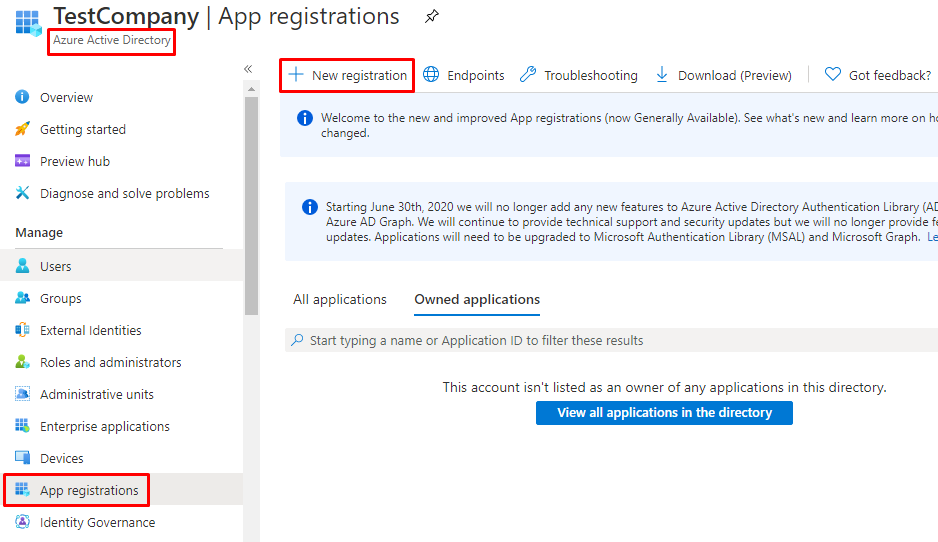
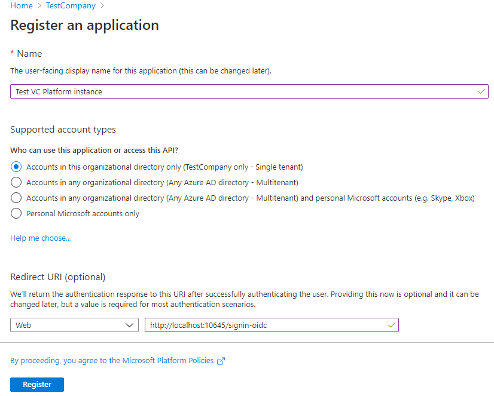
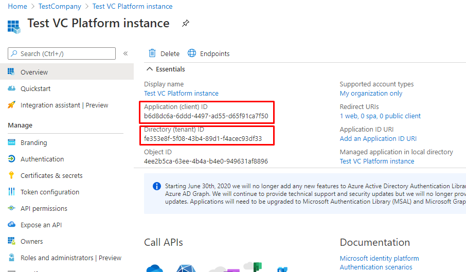
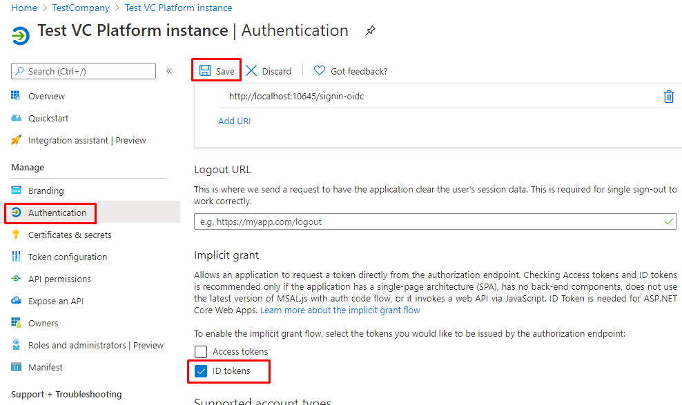
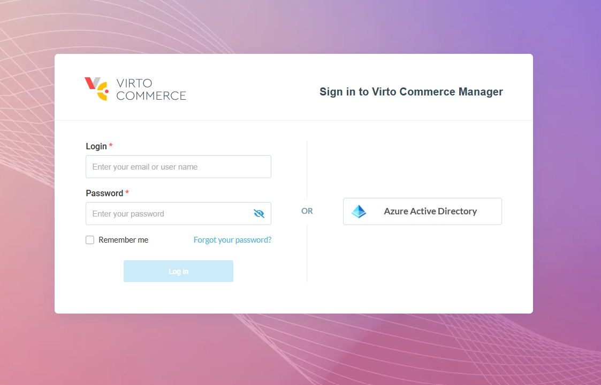
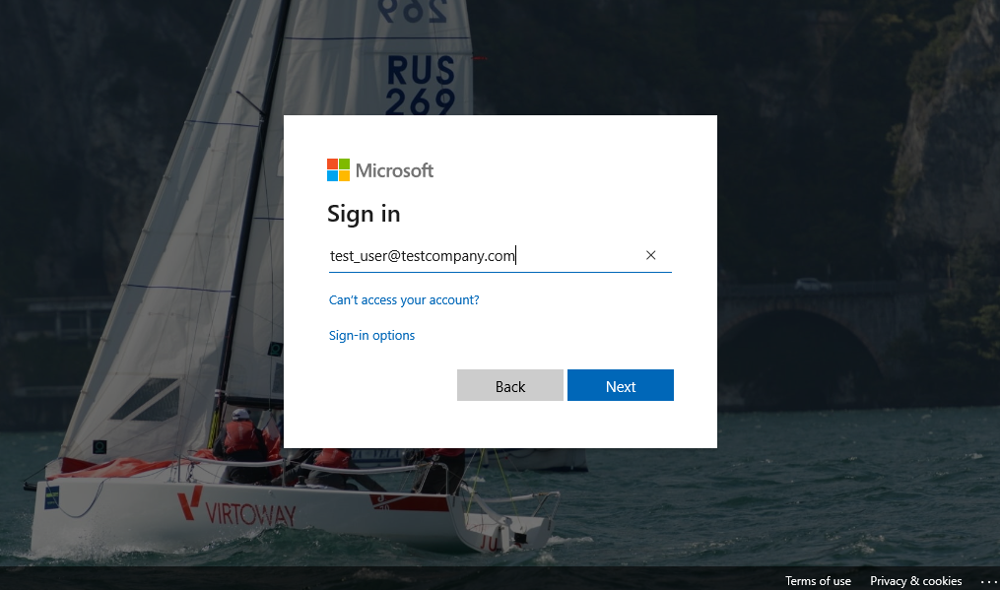
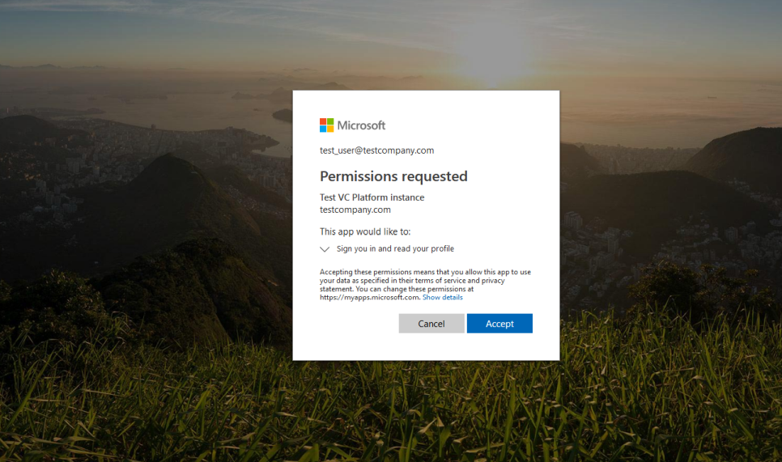
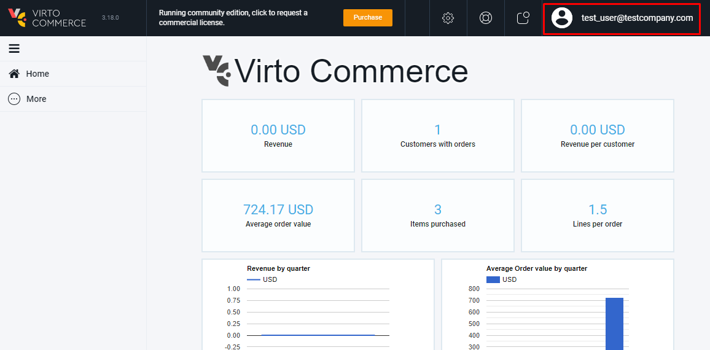
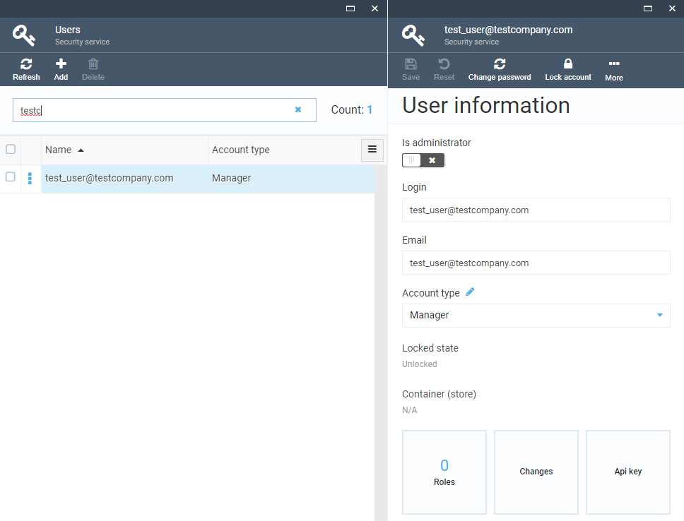

# Enabling authentication with Azure Active Directory

## Introduction
By default, Virto Commerce Platform Manager authenticates users by their logins and passwords. This method has some downsides:

- Each Virto Commerce Platform account has to be created manually by administrator;
- Each user has to memorize their login and password and to enter it every time they want to sign in to Virto Commerce Platform Manager.

These issues can be solved by enabling sign-in with Azure Active Directory. This way, Virto Commerce Platform will allow users of given organization to sign in or sign up using their Azure Active Directory account.

Benefits of the authentication with Azure Active Directory:

- Virto Commerce Platform Manager will create a new Virto Commerce Platform account automatically when the owner of that account will sign in for the first time, so Virto Commerce Platform administrator won't have to create it themselves;
- Users won't have to memorize yet another password - they will use their existing Azure Active Directory account;
- Azure Active Directory uses the [single sign-on](https://en.wikipedia.org/wiki/Single_sign-on) flow. So, if the user already uses some Microsoft's services (Office 365, Outlook.com, etc.), they won't need to enter their password to sign in to Virto Commerce Platform Manager.

To implement single sign-on, Virto Commerce Platform uses the [OpenID Connect](https://openid.net/connect/) protocol implemented by the [Microsoft.AspNetCore.Authentication.OpenIdConnect](https://www.nuget.org/packages/Microsoft.AspNetCore.Authentication.OpenIdConnect) library.


## Prerequisites
To enable Azure Active Directory authentication, you'll need to make sure that:

- Your organization has a valid Azure Active Directory tenant. If it doesn't, follow the [quickstart quide](https://docs.microsoft.com/en-us/azure/active-directory/fundamentals/active-directory-access-create-new-tenant) to create one.
- You have an Azure account that belongs to your organization's Azure Active Directory tenant. If you don't have an Azure account yet, you can [start a free Azure subscription](https://azure.microsoft.com/free/);
- You have a Virto Commerce Platform instance running (e.g., in Azure or on premises). You'll need to modify its configuration, so make sure you have privileges to do that;
- If you want to manage roles and privileges for users signed up using Azure AD, make sure you have an administrator access to Virto Commerce Platform Manager.

## Setup
To set up the Azure Active Directory-based authentication in Virto Commerce Platform Manager, you'll need to perform 3 steps:

1. Add registration for Virto Commerce Platform in Azure Active Directory;
1. Configure Virto Commerce Platform to use Azure AD authentication;
1. Test it.

### Add registration for Virto Commerce Platform in Azure Active Directory
1. Sign in to the [Azure Portal](https://portal.azure.com/) using your Azure account.
2. Select **Azure Active Directory**. You will see the blade with the overview of your organization's Azure AD tenant.
3. Select **App registrations**.
4. Click **New registration** button in **App registrations** blade:

    

5. Provide the following information on **Register an application** blade:

    - **Name**: application name for your Virto Commerce Platform instance. Note that Virto Commerce Platform users will see that name on the Azure Active Directory sign-in page.
    - **Supported account types**: OK to leave the default value.
    - **Redirect URI**: select **Web** in the first selector and enter the external sign-in URL of your Virto Commerce Platform (&lt;&lt;Platform URL&gt;&gt;/signin-oidc) E.g., *http://localhost:10645/signin-oidc*.
  
    
	
	!!! note
	    If the URL is not localhost, then **https** is required.

6. Once you've filled these fields and registered your application, you'll see its details:

    

    Copy the values from **Application (client) ID** and **Directory (tenant) ID** fields - you'll need them in the next step.

6. In **Authentication** check **ID tokens** and **Save**:

    

### Configure Virto Commerce Platform to use Azure AD authentication
1. Open **appsettings.json** for the Virto Commerce Platform instance.
2. Navigate and find the **AzureAd** node:
```json
    "AzureAd": {
        "Enabled": false,
        "AuthenticationType": "AzureAD",
        "AuthenticationCaption": "Azure Active Directory",
        "ApplicationId": "(Replace this with Application (client) ID, e.g. 01234567-89ab-cdef-0123-456789abcdef)",
        "TenantId": "(Replace this with Directory (tenant) ID, e.g. abcdef01-2345-6789-abcd-ef0123456789)",
        "AzureAdInstance": "https://login.microsoftonline.com/",
        "DefaultUserType": "Manager"
    },
```
3. Modify these settings:
    - Set the value of the **Enabled** to **true**;
    - Paste the value of **Application (client) ID** from app registration in Azure to the value of the **ApplicationId**;
    - Paste the value of **Directory (tenant) ID** to the value of the **TenantId**;
    
    The updated configuration should look like this:
```json
    "AzureAd": {
        "Enabled": true,
        "AuthenticationType": "AzureAD",
        "AuthenticationCaption": "Azure Active Directory",
        "ApplicationId": "b6d8dc6a-6ddd-4497-ad55-d65f91ca7f50",
        "TenantId": "fe353e8f-5f08-43b4-89d1-f4acec93df33",
        "AzureAdInstance": "https://login.microsoftonline.com/",
        "DefaultUserType": "Manager"
    },
```

4. Restart your Virto Commerce Platform instance, so it could read and apply the updated settings.

### Test it

1. Navigate to the login page of your Virto Commerce Platform Manager and note the **Sign in with Azure Active Directory** link:

    
    
2. By clicking that link, you'll be redirected to the Microsoft sign-in page. You might be asked to sign in with your Microsoft account if you did not sign in with it earlier:

    
    Provide the credentials of your Azure account. Make sure that this account belongs to the same domain where you registered the application.

4. When signing in for the first time, you'll also be asked to grant your application a permission to sign you in and read your account information. Just accept it:

    
	
5. If everything went well, you will be redirected back to the Virto Commerce Platform and signed in:

    

    Please note that the account created by signing in using Azure Active Directory is just a regular Virto Commerce Platform account. By default, it has no roles and almost no permissions. You will have to ask your Virto Commerce Platform administrator to adjust permissions and roles for this account:
	
    

## Advanced details
As said before, if the user signs in with Azure Active Directory for the first time, Virto Commerce Platform will create a new account for this user. But what will happen if the Virto Commerce Platform account with the same login already exists?

To answer this question, let's dive deeper to the Azure Active Directory authentication in Virto Commerce Platform. So, here are the actions that are performed by Virto Commerce Platform when someone attempts to sign in using Azure Active Directory:

1. VC Platform forces Microsoft.AspNetCore.Authentication.OpenIdConnect to check user's identity. This action starts a typical OpenID Connect flow and causes redirection to the Azure Active Directory sign-in page and back to the Virto Commerce Platform.
2. When this flow is over, Virto Commerce Platform receives an Azure Active Directory account information for the current user and extracts **upn** claim value from that information.
3. Virto Commerce Platform then attempts to find an existing Virto Commerce Platform account with login that matches that **upn** claim value. There might be 3 possible cases here:
    - The account already exists and is linked with Azure Active Directory account of signed-in user. In this case, no further actions will be performed - Virto Commerce Platform will just authenticate that user using the existing account.
    - The account already exists, but is missing the Azure Active Directory external sign-in information. In this case Virto Commerce Platform will modify that account to add external login information for the Azure Active Directory account. All other account information (including roles, permissions and personal information) will remain untouched.
    - Finally, if such account does not exist yet, VC Platform will create it and link it with Azure Active Directory account.

## Configuration when Azure AD App has custom signing keys

If your app has custom signing keys you can receive this error on `POST https://localhost:5001/signin-oidc` request.

```json
Microsoft.IdentityModel.Tokens.SecurityTokenSignatureKeyNotFoundException: IDX10501: Signature validation failed. Unable to match key
```
https://github.com/Azure/azure-sdk-for-net/issues/17695

If your app has custom signing keys as a result of using the claims-mapping feature, you must append an appid query parameter containing the app ID in order to get a jwks_uri pointing to your app's signing key information. For example: https://login.microsoftonline.com/{tenant}/v2.0/.well-known/openid-configuration?appid=6731de76-14a6-49ae-97bc-6eba6914391e contains a jwks_uri of https://login.microsoftonline.com/{tenant}/discovery/v2.0/keys?appid=6731de76-14a6-49ae-97bc-6eba6914391e.

To solve this situation the updated configuration should look like this:
```json
    "AzureAd": {
        "Enabled": true,
        "AuthenticationType": "AzureAD",
        "AuthenticationCaption": "Azure Active Directory",
        "ApplicationId": "b6d8dc6a-6ddd-4497-ad55-d65f91ca7f50",
        "TenantId": "fe353e8f-5f08-43b4-89d1-f4acec93df33",
        "AzureAdInstance": "https://login.microsoftonline.com/",
        "MetadataAddress": "https://login.microsoftonline.com/fe353e8f-5f08-43b4-89d1-f4acec93df33/v2.0/.well-known/openid-configuration?appid=b6d8dc6a-6ddd-4497-ad55-d65f91ca7f50",
        "DefaultUserType": "Manager"
    },
```
