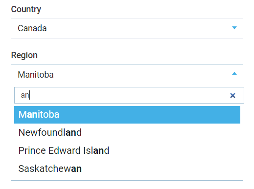

# Countries management
Adding new address usually includes filling country and country region fields. Address management UI in Virto Commerce Manager:




## Configuration
Virto Commerce provides countries and regions as configurable lists. The data is stored in `json` files in the Platform app. Configure the location of the files by modifying configuration settings:

- `VirtoCommerce:CountriesFilePath` - local path for countries list. By default, includes all the countries in the world. Default value: `"localization/common/countries.json"` 
- `VirtoCommerce:CountryRegionsFilePath` - local path for countries' regions list. By default, includes the states of USA and regions of Canada. Default value: `"localization/common/countriesRegions.json"`

Check [Configuration settings](../user-guide/configuration-settings.md) for Platform configuration guidelines.

## Custom countries list
Update `countries.json` as needed: leave only the countries which are actually maintained by this Platform instance. Remove all the others. Sample countries list:

```json
[
    { id: "CAN", name: "Canada" },
    { id: "USA", name: "United States of America" }
]
```

## Regions list
Update `countriesRegions.json` as needed: add the regions for the maintained countries if they would be missing in the file. Regions file structure:

```json
[{
     id: "<<country code>>",
     regions: [
        {name: "<<Region name 1>>", id: "<<region code 1>>" },
        {name: "<<Region name 2>>", id: "<<region code 2>>" },
        ...
    ]
}]
```

Check current [countriesRegions.json](https://github.com/VirtoCommerce/vc-platform/blob/master/src/VirtoCommerce.Platform.Web/localization/common/countriesRegions.json) in the repository.


## Localization
Virto Platform Manager supports localization resources for text, captions, tips, etc. This is also true for country and region names. This is achieved by adding translations to localization file(s). Copy the translations from [German translation file](https://github.com/VirtoCommerce/vc-platform/blob/master/src/VirtoCommerce.Platform.Web/wwwroot/Localizations/de.VirtoCommerce.Countries.json) to localize to a new language.


Country name localization:
> *"platform.countries." + <&lt;country code>>*

Region name localization:
> *"platform." + <&lt;country code>> + <&lt;region code>>*

Excerpt from translation to German:
```JSON
...
{
    "platform": {
        "countries": {
            "AFG": "Afghanistan",
            "EGY": "Ägypten",
            ...
          },
        "CAN": {
            ...
            "NL": "Neufundland und Labrador",
            "NT": "Nordwest-Territorien",
            ...
        }
    }
}
```