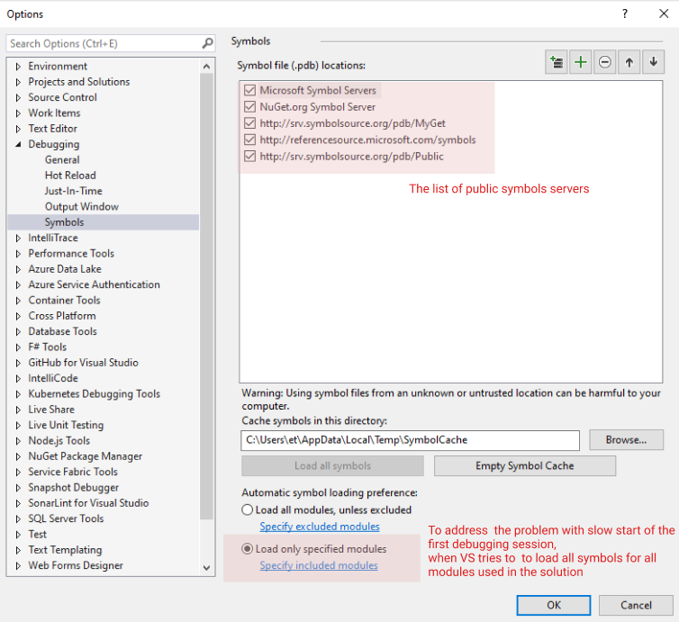
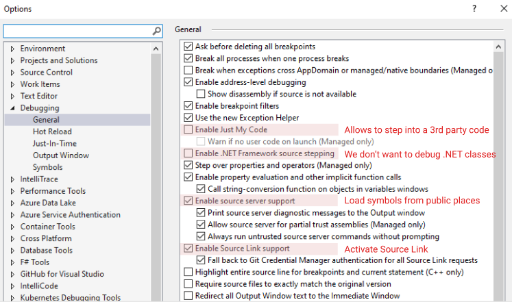
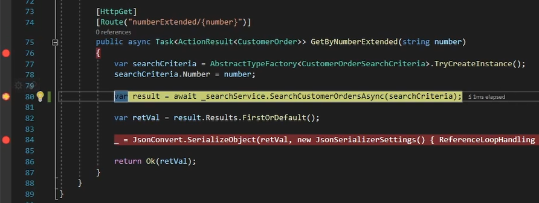
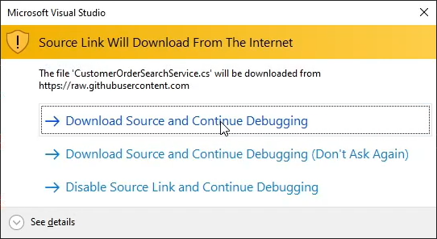
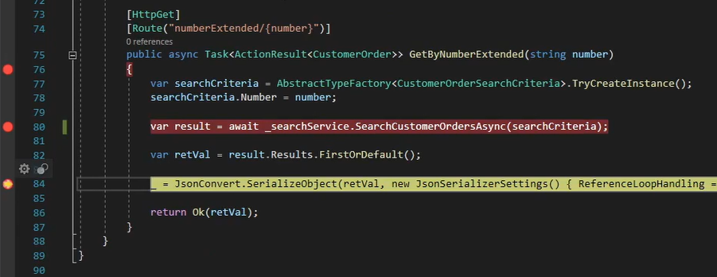
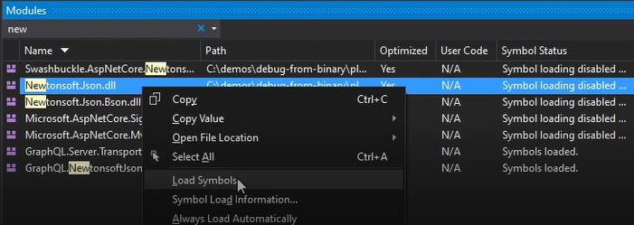

# How to debug the platform and modules code without source code

Debugging is a big part of a developer’s job. Since, the preferred way how to work with VC as binary precompiled components when the source is unavailable sometimes you have needs to debug the VC source code. In this article we will cover the main debugging-related technics that can improve your development productivity when working with VC and 3rd party components.

- Debugging VC components with using [Source Link](https://github.com/dotnet/sourcelink/blob/main/README.md) technology
- Load a PDB directly from public symbol servers

Let’s have a look at each one of them in detail and consider the scenario, where  you want to debug a 3rd party NuGet package. You have no access to the source code of the library and  the local  project that references it as a package.

## Debugging with Source Links

> Source Link is a technology that enables source code debugging of .NET assemblies from NuGet by developers. Source Link executes when creating the NuGet package and embeds source control metadata inside assemblies and the package. Developers who download the package and have Source Link enabled in Visual Studio can step into its source code. 

Since the all VC platform and modules components already support the [Source Link](https://github.com/dotnet/sourcelink/blob/main/README.md) technology, this is the preferred  way how to debug the VC components for your solution. With Source Link, you can step into framework methods just like you can with your own code, inspect all variables, and set breakpoints.

In order to start using [Source Link](https://github.com/dotnet/sourcelink/blob/main/README.md) for debugging you should complete the following steps:

### Step 1 - Configure Visual Studio to Support NuGet.org Symbol Sources
As Source Link downloads source files from the internet, it’s not enabled by default. Here’s how to enable it:

In Visual Studio, go to `Tools –> Options –> Debugging –> Symbols`:

 

Make sure the `NuGet.org Symbol Server` and `Load only specified modules` options are checked, the first option allows to VS load symbols from public NuGet servers.
Recommend additional servers order: 
- http://referencesource.microsoft.com/symbols 
- http://srv.symbolsource.org/pdb/Public 
- http://srv.symbolsource.org/pdb/MyGet 
- http://msdl.microsoft.com/download/symbols 

The second option `Load only specified modules` can significantly speed up the launch a debug session. Otherwise, Visual Studio will download the available symbols for each dependency for the solution on startup and this can take a long time.

### Step 2 - Configure Visual Studio debugging general options
In Visual Studio, go to `Tools –> Options –> Debugging –> General`:
check/uncheck the options according to the screenshot below:

 

After these steps your VS is ready for debugging the 3rd party components including the VirtoCommerce NuGet dependencies.

### Step 3 - Step into Third Party Code

Let's say we have the following code

 

Now we can set the breakpoint in our code in the line where we call `_searchService.SearchCustomerOrdersAsync`, when the debugger hits that line, make sure you press F11 or use the Step Into functionality to download the `VirtoCommerce.OrderModule.Data` source code via SourceLink and step through it.

 

You’ll be prompted to download the source from Github and after you click “Accept” you’ll be able to view the source code for that specific version of your package and you can continue debugging the 3rd party module as it is included into your solution as source code.

## Load a PDB directly from public symbol servers

Lets consider the situation when the 3rd party component doesn't support Source Links and you do not have the PDB file is loaded for this library.
As you remember, we intentionally disabled the automatic symbols loading  in the previous steps to reduce VS debugging launch time and better control which modules we want to debug.

 

We can't step into `JsonConvert.SerializeObject` because the symbols of `Newtonsoft.Json` library aren't loaded into the current debugging process, in order to load the symbols manually we have to open the `Debug-> Window -> Modules` window and load symbols manually 

 

After this step, the symbols for `Newtonsoft.Json` are successfully loaded, we can step into this library and continue debugging process.

# Conclusion

By adding Source Link support for all VirtoCommerce components we made the debugging process more streamlined without the requirement to have deal with source code of the platform and core modules.

# Additional resources

- http://www.symbolsource.org/Public/Home/VisualStudio
- https://blexin.com/en/blog-en/how-to-debug-nuget-libraries
- https://docs.microsoft.com/en-us/dotnet/standard/library-guidance/sourcelink
- https://github.com/dotnet/sourcelink/blob/master/README.md
- https://lurumad.github.io/using-source-link-in-net-projects-and-how-to-configure-visual-studio-to-use-it
