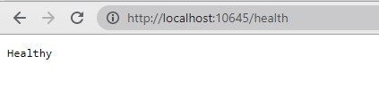

# Health checks in VirtoCommerce platform
VirtoCommerce platform support health checks from ASP.NET Core middlewares.
## Adding heal checks in modules
Create class wich inherits from `IHealthCheck` interface. Implement it.

*`CatalogHealthCheck.cs`*
``` C#
public class CatalogHealthCheck : IHealthCheck
{
    public Task<HealthCheckResult> CheckHealthAsync(
        HealthCheckContext context,
        CancellationToken cancellationToken = default(CancellationToken))
    {
        var healthCheckResultHealthy = true;

        if (healthCheckResultHealthy)
        {
            return Task.FromResult(
                HealthCheckResult.Healthy("A healthy result."));
        }

        return Task.FromResult(
            new HealthCheckResult(context.Registration.FailureStatus,
            "An unhealthy result."));
    }
}
```

Register created health checks in service collection.

*`Module.cs`*
``` C#
public class Module : IModule
{
    public void Initialize(IServiceCollection serviceCollection)
    {
        //Rest of code skipped for better clarity

        serviceCollection
            .AddHealthChecks()
            .AddCheck<CatalogHealthCheck>("catalog_health_check");

    }
}
```

### 3. Done
Now you can check your platform by getting a response from `/health` endpoint.



## Docker
Docker offers a built-in `HEALTHCHECK` directive that can be used to check the status of an app that uses the basic health check configuration:
``` bash
HEALTHCHECK CMD curl --fail http://localhost:5000/health || exit
```

## Additional Resources
1. https://docs.microsoft.com/en-us/aspnet/core/host-and-deploy/health-checks?view=aspnetcore-5.0
