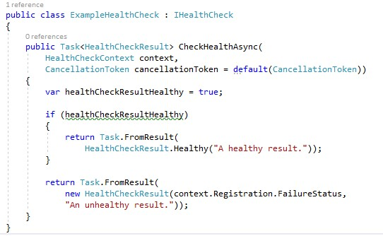
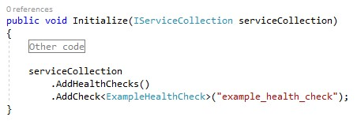

# Health checks in VirtoCommerce platform
VirtoCommerce platform support health checks from ASP.NET Core middlewares.
## Adding heal checks in modules
### 1. Creating health check
Create class wich inherits from `IHealthCheck` interface. Implement it.

### 2. Registration
Register created health checks in service collection.
1. Open `Module.cs`;
1. Find `Initialize` method;
1. Call `AddHelthChecks()` to get health check builder from `serviceCollection`;
1. Add previously added health check class.


### 3. Done
Now you can check your platform by getting a response from `/health` endpoint.


## Docker
Docker offers a built-in `HEALTHCHECK` directive that can be used to check the status of an app that uses the basic health check configuration:
``` bash
HEALTHCHECK CMD curl --fail http://localhost:5000/health || exit
```

## Additional Resources
1. https://docs.microsoft.com/en-us/aspnet/core/host-and-deploy/health-checks?view=aspnetcore-5.0
