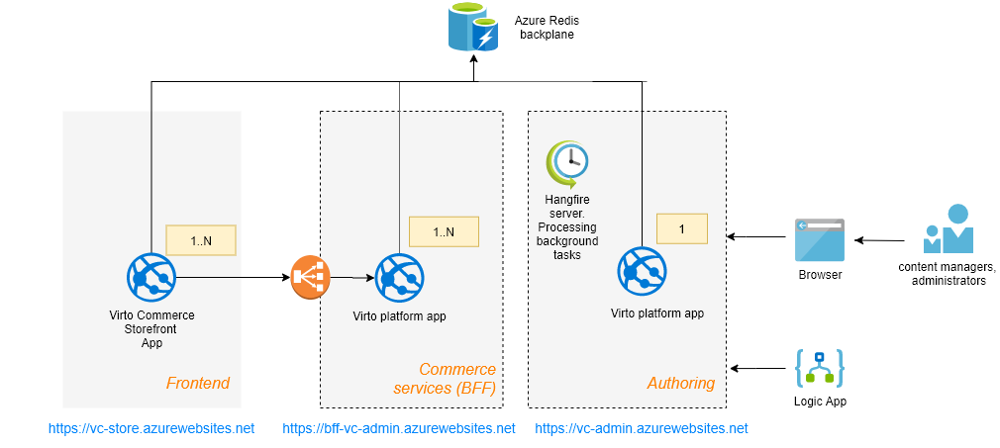

# Scaling configuration on the Azure cloud

This article explains aspects of setting up a virto platform to use for scaling out an Azure cloud environment.
Using scale-out for platform allows you to build more reliable service and also divide the whole solution to the layers and remove the single point of failure.

## Overview 

This reference architecture shows proven practices for improving scalability and performance for solutions build on the virtocommerce platform 

 

**Components:**

- **Commerce services (backend for frontend)** - The platform Web Apps runs in multiple regions, accessible to web and mobile browsers, and is scaled out across multiple server instances. The primary responsibility is to serve all requests from frontends to a commercial API with high reliability and performance. 
- **Authoring services (backend)** - The platform Web App is used to process background jobs, integrate with third-party services, commerce data management by users through the platform’s SPA manager. It is decoupled from  platform Web Apps from commercial services in order to avoid affecting their performance and resource consumption.
- **Redis server** - provides broadcasting (backplane) messages between multiple platform Web App from each layer to keep their local memory caches in the consistent state.
- **Hangfire server** - one or multiple platform instances are configured to process Hangfire background jobs.
   
## Memory cache. Use the Redis server backplane

The keep cached data in consistent state is quite simple if you have single instance application with local cache storage. You easy control cache lifecycle and invalidation when entries in a cache are removed/deleted.

But what to do in case with scaled out multiple instances application? Main problem is how instances finds out when data was changed and the local cache data becomes irrelevant.

The using of distributed cache may be the solution but in the virto platform we don't use the distributed cache because network latency for cached data degrades performance and also this way is required a serialization/deserialization support for all cached data, that also is hard to achieve.
The point is to use local cache storage for each application instance that are connected to the shared broadcasted  service (backplane) and  data by receiving invalidation message.

To resolve this problem we need some service to which all application instances will be connected, and which can broadcast messages when cache data becomes invalidate. 
Redis is quite good to this task, is an in-memory key-value store that supports a messaging system with a publish/subscribe model. 
The Virto memory caching Redis backplane uses the pub/sub feature to forward messages to other servers. When a one platform instance  evict some data from cache,
the message for this event  is passed to the backplane. The backplane knows all connected clients and which servers they're on. It sends the message to all clients via their respective servers. 

This process is illustrated in the following diagram:

 

The following example shows how to setup using the Redis backplane for memory cache in appsettings.json 

*appsettings.json*
```json

    "ConnectionStrings": {
        ...
        //Add RedisConnectionString value to start using Redis server as backplane for memory cache synchronization
        "RedisConnectionString": "vc.redis.cache.windows.net:6380,password={password}=,ssl=True,abortConnect=False"
        ...
    },
```

##  SignalR Push notification. Use the Redis server backplane
The push notification that is used in the manager is built on the [SignalR](https://docs.microsoft.com/en-us/aspnet/core/signalr/introduction?view=aspnetcore-3.1) library.
In order to be able to see all push notifications on the manager that even emits by different platform instances, you need to configure you platform to use Redis server backplane for SignalR messages. You can read more details how it works underhood by this link [Set up a Redis backplane for ASP.NET Core SignalR scale-out](https://docs.microsoft.com/en-us/aspnet/core/signalr/redis-backplane?view=aspnetcore-3.1)

*appsettings.json*
```json
"SignalR": {
        //Possible values: RedisBackplane (default) | AzureSignalRService
        //RedisBackplane will be activated only when RedisConnectionString is set otherwise no any SignalR scaling options will be used 
        "ScalabilityProvider": "RedisBackplane",
        "RedisBackplane": {
            "ChannelName": "VirtoCommerceChannel"
        }
```

## Configure the Hangfire server to processing background jobs into another process
It is very important for an overall application reliability to process all background tasks on the separate platform instance (process) to avoid the problem when your background processing consumes too much CPU or other resources, and this decreases main application’s performance. We strongly recommend to use separate platform instance for processing background jobs.

In order to do that you need to configure one platform instance  (*Commerce services* on the diagram above) that will only enqueue background jobs, when other platform instance (*Authoring* on the diagram above)  Hangfire server will process these background jobs, taken from the shared storage. 

> Ensure that all of your Client/Servers use the same job storage and JobStorageType, only **SqlServer** is allowed and have the same code base. If client enqueues a job based on the SomeClass that is absent in server’s code, the latter will simply throw a performance exception.

Here is the config of how to switch the platform instance to works as Hangfire client and only enqueues the background jobs into a queue.

*appsettings.json*
```json
...
    "VirtoCommerce": {
         "Hangfire": {
              "JobStorageType": "SqlServer",
               "UseHangfireServer": false, //Set value to false for the platform instance that you want to stop processing the background jobs
               ...
         }
         ...
    }
```

Here is the config of how to switch platform instance to works as Hangfire server and process the background jobs.

*appsettings.json*
```json
...
    "VirtoCommerce": {
         "Hangfire": {
              "JobStorageType": "SqlServer",
               "UseHangfireServer": true, //Set value to true for the platform instance that you want to process the background jobs
               ...
         }
         ...
    }
```


## The resulting configuration for **Commerce Service** platform instances

*appsettings.json*
```json
 "ConnectionStrings": {
         "VirtoCommerce": "Data Source=tcp:dev-odt.database.windows.net,1433;Initial Catalog={db-name};User ID={db-admin-name};Password={password};MultipleActiveResultSets=True;Connection Timeout=30;Trusted_Connection=False;Encrypt=True;"
        //Add RedisConnectionString value to start using Redis server as backplane for memory cache synchronization
        "RedisConnectionString": "vc.redis.cache.windows.net:6380,password={password}=,ssl=True,abortConnect=False"
    },
    ...
     "VirtoCommerce": {
         "Hangfire": {
              "JobStorageType": "SqlServer",
               "UseHangfireServer": false, //Set value to false for the platform instance that you want to stop processing the background jobs
               ...
         }
         ...
     "SignalR": {
        //Possible values: RedisBackplane (default) | AzureSignalRService
        //RedisBackplane will be activated only when RedisConnectionString is set otherwise no any SignalR scaling options will be used 
        "ScalabilityProvider": "RedisBackplane",
        "RedisBackplane": {
            "ChannelName": "VirtoCommerceChannel"
        }
        ...

```

## The resulting configuration for **Authoring** platform instances

*appsettings.json*
```json
 "ConnectionStrings": {
         "VirtoCommerce": "Data Source=tcp:dev-odt.database.windows.net,1433;Initial Catalog={db-name};User ID={db-admin-name};Password={password};MultipleActiveResultSets=True;Connection Timeout=30;Trusted_Connection=False;Encrypt=True;"
        //Add RedisConnectionString value to start using Redis server as backplane for memory cache synchronization
        "RedisConnectionString": "vc.redis.cache.windows.net:6380,password={password}=,ssl=True,abortConnect=False"
    },
    ...
     "VirtoCommerce": {
         "Hangfire": {
              "JobStorageType": "SqlServer",
               "UseHangfireServer": true, //Set value to false for the platform instance that you want to stop processing the background jobs
               ...
         }
         ...
     "SignalR": {
        //Possible values: RedisBackplane (default) | AzureSignalRService
        //RedisBackplane will be activated only when RedisConnectionString is set otherwise no any SignalR scaling options will be used 
        "ScalabilityProvider": "RedisBackplane",
        "RedisBackplane": {
            "ChannelName": "VirtoCommerceChannel"
        }
        ...

```

## Additional Resources


**Virto Platform scalability architectures**
[Scalability](../fundamentals/scalability.md)