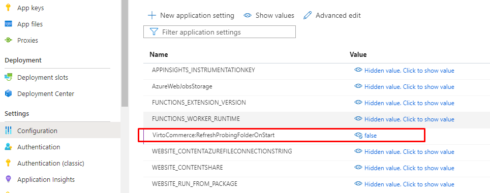

Azure Functions lets you run your code in a serverless environment without having to first create a virtual machine (VM) or publish a web application. 
In this article, you use command-line tools to deploy and run VC Platform on the serverless environment  of Azure Functions.


# How it works
For run `vc platform` on the serverless environment of Azure Functions we use the [Azure Functions custom handlers](https://docs.microsoft.com/en-us/azure/azure-functions/functions-custom-handlers). Custom handlers are best suited for situations where we want to host and run the existing ASP.NET Core application that is not intendent to run on Azure functions, and by the way recieves a good options to run as serverless application without any code changes.


# Prerequisites
Verify these prerequisites before you begin
- [Azure CLI](https://docs.microsoft.com/en-us/cli/azure/install-azure-cli) must be installed
- The [Azure Functions Core Tools](https://docs.microsoft.com/en-us/azure/azure-functions/functions-run-local) version 3.x.
- Locally installed [VC Platform](https://github.com/VirtoCommerce/vc-platform/blob/master/docs/getting-started/deploy-from-precompiled-binaries-windows.md) instance with a set of modules installed
- [Create supporting Azure resources for your function](https://docs.microsoft.com/en-us/azure/azure-functions/create-first-function-cli-csharp?tabs=azure-cli%2Cbrowser#create-supporting-azure-resources-for-your-function)

In this article, you use `command-line` tools to deploy platform app to the serverless environment of Azure Functions. There is also the article how to getting started with Azure Functions [Getting started with Azure Functions using command line](https://docs.microsoft.com/en-us/azure/azure-functions/functions-get-started?pivots=programming-language-csharp), or alternative [Create a C# function in Azure using Visual Studio Code](https://docs.microsoft.com/en-us/azure/azure-functions/create-first-function-vs-code-csharp)

The platform folder already includes all files that required to run platform app as custom handler you don't need to do anything extra with this:


A `/host.json` file at the root of platform app tells the Functions host where to send requests by pointing to a web server capable of processing HTTP events.

Azure Functions lets you run your code in a serverless environment without having to first create a virtual machine (VM) or publish a web application. 
In this article, you use command-line tools to deploy and run VC Platform on the serverless environment  of Azure Functions.


# How it works
For run `vc platform` on the serverless environment of Azure Functions we use the [Azure Functions custom handlers](https://docs.microsoft.com/en-us/azure/azure-functions/functions-custom-handlers). Custom handlers are best suited for situations where we want to host and run the existing ASP.NET Core application that is not intendent to run on Azure functions, and by the way recieves a good options to run as serverless application without any code changes.


# Prerequisites
Verify these prerequisites before you begin
- [Azure CLI](https://docs.microsoft.com/en-us/cli/azure/install-azure-cli) must be installed
- The [Azure Functions Core Tools](https://docs.microsoft.com/en-us/azure/azure-functions/functions-run-local) version 3.x.
- Locally installed [VC Platform](https://github.com/VirtoCommerce/vc-platform/blob/master/docs/getting-started/deploy-from-precompiled-binaries-windows.md) instance with a set of modules installed
- [Create supporting Azure resources for your function](https://docs.microsoft.com/en-us/azure/azure-functions/create-first-function-cli-csharp?tabs=azure-cli%2Cbrowser#create-supporting-azure-resources-for-your-function)

In this article, you use `command-line` tools to deploy platform app to the serverless environment of Azure Functions. There is also the article how to getting started with Azure Functions [Getting started with Azure Functions using command line](https://docs.microsoft.com/en-us/azure/azure-functions/functions-get-started?pivots=programming-language-csharp), or alternative [Create a C# function in Azure using Visual Studio Code](https://docs.microsoft.com/en-us/azure/azure-functions/create-first-function-vs-code-csharp)

The platform folder already includes all files that required to run platform app as custom handler you don't need to do anything extra with this:


A `/host.json` file at the root of platform app tells the Functions host where to send requests by pointing to a web server capable of processing HTTP events.

A `/local.settings.json` file at the root of platform app. Defines application settings used when running the function app locally.

A `/azure-func/function.json` function metadata in a folder `azure-func`, that will forward all requests payloads to the platform app

> Please note! You can run selected platform modules as resource servers on Azure Functions without access to the main membership data [Share bearer tokens across multiple instances](https://github.com/VirtoCommerce/vc-platform/blob/master/docs/techniques/sharing-bearer-tokens-across-platform-instances.md)
> Also is important for each platform application that is run on serverless environment must be configured to use [Redis cache backplane](https://github.com/VirtoCommerce/vc-platform/blob/master/docs/techniques/how-scale-out-platform-on-azure.md#memory-cache-use-the-redis-server-backplane) to keep a local memory cache of instances in the consistent state and has the setting for processing Hangfire jobs disabled [Configure the Hangfire server to processing background jobs into another process](https://github.com/VirtoCommerce/vc-platform/blob/master/docs/techniques/how-scale-out-platform-on-azure.md#configure-the-hangfire-server-to-processing-background-jobs-into-another-process).

# Run the platform as function locally
Run platform function by starting the local Azure Functions runtime host from the platform's installed folder:

```console
cd C:\vc-platform-3\
func start
```
Toward the end of the output, the following lines should appear:

```console

Functions:

        azure-func: [GET,POST,PUT,DELETE] http://localhost:7071/{*paths}

For detailed output, run func with --verbose flag.
```

Then you can execute  platform Api locally by sending http requests to http://localhost:7071/{*paths}. 
```console
curl http://localhost:7071/api/currencies
```

# Deploy the function project to Azure

Before you can deploy your function code to Azure, you need to create three resources:

- A resource group, which is a logical container for related resources. [Create resource groups](https://docs.microsoft.com/en-us/azure/azure-resource-manager/management/manage-resource-groups-portal#create-resource-groups)  
- A Storage account, which is used to maintain state and other information about your functions. [Create a storage account](https://docs.microsoft.com/en-us/azure/storage/common/storage-account-create)
- A function app, which provides the environment for executing platform app as function. 


Use the following commands to create these items.

1. If you haven't done so already, sign in to Azure:
```console
az login
```
2. Create a resource group named `vc-platform-func-rg` in the `westeurope` region or in a region near you:
```console
az group create --name vc-platform-func-rg --location westeurope
```
3. Create a general-purpose storage account in your resource group and region
```console
az storage account create --name vcplatformfuncstorage --location westeurope --resource-group vc-platform-func-rg --sku Standard_LRS
```
4. Create the function app
```console
az functionapp create --resource-group vc-platform-func-rg --consumption-plan-location westeurope --runtime custom --functions-version 3 --name vc-platform-func-app --storage-account vcplatformfuncstorage --os-type Windows --subscription <your azure subscription id>
```


Then deploy the platform application to Azure
```console
cd C:\vc-platform-3\
func azure functionapp publish vc-platform-func-app --subscription <your azure subscription id>
```   

> Important note! 
> 
> To reduce the launch time of the platform app, the next step after the successful publication to Azure please set the `RefreshProbingFolderOnStart` setting to `false` for the Azure Function App configuration in Azure portal.

 


# Known limitations
- Platform runs as Azure Functions only on Windows os type (Linux os WIP)
- Non reliable behavior, often the exception "System.OutOfMemoryException" has thrown during working (WIP on the lite platform version)
