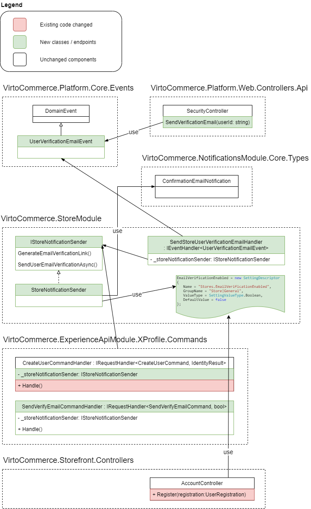
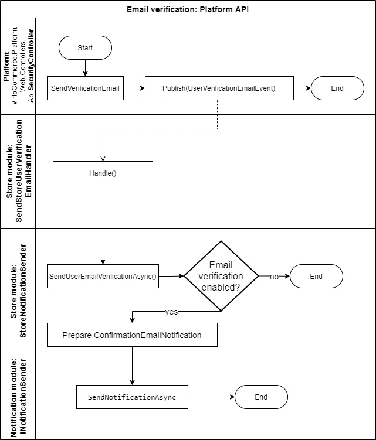
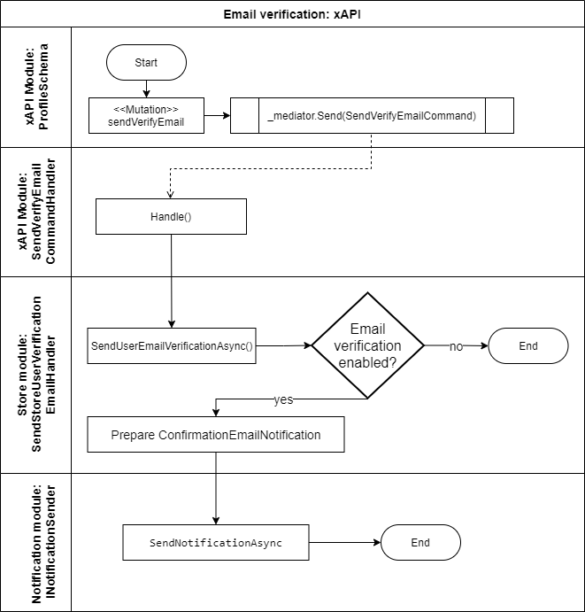
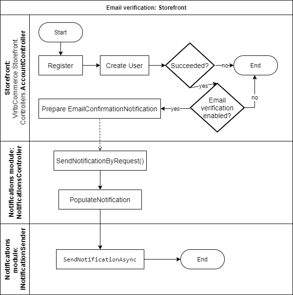

# User e-mail verification

To protect user’s account and prevent fraud, he/she can be asked to verify and confirm their identity via e-mail. This feature is called user email verification. It can be activated (switched on) or deactivated (off). The default value is “off”.

`Microsoft.AspNetCore.Identity.UserManager` is the component for user management. Its `IsEmailConfirmedAsync(TUser user)` method provides a flag indicating whether the email address for the specified user has been confirmed or not.

## E-mail verification feature Components

User can verify his email by clicking a verification link in the email sent to the address being verified. The verification email can be sent when:

* Administrator (user manager) clicks "Verify email" in Platform UI (`users/{userId}/sendVerificationEmail` endpoint requested);
* Administrator calls `users/{userId}/sendVerificationEmail` endpoint explicitly e.g., via Swagger UI;
* New user created in xAPI;
* New user self-registered in Storefront UI.

## E-mail verification in Platform API

1. **_SendVerificationEmail_** endpoint activated. It publishes `UserVerificationEmailEvent` via `IEventPublisher.Publish()`.
2. `UserVerificationEmailEvent` event received in VirtoCommerce.StoreModule.
2. Received `ApplicationUser` passed to `IStoreNotificationSender.SendUserEmailVerificationAsync()` (in Background Job).
2. Stop processing and exit, if e-mail verification is not enabled for the particular store.
2. `ConfirmationEmailNotification` notification template retrieved and filled.
2. Notification passed to `INotificationSender.SendNotificationAsync()` for dispatching.

## E-mail verification in xAPI

1. A **_sendVerifyEmail_** mutation activated. It creates and publishes `SendVerifyEmailCommand` via `IMediator.Send()`.
2. `SendVerifyEmailCommand` command received in `SendVerifyEmailCommandHandler`.
2. An associated `ApplicationUser` retrieved and passed to `IStoreNotificationSender.SendUserEmailVerificationAsync()`.
2. Request processing in `SendUserEmailVerificationAsync()` as described in previous scenario.

#### Alternative scenario
1. A **_createUser_** mutation activated. It creates and publishes `CreateUserCommand` via `IMediator.Send()`.
2. `CreateUserCommand` command received in `SendVerifyEmailCommandHandler`.
2. Newly created user retrieved and passed to `IStoreNotificationSender.SendUserEmailVerificationAsync()`.
2. Request processing in `SendUserEmailVerificationAsync()` as described in previous scenario.

## E-mail verification in Storefront kit

Storefront kit is one example of Platform API clients.

1. A **_Register_** endpoint activated in `AccountController`. A new user is created (via Virto Platform API).
2. Stop processing and exit, if e-mail verification is not enabled for the particular store.
2. `EmailConfirmationNotification` notification created and filled.
2. Dispatch the notification via `SendNotificationByRequest` endpoint (Notifications module).

