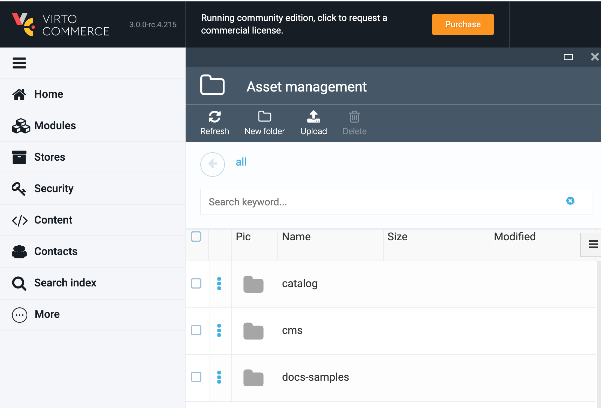
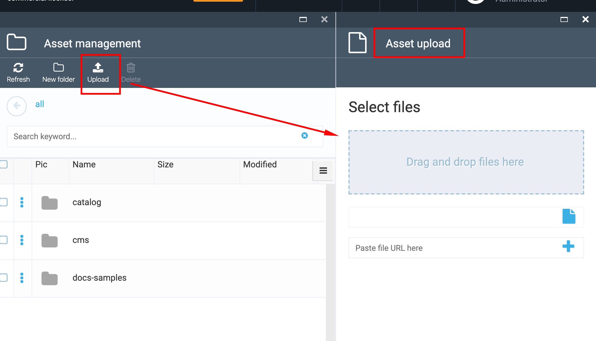

# Asset management

## Overview

Assets function is a basic Platform functionality and is an abstraction or an internal programming interface that helps working with Platform file system. There is no possibility to work with files directly, only via Assets abstraction.

This programming interface allows the following actions:

1. Upload files;
2. Read files;
3. Search for files.

Asset Management has also a user interface that constitute a File Manager or File Dictionary. All Platform modules have access to this dictionary via programming interface and all folders in Assets are created by Platform modules.
Each Platform module works with it's own folder located in Assets.

Asset Management can be implemented both on a physical disc or on Azure blob storage.



## Upload file to Asset Management

The file can not be uploaded into the root.
Select a folder from the list of assets (ex, Catalog) and then click the 'Upload' button.
You can upload the file using one of the following ways:

1. Drag and drop the file;
1. Browse the file;
1. Enter external file link.



## Asset modules

There are three modules that provide asset functionality to platform:

1. [vc-module-assets](https://github.com/VirtoCommerce/vc-module-assets). Provides basic infrastructure for the assets storage: core assets abstractions, base provider class, UI elements.
2. [vc-module-azureblob-assets](https://github.com/VirtoCommerce/vc-module-azureblob-assets). Provides Azure Blob Storage implementation.
3. [vc-module-filesystem-assets](https://github.com/VirtoCommerce/vc-module-filesystem-assets). Provides File System implementation.

To switch between implementations:
1. Open **appsettings.json** for the Virto Commerce Platform instance.
2. Navigate to **Assets** node:
```json
    "Assets": {
        "Provider": "FileSystem",
        "FileSystem": {
            "RootPath": "~/assets",
            "PublicUrl": "http://localhost:10645/assets/"
        },
        "AzureBlobStorage": {
            "ConnectionString": "",
            "CdnUrl": ""
        }
    }
```
3. Modify these settings:
    - Set the value of the **Provider** to **FileSystem** or **AzureBlobStorage**;
    - To use **AzureBlobStorage** implementation **ConnectionString** must be provided.
