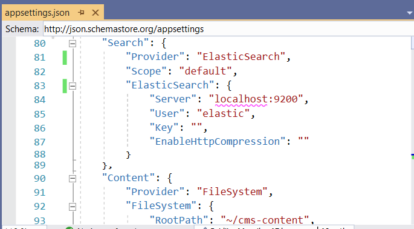
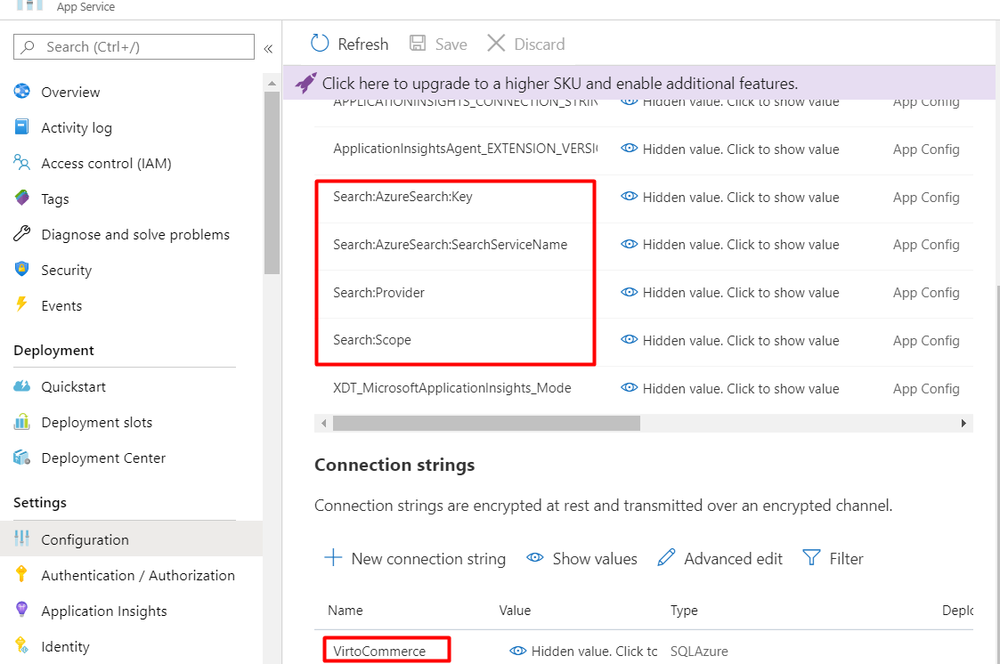

# Configuration
VC Platform is ASP&#46;NET Core application, and it's configurable as described in [Configuration in ASP.NET Core](https://docs.microsoft.com/en-us/aspnet/core/fundamentals/configuration/?view=aspnetcore-3.1).

## Configuration settings
The configuration keys are hierarchical. This structure is most convenient to manage in _appsettings.json_ file:

| Top Configuration node | Child node(s) | Default OR sample value  | Description  |
| ---------------------- | ------------- | ------------------------ | ------------ |
| ConnectionStrings    |  |  | **Required.** Connection strings for VC Platform and modules.
|  | VirtoCommerce | E.g., `Data Source=(local);Initial Catalog=VirtoCommerce3;Persist Security Info=True;User ID=virto;Password=virto; MultipleActiveResultSets=True;Connect Timeout=30` | **Required.** VC Platform system connection string to SQL Server DB. VC modules would revert to this connection string, if specific connection string wasn't defined.                          |
|  | E.g., VirtoCommerce.Catalog        | E.g., `Data Source=(local);Initial Catalog=VirtoCommerceCatalog;Persist Security Info=True;User ID=virto;Password=virto; MultipleActiveResultSets=True;Connect Timeout=30` | Other, module-specific connection string(s). E.g., VirtoCommerce.Catalog module would use `VirtoCommerce.Catalog` connection string, if it's defined. |
| | RedisConnectionString | E.g., `"localhost"` | StackExchange.Redis Configuration string. Check [Redis Configuration](https://stackexchange.github.io/StackExchange.Redis/Configuration) for details.
| VirtoCommerce |  |  | VC Platform system settings
|  | CountriesFilePath |`"localization/common/countries.json"` | Local path for countries list. By default, includes all the countries in the world.
|  | CountryRegionsFilePath |`"localization/common/countriesRegions.json"` | Local path for countries' regions list. By default, includes the states of USA and regions of Canada.
|  | LicenseActivationUrl |`"https://virtocommerce.com/admin/api/licenses/activate/"` | VC Platform license activation service URL
|  | LicenseFilePath |      `"App_Data/VirtoCommerce.lic"`                            | VC Platform license file location
|  | LocalUploadFolderPath | `"App_Data/Uploads"`                                     | Uploads folder location
|  | SampleDataUrl | E.g., `"http://virtocommerce.azureedge.net/sample-data"` | URL to download sample data during initial Platform setup
|  | DiscoveryPath | `"./Modules"` | Relative or absolute folder location where Platform will discover installed modules
|  | AllowInsecureHttp | `false` | Controls how the OpenID Connect server (ASOS) handles the incoming requests to arriving on non-HTTPS endpoints should be rejected or not. By default, this property is set to false to help mitigate man-in-the-middle attacks.
|  | Hangfire          | E.g.  "Hangfire": {             "JobStorageType": "Memory",             "UseHangfireServer": true,             "AutomaticRetryCount": 1,             "SqlServerStorageOptions": {                 "CommandBatchMaxTimeout": "00:05:00",                 "SlidingInvisibilityTimeout": "00:05:00",                 "QueuePollInterval": "00:00:00",                 "UseRecommendedIsolationLevel": true,                 "UsePageLocksOnDequeue": true,                 "DisableGlobalLocks": true,                 "EnableHeavyMigrations": true             }         }   | Background processing library (Hangfire) configuration.   `JobStorageType` - current job storage. Supported values: Memory, SqlServer.  `UseHangfireServer` - enable/disable HangFire for this app instance.  `AutomaticRetryCount` - maximum number of automatic retry attempts.  `SqlServerStorageOptions` - Hangfire.SqlServer.SqlServerStorageOptions. Check [Hangfire's SQL Server Configuration](https://docs.hangfire.io/en/latest/configuration/using-sql-server.html#configuration) for details.
|  | Swagger | E.g.  "Swagger": { "Disable": true }| Allows to disable swagger initialization at platform startup to prevent access to the swagger UI and documents.
|  | FileExtensionsBlackList | E.g.  "FileExtensionsBlackList": [".pdf", ".json"]| This used together with the 'VirtoCommerce.Platform.Security.FileExtensionsBlackList' setting (admin UI) to set extensions of the files prohibited to be uploaded to the server by the platform. 'FileExtensionsBlackList' not accessible from admin UI. Administrator gives additional list of extensions thru UI that mixing with 'FileExtensionsBlackList'.
|Assets |  |  | **Required.** Configuration defining how VC Platform works with assets (files).
|  | Provider | `"FileSystem"` | Current assets provider. Supported values: FileSystem, AzureBlobStorage.
|  | FileSystem | E.g.,   "FileSystem": {  "RootPath": "~/assets", "PublicUrl": "http://localhost:10645/assets/" } | File system based assets provider configuration. Used, if `"Provider": "FileSystem"`
|  | AzureBlobStorage | E.g.,   "AzureBlobStorage": {  "ConnectionString": "", "CdnUrl": "" }  | Azure Blob Storage based assets provider configuration. Used, if `"Provider": "AzureBlobStorage"`
| IdentityOptions | | | Options to configure the ASP&#46;NET Core Identity system. Check [Configure ASP.NET Core Identity](https://github.com/dotnet/AspNetCore.Docs/blob/master/aspnetcore/security/authentication/identity-configuration.md#configure-aspnet-core-identity) for details.
|  | Password.PasswordHistory | E.g.,  "PasswordHistory": 4 | The number of recent user's passwords to check during the password validation. Old password can't be reused for this number of cycles. Value of "0" or not defined - password history is disabled.
|  | Password.RepeatedResetPasswordTimeLimit | "RepeatedResetPasswordTimeLimit": "0:01:0" | The time limit after which a user can request a password reset.
|  | User.MaxPasswordAge | "MaxPasswordAge": "0" | TimeSpan defining max. user password age until the password expires. The user is forced to change the expired password on login to Platform Manager UI. Value of "0" or not defined - password expiration is disabled.
|  | User.RemindPasswordExpiryInDays | "RemindPasswordExpiryInDays": 7  | Number of days to start showing password expiry warning in Platform Manager UI. Used, if password expiration is enabled. 
| ExternalModules | | | Configure external source to install modules.
|  | IncludePrerelease | `false` | Show module versions marked as *Prerelease* if value is `true`.
|  | ModulesManifestUrl | E.g., `"https://raw.githubusercontent.com/VirtoCommerce/vc-modules/master/modules_v3.json"` | Url to *.json* file containing modules' manifests.
|  | AuthorizationToken | | Authorization token to access *ModulesManifestUrl*. Added to *Authorization* header, if specified.
|  | AutoInstallModuleBundles | `["commerce"]` | Group(s) of modules to install automatically during initial Platform setup. Provide empty array to install none.
| Caching |  |  | Caching configuration
|  | Redis | E.g.,  "Redis": { "ChannelName": "VirtoCommerceChannel", "BusRetryCount": 3 } | Redis configuration, incl. the message channel to use and number of times to retry.
|  | CacheEnabled | `true` | If set to `true`, cache entries are retained based on _expiration settings_. Otherwise, cache entries expire immediately. Used, if _ConnectionStrings\:RedisConnectionString_ not specified.
|  | CacheSlidingExpiration | E.g., `"0:15:00"` | Cache entry will expire if it hasn't been accessed in a set amount of time. Used, if CacheAbsoluteExpiration was not defined.
|  | CacheAbsoluteExpiration | E.g., `"0:5:00"` | Cache entry will expire after a set amount of time. Used, if _RedisConnectionString_ not specified.
| Notifications | | | Notifications configuration for `VirtoCommerce.Notifications` module
|  | Gateway | E.g., `"SendGrid"` | Current notification sending gateway. Out of the box implemented and supported values: Smtp, SendGrid.
|  | DefaultSender | E.g., `"noreply@gmail.com"` | **Required.** Sender identification used by current notification sending gateway.
|  | Smtp | E.g., "Smtp": { "SmtpServer": "http://smtp.gmail.com", "Port": 587, "Login": "my-login", "Password": "my-password" } | Smtp gateway configuration. Used, if `"Gateway": "Smtp"`
|  | SendGrid | E.g., "SendGrid": { "ApiKey": "my-SendGrid-Api-Key" } | SendGrid gateway configuration. Used, if `"Gateway": "SendGrid"`
| Search | | | Full text search configuration for `VirtoCommerce.Search` module
|  | Provider | E.g., `"Lucene"` | **Required.** Current Search Provider. Implemented (in dedicated modules) and supported values: Lucene, AzureSearch, ElasticSearch.
|  | Scope | E.g., `"default"`   | **Required.** Scope to use
|  | Lucene | E.g., "Lucene": { "Path": "App_Data/Lucene" } | Lucene Provider configuration for _VirtoCommerce.LuceneSearch_ module. Used, if `"Provider": "Lucene"`
|  | AzureSearch | E.g., "AzureSearch": { "SearchServiceName": "my-ServiceName", "Key": "my-AccessKey" } | AzureSearch Provider configuration for _VirtoCommerce.AzureSearch_ module. Used, if `"Provider": "AzureSearch"`
|  | ElasticSearch | E.g., "ElasticSearch": { "Server": "localhost:9200", "User": "elastic", "Key": "", "EnableHttpCompression": "" } | ElasticSearch  Provider configuration for _VirtoCommerce.ElasticSearch_ module. Used, if `"Provider": "ElasticSearch"`
| Content | | | **Required.** Static content (incl. themes) configuration for `VirtoCommerce.Content` module
|  | Provider | `"FileSystem"` | Current Content (files) Provider. Supported values: FileSystem, AzureBlobStorage.
|  | FileSystem | E.g.,   "FileSystem": {  "RootPath": "~/cms-content", "PublicUrl": "http://localhost:10645/cms-content/" }  | File system based content provider configuration. This is the default provider, used if `AzureBlobStorage` is not set as current provider.
|  | AzureBlobStorage | E.g.,   "AzureBlobStorage": {  "ConnectionString": "", "CdnUrl": "" }  | Azure Blob Storage based content provider configuration. Used, if `"Provider": "AzureBlobStorage"`.
| AzureAd | | | Used for authentication with Azure Active Directory. Check [Enabling authentication with Azure Active Directory](https://github.com/VirtoCommerce/vc-platform/blob/master/docs/techniques/authentication-with-azure-ad.md) for details. 
|  | UsePreferredUsername | `false` | If set to `true` will check the `preffered_username` in case if the `upn` claim returns empty.
| LoginPageUI | | | Used for configuration of the background screen and background pattern of the login page.
|  | BackgroundUrl | | Login page background URI. If set takes priority over the preset.
|  | PatternUrl | | Login page background pattern URI. If set takes priority over the preset.
|  | Preset | `demo` | Login page background preset name. If set searches the preset from the Presets list and applies BackgroundUrl and PatternUrl from it.
|  | Presets | E.g., [{ "Name": "demo", "BackgroundUrl": "images/login_background.png", "PatternUrl": "/images/pattern-demo.svg" }, { "Name": "prod", "BackgroundUrl": "", "PatternUrl": "/images/pattern-live.svg" }] | A list of background Presets.

**_Note:_** Each setting is optional, if it's not marked as **Required.**

## Hierarchical keys
* Within the Configuration API, a colon separator (`:`) works on all platforms.
* In environment variables, a colon separator may not work on all platforms. A double underscore, `__`, is supported by all platforms and is automatically converted into a colon `:`.
* In Azure Key Vault, hierarchical keys use `--` as a separator. The Azure Key Vault configuration provider automatically replaces `--` with a `:` when the secrets are loaded into the app's configuration.

_Configuring ElasticSearch on localhost in **appsettings.json** file._

")

_Configuring "**VirtoCommerce**" ConnectionString and other settings trough **environment variables** in docker-compose.yml file._

_Configuring "**AzureSearch**" and other settings trough **Application settings** in **Azure**._

Check [ASP.NET Core Configuration keys and values](https://docs.microsoft.com/en-us/aspnet/core/fundamentals/configuration/?view=aspnetcore-3.1#configuration-keys-and-values) for more details.
