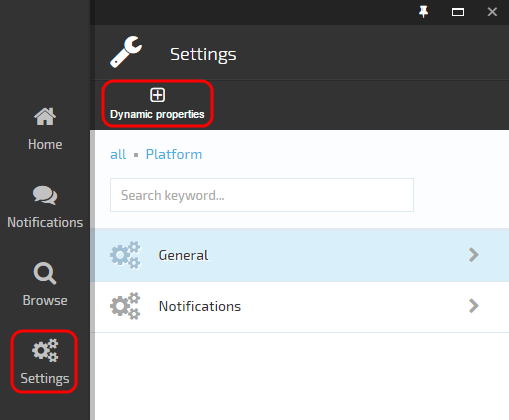
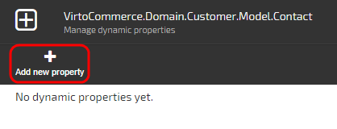
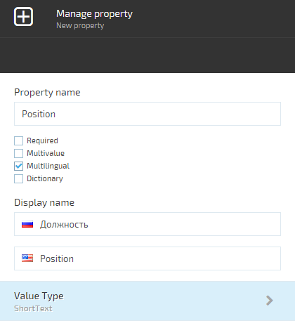
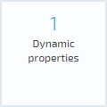
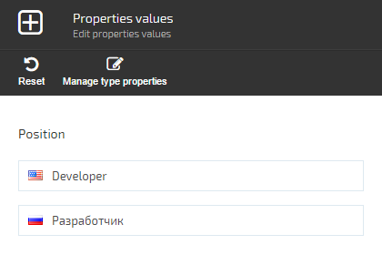
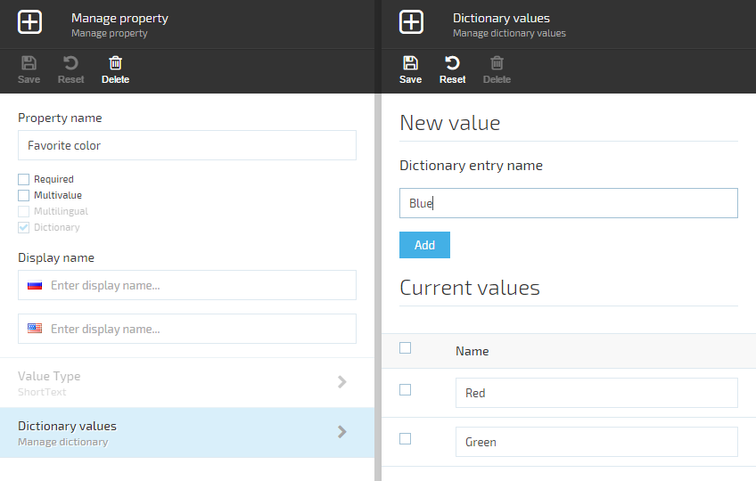
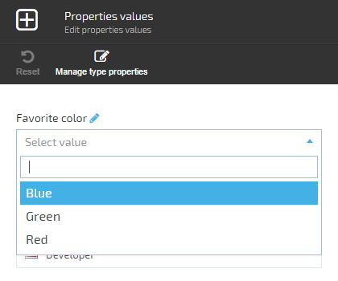
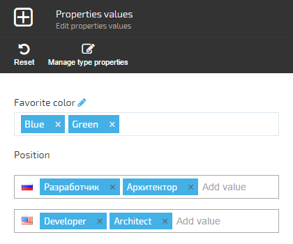

---
title: Managing dynamic properties
description: The article about adding new properties to entities at runtime
layout: docs
date: 2015-07-24T22:02:10.487Z
sorting: 1
---
## Overview

VirtoCommerce Platform allows to add new properties to entities at runtime.

## Adding new property

In the left toolbar menu click **More** then **Dynamic Properties** button and select one of the available objects:  

After choosing object from the click the **Add** button:  

Enter new property name, select value type and other options. Also you can define the property name for each of the registered languages:

**Required**  
Does not allow empty property value when editing object values.

**Multivalue**  
Allows to enter more than one value for the property when editing object values.

**Multilingual**  
Allows to define different values for each registered language when editing object values.

**Dictionary**  
Allows to select one of the predefined values when editing object values. The value type for dictionaries can be short text only. You can add dictionary items after creating the property.

## Editing object values

Open the object details and click the Dynamic propertis widget:  

In the new balde you will see the list of available properties with input controls for entering values:  

## Dictionaries

After creating a property with **Dictionary** option you can add dictionary items:  

When editing an object you can select one of the dictionary items:  

## Multivalue properties

If **Multivalue** option is selected you can enter multiple values for the property or select multiple dictionary items:  

