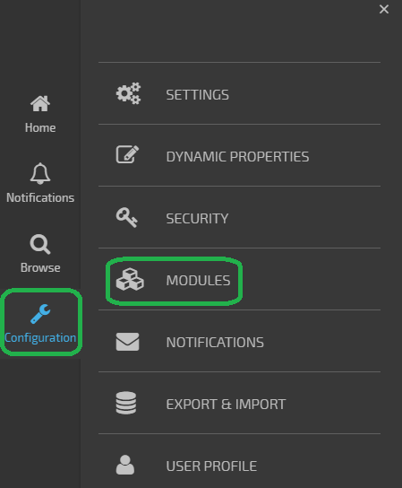
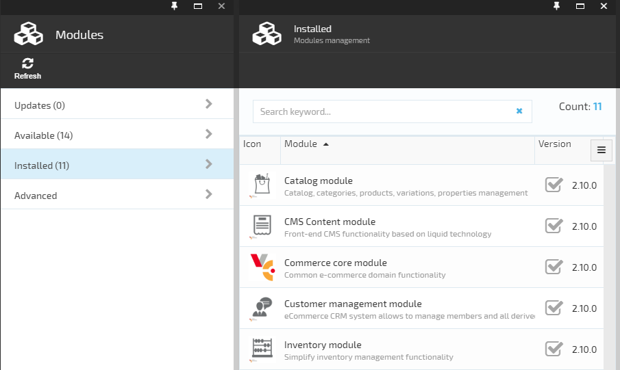
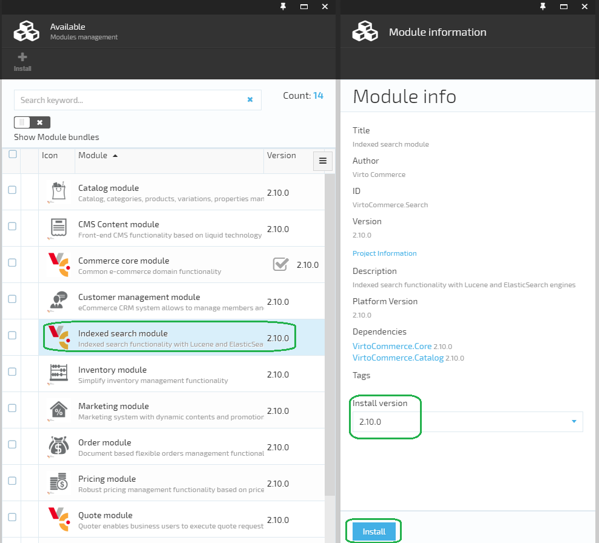
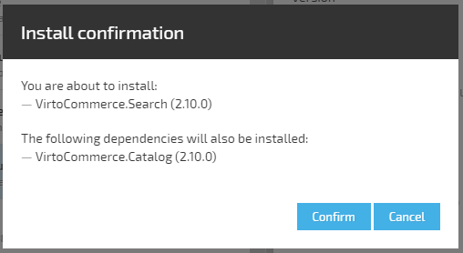
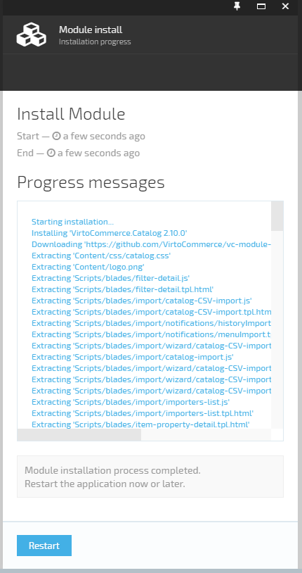
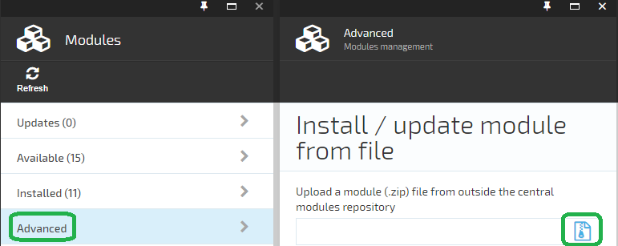
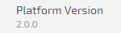

---
title: Modules management
description: The article about managing Virto Commerce modules
layout: docs
date: 2016-06-03T14:26:15.983Z
sorting: 2
---
## Introduction

Modules management UI is accessible in <a class="crosslink" href="https://virtocommerce.com/b2b-ecommerce-platform" target="_blank">Virto Commerce</a> (VC) Manager: in the left menu click **Configuration** > **Modules**:

Modules management UI is displayed:

The available module **updates**, all the **available** and **installed** modules are showcased. There is also an **Advanced** option for manual module installation.

## Module installation

Navigate to **Available** tab, select a module from the list, review it's information, select **Install version** (as there might be multiple versions available) and click **Install** button:

Some modules may require to accept a license agreement before proceeding.

The system resolves the module dependencies (if any), checks version compatibility, etc. A list of modules (and dependency modules) to install is displayed in the install confirmation dialog:

Click **Confirm** button to start the installation process. The installation progress is displayed:

The **Restart** button gets activated only after the installation process has completed. Click **Restart** to finish the installation and apply the changes. The new module(s) should appear in the **installed** modules list.

## Multiple modules installation

Multiple modules can be installed at once from the modules list: mark the proper modules by checkboxes and click **Install** in the toolbar. Proceed the same way as described in **Module installation** section (from install confirmation dialog).

You can also view the available modules grouped by various usage scenarios. Switch the **Show Module bundles** switcher on, select the whole group by a single click and proceed with the installation as usual.

## Manual module installation

Navigate to **Advanced** tab, click **Browse** button and select a module package (.zip) file to install:

The package will be uploaded to the server where its analysis takes place. Proceed the same way as described in **Module installation** section.

## Dependencies

### Platform dependency

Each module declares the minimal supported platform version.

If your platform version is less than required version, the module installation will report an error and fail.

### Module dependencies

Some modules may depend on other modules. If these dependencies are not installed and are absent in the **available** modules list, you will see an error message. In this case you have to obtain and install the dependency first.
