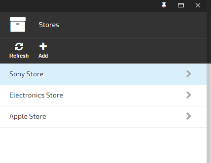
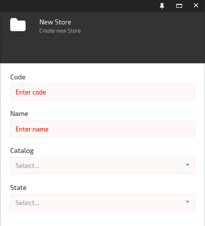
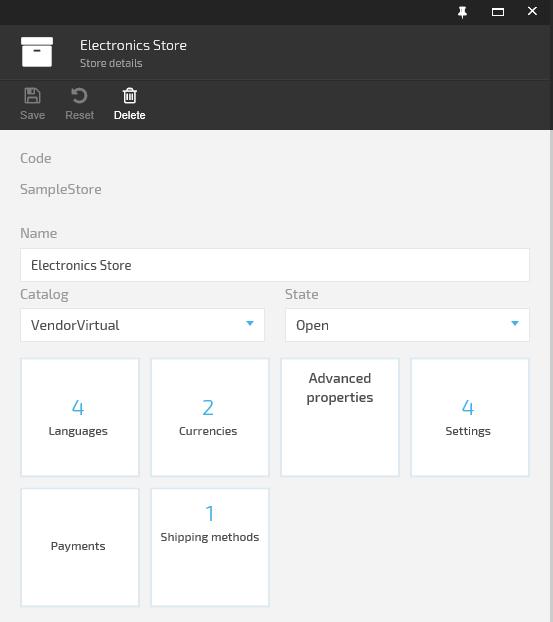
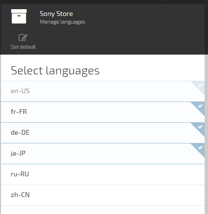
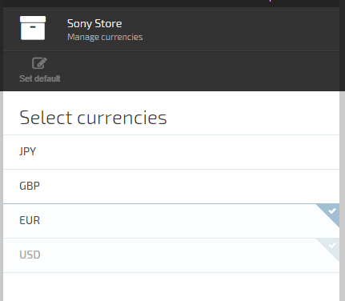
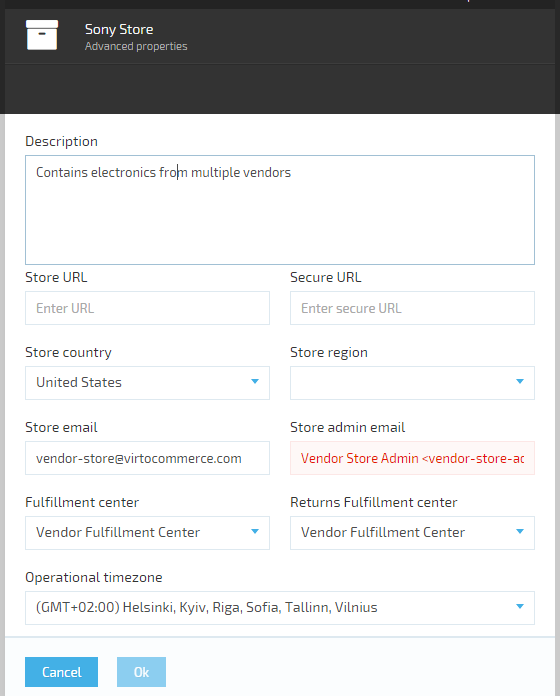
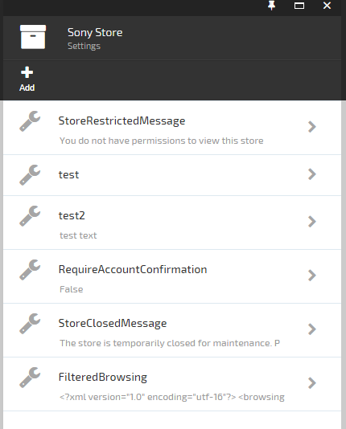
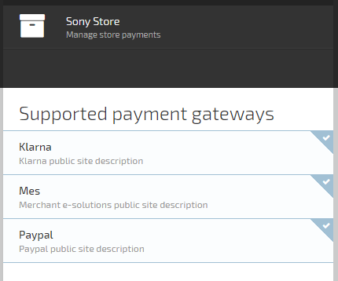

---
title: Store
description: A store in Virto Commerce represents the collection of settings for the web page (storefront) to function correctly. That includes item catalog to showcase, available currencies, languages, payment methods, even UI themes, pages and much more.
layout: docs
date: 2015-06-01T15:18:37.683Z
sorting: 3
---
## Virto Commerce Store module

### APIs and UI for managing stores

A store in Virto Commerce represents the collection of settings for the web page (storefront) to function correctly. That includes item catalog to showcase, available currencies, languages, payment methods, even UI themes, pages and much more. A default storefront as well as sample stores are provided by the Virto Commerce team.

Virto Commerce platform is <a class="crosslink" href="https://virtocommerce.com/multi-tenant" target="_blank">multi-store</a> by design. This gives the ability to have and run multiple stores on the same system.

Store management landing UI and sample stores

Refresh button will refresh content of current blade and Add button will open a new blade New store.

New store blade contains several main required settings such as store code (requirements for store code are the same as for any identifiers - it will be using as store id in source code and in url), store name (for displaying), catalog and state.

This properties also available in store management blade which can be called with selecting store.

New store blade

Store management details UI

The most important properties goes first. Then theres a list of available widgets. It includes:

* languages
* currencies
* advanced (additional) properties
* settings
* payment methods
* shipping methods

## Languages

<a class="crosslink" href="https://virtocommerce.com/website-design" target="_blank">Languages</a> tile displays the count of languages currently assigned to the store. Click on it to manage. Setting one of languages as default is required.

## Currencies

Currencies tile displays the count of currencies currently assigned to the store. Click on it to manage. Setting one of currencies as default is required.

## Advanced properties

Click on Advanced properties tile to manage advanced information.

## Settings

Settings tile displays the count of custom settings currently assigned to the store. Click on it to manage.

## Payments

Payments tile displays the count of payment gateways currently assigned to the store. Click on it to manage.

