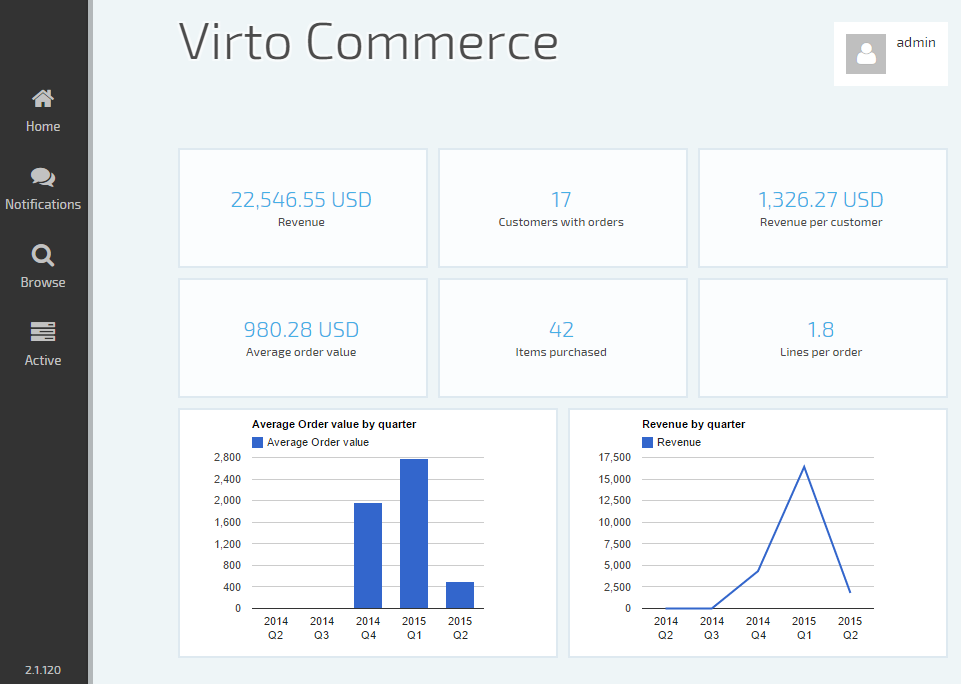

---
title: Dashboard - Virto Commerce 2 User Guide
dashboard: The article describes Virto Commerce dashboard
layout: docs
date: 2015-09-19T00:03:50.657Z
priority: 4
---
## Home page

Home page is the Commerce Manager area where a user starts his work after authentication. It contains main menu, current user information and dashboard.

## Main menu

The main menu is a zone located on the left hand side of the screen dedicated for quick navigation. The main menu is always visible and accessible. It contains:

<table>
    <tr>
        <td></td>
        <td>Link to home page.</td>
    </tr>
    <tr>
        <td></td>
        <td>Notifications area. New notifications appear here. The icon displays the number of unread messages, if any. Click to view the latest ones. The messages are sent from Commerce manager system reporting that some important event happened. For instance, it could be a data export progress report, a warning indicating that data retrieval is taking longer then expected or that a popular item's stock is getting low.</td>
    </tr>
    <tr>
        <td></td>
        <td>The main link to all available functionality.</td>
    </tr>
    <tr>
        <td></td>
        <td>The currently active tasks or open blades list.</td>
    </tr>
    <tr>
        <td></td>
        <td>Virto Commerce version number.</td>
    </tr>
</table>

## Current user information

On logging in, a user is identified and authorized to use the Commerce manager.

<table>
    <tr>
        <td></td>
        <td>The user identity information. Click for available actions (Sign out).</td>
    </tr>
</table>

## Dashboard

Dashboard occupies the ultimate part of the home page. It reveals basic information about the latest activities related to the user, tracks key metrics and dimensions such as sales dynamics, etc. The dashboard is extendable, it can contain additional information and/or functionality (even depending on user role or permissions). E.g. quick access links to the Commerce manager functional modules (<a class="crosslink" href="https://virtocommerce.com/shopping-cart" target="_blank">orders</a>, catalogs, marketing) or common actions (create new customer, promotion or check item inventory) can be added.
